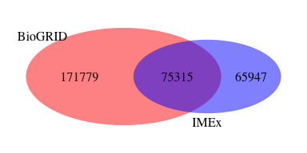
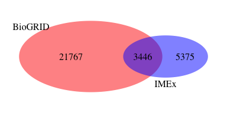
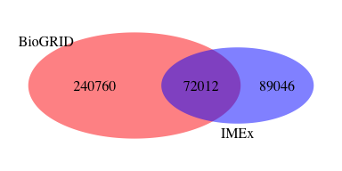

BioGRID dataset generator
========================================================

#### Load BioGRID data


I download the latest version of the BioGRID data from mentha website. I have tried using PSICQUIC, however, downloading whole mentha using PSICQUIC takes too much time. Now, however, the link should be updated manually to get the latest mentha release. Current file was downloaded on Wed Mar  1 15:20:46 2017. 


```r
if(!file.exists("./source_files/2017-02-27_MITAB-2.5.zip")){
        mentha_url = "http://mentha.uniroma2.it/dumps/2017-02-27_MITAB-2.5.zip"
        # httr::GET(http://mentha.uniroma2.it/doDownload.php?file=2017-02-27_MITAB-2.5.zip) - this is how I got the direct link
        download(mentha_url, destfile = "./source_files/2017-02-27_MITAB-2.5.zip")
}
unzip("./source_files/2017-02-27_MITAB-2.5.zip", exdir = "./source_files/")
# databases <- c("mentha")
## Query PSICQUIC for interactions, get MI-TAB-2.5, save
# source("./scripts/query_PSICQUIC_for_interactions.R")
# query_PSICQUIC_for_interactions(SPECIES_ID = "all", SPECIES_NAME = "all", databases= "mentha", date = BioGRID_mentha_date,
#                                          database.name = "./source_files/mentha_mitab25.txt", return_data = F, show_summary = F, MITAB = "tab25")
```

I need to filter only BioGRID interactions and to clean up the BioGRID file.


```r
mentha = fread("./source_files/2017-02-27_MITAB-2.5", header = F, sep = "\t", colClasses = "character")
```

```
## 
Read 39.8% of 1105301 rows
Read 70.6% of 1105301 rows
Read 91.4% of 1105301 rows
Read 1105301 rows and 15 (of 15) columns from 0.325 GB file in 00:00:05
```

```r
biogrid_from_mentha = mentha[V13 == "psi-mi:\"MI:0463\"(biogrid)",]
fwrite(x = biogrid_from_mentha, file = "./processed_files/biogrid_mitab25.txt",sep = "\t")
system("perl ./scripts/MITAB25extractor_v12.pl ./processed_files/biogrid_mitab25.txt ./processed_files/biogrid_pairs.txt")
unlink(c("./source_files/2017-02-27_MITAB-2.5","./processed_files/biogrid_mitab25.txt"))
```

I save a table of interacting pairs, publication IDs and BioGRID tag.


```r
biogrid_from_mentha = fread("./processed_files/biogrid_pairs.txt", header = T, sep = "\t", colClasses = "character")
fwrite(x = unique(biogrid_from_mentha[, .(pair_id_clean, pubid, biogrid = rep(1, .N))]), 
       file = "./results/pairs_pmids_biogrid.txt", sep = "\t")
N_biogrid = length(biogrid_from_mentha[,unique(pair_id_clean)])
```

The BioGRID dataset contains 341408 interacting pairs. 

I create a list of PMIDs that have been curated by them.


```r
biogrid_pmids <- data.frame(unique(biogrid_from_mentha$pubid))

write.table(biogrid_pmids, "./results/biogrid_pmids.txt", quote=F, sep ="\t", row.names = F, col.names = T)
```

36936 publications are curated into BioGRID database. 

#### Compare BioGRID interactions and publications to IMEx 

I calculate how many interactions in BioGRID match to IMEx.


```r
imex = fread("https://raw.githubusercontent.com/pporrasebi/darkspaceproject/master/IMEx/results/imex_full.txt", header = T, sep = "\t", colClasses = "character")
N_imex = length(imex[,unique(pair_id_clean)])
N_biogrid = length(biogrid_from_mentha[,unique(pair_id_clean)])
N_overlap = sum(!is.na(match(biogrid_from_mentha[,unique(pair_id_clean)], imex[,unique(pair_id_clean)])))

venn.d = draw.pairwise.venn(area1 = N_imex, area2 = N_biogrid, cross.area = N_overlap, category = c("IMEx", "BioGRID"), 
                          lty = rep("blank", 2), 
                          fill = c("blue", "red"), 
                          alpha = rep(0.5, 2), cat.pos = c(0, 135), 
                          cat.dist = rep(0.035, 2), 
                          cat.cex = c(1,1), scaled = TRUE, euler.d = TRUE,  margin = 0.05,
                          direct.area = TRUE,
                          cex = 1)
```

<!-- -->

I calculate how many publications in BioGRID match to IMEx.


```r
N_pubid_imex = length(imex[,unique(pubid)])
N_pubid_biogrid = length(biogrid_from_mentha[,unique(pubid)])
N_pubid_overlap = sum(!is.na(match(biogrid_from_mentha[,unique(pubid)], imex[,unique(pubid)])))

venn.d = draw.pairwise.venn(area1 = N_pubid_imex, area2 = N_pubid_biogrid, cross.area = N_pubid_overlap, category = c("IMEx", "BioGRID"), 
                          lty = rep("blank", 2), 
                          fill = c("blue", "red"), 
                          alpha = rep(0.5, 2), cat.pos = c(0, 135), 
                          cat.dist = rep(0.035, 2), 
                          cat.cex = c(1,1), scaled = TRUE, euler.d = TRUE,  margin = 0.05,
                          direct.area = TRUE,
                          cex = 1)
```

<!-- -->

I calculate how many interactions published in specific articles (the same interaction can come from different publications) in BioGRID match to IMEx.


```r
N_pub_int_imex = length(imex[,unique(paste0(pubid,"_",pair_id_clean))])
N_pub_int_biogrid = length(biogrid_from_mentha[,unique(paste0(pubid,"_",pair_id_clean))])
N_pub_int_overlap = sum(!is.na(match(biogrid_from_mentha[,unique(paste0(pubid,"_",pair_id_clean))], imex[,unique(paste0(pubid,"_",pair_id_clean))])))

venn.d = draw.pairwise.venn(area1 = N_pub_int_imex, area2 = N_pub_int_biogrid, cross.area = N_pub_int_overlap, category = c("IMEx", "BioGRID"), 
                          lty = rep("blank", 2), 
                          fill = c("blue", "red"), 
                          alpha = rep(0.5, 2), cat.pos = c(0, 135), 
                          cat.dist = rep(0.035, 2), 
                          cat.cex = c(1,1), scaled = TRUE, euler.d = TRUE,  margin = 0.05,
                          direct.area = TRUE,
                          cex = 1)
```

<!-- -->
