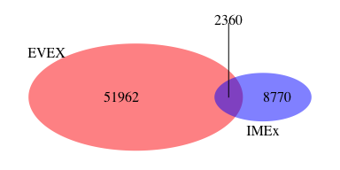
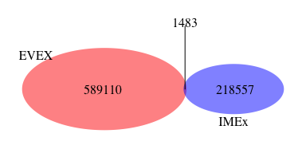

EVEX dataset generator
========================================================

#### Load EVEX data


I download the latest version of the EVEX data from EVEX website: relations table and articles table (which have common General event ID). Current file was downloaded on Tue Mar  7 10:49:36 2017. 

Format rescription:


```r
README = readLines("http://evexdb.org/download/network-format/README-network.txt")
README[19:35]
```

```
##  [1] "EVEX_relations_XXX.tab"                                                                                                                                             
##  [2] ""                                                                                                                                                                   
##  [3] "XXX represents the Taxonomy ID of the organism, as defined by NCBI Taxonomy. E.g. http://www.ncbi.nlm.nih.gov/Taxonomy/Browser/wwwtax.cgi?id=3702"                  
##  [4] "This file only includes non-self interactions, where the source ID is not equal to the target ID"                                                                   
##  [5] ""                                                                                                                                                                   
##  [6] "Tab-delimited format recording respectively:"                                                                                                                       
##  [7] "- General event ID: This can be used to link to the website and inspect all occurrences of a particular general event, e.g. http://evexdb.org/entrez/events/471573/"
##  [8] "- Source EntrezGene ID: This unique, species-specific identifier unambiguously determines the first gene, e.g. http://www.ncbi.nlm.nih.gov/gene/852433/"            
##  [9] "- Target EntrezGene ID: This unique, species-specific identifier unambiguously determines the second gene, e.g. http://www.ncbi.nlm.nih.gov/gene/852577/"           
## [10] "- Confidence value: These values can be used for ranking the predictions from least to most reliable. Negative values have no special meaning."                     
## [11] "- Negation: A boolean value of 0 (no negation) or 1 (negation)"                                                                                                     
## [12] "- Speculation: A boolean value of 0 (no speculation) or 1 (speculation)"                                                                                            
## [13] "- Coarse Type: This string value expresses the type of interaction between the first and second gene, e.g. 'Binding' or 'Regulation'."                              
## [14] "- Coarse Polarity: Can be used together with Coarse Type to further define whether the interaction has a positive, negative or unspecified effect."                 
## [15] "- Refined Type: This string value expresses the detailed type of interaction between the first and second gene, e.g. 'Regulation of gene expression'."              
## [16] "  When no further details have been extracted, the Refined Type equals the Coarse Type, in other cases it is a subclass."                                           
## [17] "- Refined Polarity: Can be used together with Refined Type to further define whether the interaction has a positive, negative or unspecified effect."
```

```r
README[39:45]
```

```
## [1] "EVEX_articles_XXX.tab"                                                                                                                             
## [2] ""                                                                                                                                                  
## [3] "XXX represents the Taxonomy ID of the organism, as defined by NCBI Taxonomy. E.g. http://www.ncbi.nlm.nih.gov/Taxonomy/Browser/wwwtax.cgi?id=3702" 
## [4] ""                                                                                                                                                  
## [5] "Tab-delimited format recording respectively:"                                                                                                      
## [6] "- General event ID: This can be used to link to the EVEX_relations_XXX.tab file, and to the website, e.g. http://evexdb.org/entrez/events/471573/" 
## [7] "- Article ID: Each article in which the specified event was found, either in a PubMed abstract (PMID) or a PubMed Central full-text article (PMC) "
```


```r
url_EVEX = "http://evexdb.org/download/network-format/"
directories = htmlTreeParse(url_EVEX, useInternalNodes = T)
directories = xpathSApply(directories, "//a", xmlValue)
directories = grep("^[[:alpha:]]+/", directories , value = T)
filepaths = character()
files = character()
for(directory in directories) {
        files_temp = htmlTreeParse(paste0(url_EVEX, directory), useInternalNodes = T)
        files_temp = xpathSApply(files_temp, "//a", xmlValue)
        files_temp = grep("\\.tar\\.gz$", files_temp , value = T)
        files = c(files, files_temp)
        filepaths_temp = paste0(url_EVEX, directory,files_temp)
        filepaths = c(filepaths, filepaths_temp)
}
files = paste0("./source_files/", files)
for(i in 1:length(filepaths)){
       if(!file.exists(files[i])) download(filepaths[i],files[i])
}
```


```r
homo_file = grep("Homo", files, value =T)
gunzip(homo_file, remove = F)
untar(substr(homo_file, 1, nchar(homo_file)-3), exdir = "./source_files/Homo/")
unlink(substr(homo_file, 1, nchar(homo_file)-3))
Homo_sapiens_EVEX_relations = fread("./source_files/Homo/EVEX_relations_9606.tab", colClasses = "character")
Homo_sapiens_EVEX_articles = fread("./source_files/Homo/EVEX_articles_9606.tab", colClasses = "character")
```

EVEX is a text-mining resource which aims to identify interactions of different types from the literature as well as segment those interactions by type and measure the confidence of those in interactions being really described in the articles (not an artifact of text-mining).   
Interactions is identified by a pair of genes (in the network format, there is another data format in EVEX which is not relevant here), segmented by type and polarity, and given a confidence score.

Below you can see how many interactions belong to each type. 


```r
Homo_sapiens_EVEX_relations[,table(coarse_type)]
```

```
## coarse_type
##             Binding Indirect_regulation          Regulation 
##              206188               32095              206836
```

```r
Homo_sapiens_EVEX_relations[,table(refined_type,refined_polarity)]
```

```
##                                         refined_polarity
## refined_type                             Negative Neutral Positive
##   Binding                                       0  206188        0
##   Catalysis of acetylation                      0       0        0
##   Catalysis of DNA methylation                  0       0        0
##   Catalysis of glycosylation                    0       0        0
##   Catalysis of hydroxylation                    0       0        0
##   Catalysis of methylation                      0       0        0
##   Catalysis of phosphorylation                  0       0        0
##   Catalysis of ubiquitination                   0       0        0
##   Indirect_catalysis of acetylation             0       0        0
##   Indirect_catalysis of methylation             0       0        0
##   Indirect_catalysis of ubiquitination          0       0        0
##   Indirect_regulation                        5326       0     4967
##   Indirect_regulation of binding              569       0      269
##   Indirect_regulation of catabolism           215       0      149
##   Indirect_regulation of expression          3425       0     3658
##   Indirect_regulation of localization         867       0      468
##   Indirect_regulation of phosphorylation     1273       0      926
##   Indirect_regulation of transcription        257       0      266
##   Regulation                                17639       0    58398
##   Regulation of binding                      3837       0    10637
##   Regulation of catabolism                    456       0     2192
##   Regulation of expression                   8626       0    25574
##   Regulation of localization                 2044       0     6839
##   Regulation of phosphorylation              2105       0     9559
##   Regulation of transcription                1172       0     3782
##                                         refined_polarity
## refined_type                             Unspecified
##   Binding                                          0
##   Catalysis of acetylation                       359
##   Catalysis of DNA methylation                    28
##   Catalysis of glycosylation                      19
##   Catalysis of hydroxylation                      35
##   Catalysis of methylation                       221
##   Catalysis of phosphorylation                   156
##   Catalysis of ubiquitination                    833
##   Indirect_catalysis of acetylation                7
##   Indirect_catalysis of methylation                3
##   Indirect_catalysis of ubiquitination            21
##   Indirect_regulation                           4289
##   Indirect_regulation of binding                 283
##   Indirect_regulation of catabolism              150
##   Indirect_regulation of expression             2867
##   Indirect_regulation of localization            592
##   Indirect_regulation of phosphorylation        1003
##   Indirect_regulation of transcription           245
##   Regulation                                   24847
##   Regulation of binding                         4212
##   Regulation of catabolism                       639
##   Regulation of expression                     15905
##   Regulation of localization                    2938
##   Regulation of phosphorylation                 1829
##   Regulation of transcription                   1955
```

The total number of articles analysed: 172010  


```r
pairs_entrezgene_id = Homo_sapiens_EVEX_relations[, as.character(unique(c(source_entrezgene_id, target_entrezgene_id)))]
# connecting to Uniprot
 uniprot = UniProt.ws(taxId=9606)
# getting names of the keys and columns from Uniprot
# keytypes(uniprot)
# mapping IDs
 entrezgene2uniprot_temp <- as.data.table(select(uniprot, 
               keys = pairs_entrezgene_id, 
               columns = c("ENTREZ_GENE", "UNIPROTKB"),
               keytype = "ENTREZ_GENE"))
 entrezgene2uniprot = copy(entrezgene2uniprot_temp[complete.cases(entrezgene2uniprot_temp),])
# what is the fraction of matches
# mean(complete.cases(entrezgene2uniprot_temp)) # 0.9517783
# what is the fraction of one to many mappings to UNIPROTKB?
# sum(table(entrezgene2uniprot_comp_temp[, .N , by = ENTREZ_GENE]$N)[-1])/sum(table(entrezgene2uniprot_comp_temp[, .N , by = ENTREZ_GENE]$N)) # 0.5032162

# connecting to ENSEMBL
# ensembl=useMart("ensembl")
# ensembl = useDataset("hsapiens_gene_ensembl",mart=ensembl)
# getting names of the keys and columns from ENSEMBL
# attributes = listAttributes(ensembl)
# entrezgene_uniprot_ENSEMBL = data.table()
# for(i in seq(1,length(pairs_entrezgene_id),500)){
# entrezgene_temp = as.data.table(getBM(attributes = c('entrezgene', 'uniprot_swissprot',"uniprot_sptrembl"), 
#               values = pairs_entrezgene_id[i:(i+499)], filters = 'entrezgene',
#               mart = ensembl))
# entrezgene_uniprot_ENSEMBL = rbind(entrezgene_uniprot_ENSEMBL, entrezgene_temp)
# }
# entrezgene_uniprot_ENSEMBL = unique(entrezgene_uniprot_ENSEMBL)

# what is the fraction of matches?
# 1-mean(entrezgene_uniprot_ENSEMBL$uniprot_swissprot == "" & entrezgene_uniprot_ENSEMBL$uniprot_sptrembl == "") # 0.9951115

# what is the fraction of one to many mappings to SwissProt+trEMBL?
# sum(table(entrezgene_uniprot_ENSEMBL[, .N , by = entrezgene]$N)[-1])/sum(table(entrezgene_uniprot_ENSEMBL[, .N , by = entrezgene]$N)) # 0.7543455

# what is the fraction of one to many mappings to SwissProt?
# entrezgene_uniprot_ENSEMBL_z = unique(entrezgene_uniprot_ENSEMBL[, .(entrezgene, uniprot_swissprot)])
# sum(table(entrezgene_uniprot_ENSEMBL_z[, .N , by = entrezgene]$N)[-1])/sum(table(entrezgene_uniprot_ENSEMBL_z[, .N , by = entrezgene]$N)) # 0.7310322

Homo_sapiens_EVEX_relations = unique(Homo_sapiens_EVEX_relations)
entrezgene2uniprot = unique(entrezgene2uniprot)
Homo_sapiens_EVEX_relations = merge(x = Homo_sapiens_EVEX_relations, y = entrezgene2uniprot, by.x = "source_entrezgene_id", by.y = "ENTREZ_GENE", all.x = T, allow.cartesian=TRUE)
setnames(Homo_sapiens_EVEX_relations, colnames(Homo_sapiens_EVEX_relations)[ncol(Homo_sapiens_EVEX_relations)], "source_uniprotkb_id")
Homo_sapiens_EVEX_relations = merge(x = Homo_sapiens_EVEX_relations, y = entrezgene2uniprot, by.x = "target_entrezgene_id", by.y = "ENTREZ_GENE", all.x = T, allow.cartesian=TRUE)
setnames(Homo_sapiens_EVEX_relations, colnames(Homo_sapiens_EVEX_relations)[ncol(Homo_sapiens_EVEX_relations)], "target_uniprotkb_id")

# filter out interactions with unmapped source or target id
Homo_sapiens_EVEX_relations = Homo_sapiens_EVEX_relations[!(is.na(source_uniprotkb_id) | is.na(target_uniprotkb_id)),]
# filter for interaction types
interaction_types = c("Binding", "Catalysis of acetylation", "Catalysis of DNA methylation", "Catalysis of glycosylation","Catalysis of hydroxylation", "Catalysis of methylation", "Catalysis of phosphorylation", "Catalysis of ubiquitination")
EVEX_pairs = Homo_sapiens_EVEX_relations[refined_type %in% interaction_types, 
                                                          .(general_event_id, ida_clean = source_uniprotkb_id,idb_clean = target_uniprotkb_id, interaction_type = refined_type, interaction_confidence = confidence, taxon = "9606", EVEX = 1)]
# generating interacting pairs
EVEX_pairs[, pair_id := apply(data.table(ida_clean,idb_clean,stringsAsFactors = F), 1,
                                               function(a) { z = sort(a)
                                               paste0(z[1],"_",z[2]) })]

# Mapping between general_event_id and publicationID
EVEX_pairs[, pmids_mixed := Homo_sapiens_EVEX_articles$article_id[match(general_event_id, Homo_sapiens_EVEX_articles$general_event_id)]]
merge(x = EVEX_pairs, y = Homo_sapiens_EVEX_articles, by.x = "general_event_id", by.y = "general_event_id", all.x = T)
EVEX_pairs[, pmids_mixed := gsub("PMID: ", "",pmids_mixed)]
EVEX_pairs[, pmids_mixed := gsub("PMCID: ", "",pmids_mixed)]
# Downloading PMCID to PMID conversion table
url = "ftp://ftp.ncbi.nlm.nih.gov/pub/pmc/PMC-ids.csv.gz"
filename = "./source_files/PMC-ids.csv.gz"
if(!file.exists(filename)) download(url,filename); 
gunzip(filename, remove = F)
PMCID_2_PMID = fread(substr(filename,1, nchar(filename)-3), colClasses = "character")
unlink(substr(filename,1, nchar(filename)-3))
EVEX_pairs[, pmids := PMCID_2_PMID$PMID[match(pmids_mixed, PMCID_2_PMID$PMCID)]]
EVEX_pairs[is.na(pmids), pmids := pmids_mixed]

# saving detailed EVEX table with standard columns
EVEX_pairs = EVEX_pairs[, .(pair_id_clean = pair_id, ida_clean, idb_clean, pubid = pmids, taxon, interaction_type, interaction_confidence, EVEX)]
fwrite(x = unique(EVEX_pairs), 
       file = "./results/pairs_pmids_EVEX_detailed.txt", sep = "\t")
N_EVEX = length(EVEX_pairs[,unique(pair_id_clean)])

# saving detailed EVEX table with standard columns
EVEX_pairs_s = EVEX_pairs[, .(pair_id_clean, ida_clean, idb_clean, pubid, taxon, EVEX)]
fwrite(x = unique(EVEX_pairs_s), 
       file = "./results/pairs_pmids_EVEX_shallow.txt", sep = "\t")
```

The total number of interacting pairs extracted from EVEX:517258

I create a list of PMIDs that have been mined by them.


```r
EVEX_pmids <- data.frame(unique(EVEX_pairs$pubid))
write.table(EVEX_pmids, "./results/EVEX_pmids.txt", quote=F, sep ="\t", row.names = F, col.names = T)
```

54247 publications are were mined to get interactions in the EVEX database. 

#### Compare EVEX interactions and publications to IMEx 

I calculate how many interactions in EVEX match to IMEx.


```r
imex = fread("https://raw.githubusercontent.com/pporrasebi/darkspaceproject/master/IMEx/results/imex_full.txt", header = T, sep = "\t", colClasses = "character")
imex_human = imex[taxid_a == "9606" | taxid_b == "9606",]
N_imex = length(imex_human[,unique(pair_id_clean)])
N_EVEX = length(EVEX_pairs[,unique(pair_id_clean)])
N_overlap = sum(!is.na(match(EVEX_pairs[,unique(pair_id_clean)], imex_human[,unique(pair_id_clean)])))

venn.d = draw.pairwise.venn(area1 = N_imex, area2 = N_EVEX, cross.area = N_overlap, category = c("IMEx", "EVEX"), 
                          lty = rep("blank", 2), 
                          fill = c("blue", "red"), 
                          alpha = rep(0.5, 2), cat.pos = c(0, 135), 
                          cat.dist = rep(0.035, 2), 
                          cat.cex = c(1,1), scaled = TRUE, euler.d = TRUE,  margin = 0.05,
                          direct.area = TRUE,
                          cex = 1)
```

<!-- -->

I calculate how many publications in EVEX match to IMEx.


```r
N_pubid_imex = length(imex_human[,unique(pubid)])
N_pubid_EVEX = length(EVEX_pairs[,unique(pubid)])
N_pubid_overlap = sum(!is.na(match(EVEX_pairs[,unique(pubid)], imex_human[,unique(pubid)])))

venn.d = draw.pairwise.venn(area1 = N_pubid_imex, area2 = N_pubid_EVEX, cross.area = N_pubid_overlap, category = c("IMEx", "EVEX"), 
                          lty = rep("blank", 2), 
                          fill = c("blue", "red"), 
                          alpha = rep(0.5, 2), cat.pos = c(0, 135), 
                          cat.dist = rep(0.035, 2), 
                          cat.cex = c(1,1), scaled = TRUE, euler.d = TRUE,  margin = 0.05,
                          direct.area = TRUE,
                          cex = 1)
```

<!-- -->

I calculate how many interactions published in specific articles (the same interaction can come from different publications) in EVEX match to IMEx.


```r
N_pub_int_imex = length(imex_human[,unique(paste0(pubid,"_",pair_id_clean))])
N_pub_int_EVEX = length(EVEX_pairs[,unique(paste0(pubid,"_",pair_id_clean))])
N_pub_int_overlap = sum(!is.na(match(EVEX_pairs[,unique(paste0(pubid,"_",pair_id_clean))], imex_human[,unique(paste0(pubid,"_",pair_id_clean))])))

venn.d = draw.pairwise.venn(area1 = N_pub_int_imex, area2 = N_pub_int_EVEX, cross.area = N_pub_int_overlap, category = c("IMEx", "EVEX"), 
                          lty = rep("blank", 2), 
                          fill = c("blue", "red"), 
                          alpha = rep(0.5, 2), cat.pos = c(0, 135), 
                          cat.dist = rep(0.035, 2), 
                          cat.cex = c(1,1), scaled = TRUE, euler.d = TRUE,  margin = 0.05,
                          direct.area = TRUE,
                          cex = 1)
```

<!-- -->
