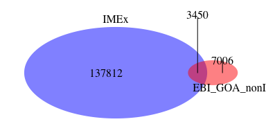
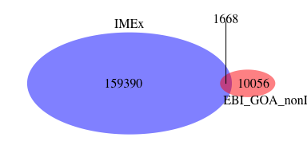

GO IPI, Gene Ontology - Inferred from Physical Interaction - dataset generator
========================================================

#### Load Gene Ontology


I download the latest version of the GO annotations (UniProt KnowledgeBase (UniProtKB), IntAct protein complexes, and RNAcentral identifiers - multispecies) data from geneontology.org. Current file was downloaded on Thu Mar  2 11:18:39 2017. 


```r
if(!file.exists("./source_files/goa_uniprot_all_noiea.gaf.gz")){
        GO_url = "http://geneontology.org/gene-associations/goa_uniprot_all_noiea.gaf.gz"
        download(GO_url, destfile = "./source_files/goa_uniprot_all_noiea.gaf.gz")
}
gunzip(filename = "./source_files/goa_uniprot_all_noiea.gaf.gz", destname = "./source_files/goa_uniprot_all_noiea.gaf", remove = F)
readLines("./source_files/goa_uniprot_all_noiea.gaf", n = 10)
```

```
##  [1] "!gaf-version: 2.0"                                                                                                         
##  [2] "!Project_name: UniProt GO Annotation program (UniProt-GOA)"                                                                
##  [3] "!URL: http://www.ebi.ac.uk/GOA"                                                                                            
##  [4] "!Contact Email: goa@ebi.ac.uk"                                                                                             
##  [5] "!"                                                                                                                         
##  [6] "!This file contains all GO annotations and gene product information for proteins in the UniProt KnowledgeBase (UniProtKB),"
##  [7] "!IntAct protein complexes, and RNAcentral identifiers."                                                                    
##  [8] "!"                                                                                                                         
##  [9] "!Generated: 2017-02-13 16:27"                                                                                              
## [10] "!GO-version: http://purl.obolibrary.org/obo/go/releases/2017-02-11/go.owl"
```
Format description - http://www.geneontology.org/page/go-annotation-file-format-20.

Reading and filtering GO by evidence code "IPI" - Inferred from Physical Interaction (http://www.geneontology.org/page/ipi-inferred-physical-interaction).


```r
GO = fread("./source_files/goa_uniprot_all_noiea.gaf", skip = 11, header = F, sep = "\t", colClasses = "character")
```

```
## 
Read 45.6% of 1338386 rows
Read 87.4% of 1338386 rows
Read 1338386 rows and 17 (of 17) columns from 0.215 GB file in 00:00:04
```

```r
GO_IPI = unique(GO[V7 == "IPI",])
unlink(c("./source_files/goa_uniprot_all_noiea.gaf"))
```

Below you can see how many of GO IPI annotations (not how many interacting pairs) records originate from each source database.


```r
GO_IPI[,table(V15)]
```

```
## V15
##           AgBase            AspGD          BHF-UCL            CACAO 
##              777               16               74                1 
##              CGD            DFLAT          FlyBase           GeneDB 
##               22                4                7              126 
##       GO_Central               GR             HGNC           IntAct 
##               15                3                3             4516 
##              MGI          MTBBASE ParkinsonsUK-UCL        PseudoCAP 
##               26              504               14                7 
##          UniProt         WormBase 
##             1385                3
```

Generating a list of PMIDs that have been curated into GO IPI annotations


```r
GO_IPI_publications = GO_IPI[,.(GO_IPI_pmids = unique(gsub("^PMID:", "", V6)))]

write.table(GO_IPI_publications, "./results/GO_IPI_pmids.txt", quote=F, sep ="\t", row.names = F, col.names = T)
```

2288 publications are curated into GO IPI annotations 

#### Compare GO IPI publications to IMEx 


```r
imex = fread("https://raw.githubusercontent.com/pporrasebi/darkspaceproject/master/IMEx/results/imex_full.txt", header = T, sep = "\t", colClasses = "character")
N_pubid_imex = length(imex[,unique(pubid)])
N_pubid_GO_IPI = length(GO_IPI_publications$GO_IPI_pmids)
N_pubid_overlap = sum(!is.na(match(GO_IPI_publications$GO_IPI_pmids, imex[,unique(pubid)])))

venn.d = draw.pairwise.venn(area1 = N_pubid_imex, area2 = N_pubid_GO_IPI, cross.area = N_pubid_overlap, category = c("IMEx", "GO_IPI"), 
                          lty = rep("blank", 2), 
                          fill = c("blue", "red"), 
                          alpha = rep(0.5, 2), cat.pos = c(0, 135), 
                          cat.dist = rep(0.035, 2), 
                          cat.cex = c(1,1), scaled = TRUE, euler.d = TRUE,  margin = 0.05,
                          direct.area = TRUE,
                          cex = 1)
```

<!-- -->


Transforming the data to get interacting pairs, and save the table of interacting pairs, publication IDs and GO IPI tag.


```r
# selecting necessary columns
GO_IPI_pairs = GO_IPI[,.(ida = V2, idb = V8, pubid = V6, GO_IPI = 1)]
# expanding frow/with column (for the cases when frow/with column contains more that 1 identifier) to get pairs of interactions
idbz = GO_IPI_pairs[, tstrsplit(x = as.character(idb), split = "|",fixed = TRUE)]
GO_IPI_pairs = GO_IPI_pairs[, data.table(ida = ida, idbz, pubid = pubid, GO_IPI = GO_IPI)]
GO_IPI_pairs = melt(GO_IPI_pairs,measure.vars = patterns("^V[[:digit:]]+"), value.name = "idb", na.rm = T)
GO_IPI_pairs[, variable := NULL]
idbz = GO_IPI_pairs[, tstrsplit(x = as.character(idb), split = ",",fixed = TRUE)]
GO_IPI_pairs = GO_IPI_pairs[, data.table(ida = ida, idbz, pubid = pubid, GO_IPI = GO_IPI)]
GO_IPI_pairs = melt(GO_IPI_pairs, measure.vars = patterns("^V[[:digit:]]+"), value.name = "idb", na.rm = T)
GO_IPI_pairs[, variable := NULL]
# Cleaning idb of the database of origin
GO_IPI_pairs[, idb := gsub("^[[:alpha:]]+:","",idb)]
# Cleaning publication identifiers of "PMID:"
GO_IPI_pairs[, pubid := gsub("^PMID:", "", pubid)]
# generating interacting pairs
GO_IPI_pairs[, pair_id := apply(data.table(ida,idb,stringsAsFactors = F), 1,
                                               function(a) { z = sort(a)
                                               paste0(z[1],"_",z[2]) })]
# cleaning ids of isoform information
GO_IPI_pairs[, ida_clean := gsub("-[[:digit:]]+$","",ida)]
GO_IPI_pairs[, idb_clean := gsub("-[[:digit:]]+$","",idb)]
# cleaning ids of postprocessing information :PRO_[[:digit:]]+
GO_IPI_pairs[, ida_clean := gsub(":PRO_[[:digit:]]+$","",ida_clean)]
GO_IPI_pairs[, idb_clean := gsub(":PRO_[[:digit:]]+$","",idb_clean)]
# generating interacting pairs without isoform information
GO_IPI_pairs[, pair_id_clean := apply(data.table(ida_clean,idb_clean,stringsAsFactors = F), 1,
                                               function(a) { z = sort(a)
                                               paste0(z[1],"_",z[2]) })]
GO_IPI_pairs = GO_IPI_pairs[,.(ida, idb, pair_id, ida_clean, idb_clean, pair_id_clean, pubid, GO_IPI)]
fwrite(x = unique(GO_IPI_pairs), 
       file = "./processed_files/pairs_pmids_GO_IPI.txt", sep = "\t")
N_GO_IPI = length(GO_IPI_pairs[,unique(pair_id_clean)])
```

The GO IPI dataset contains 4301 interacting pairs. 

Saving the table of interacting pairs, publication IDs and GO IPI tag.

```r
fwrite(x = unique(GO_IPI_pairs[, .(pair_id_clean, pubid, GO_IPI)]), 
       file = "./results/pairs_pmids_GO_IPI.txt", sep = "\t")
```

#### Compare BioGRID interactions and publications to IMEx 

I calculate how many interactions in GO IPI dataset match to IMEx.


```r
N_imex = length(imex[,unique(pair_id_clean)])
N_GO_IPI = length(GO_IPI_pairs[,unique(pair_id_clean)])
N_overlap = sum(!is.na(match(GO_IPI_pairs[,unique(pair_id_clean)], imex[,unique(pair_id_clean)])))

venn.d = draw.pairwise.venn(area1 = N_imex, area2 = N_GO_IPI, cross.area = N_overlap, category = c("IMEx", "GO_IPI"), 
                          lty = rep("blank", 2), 
                          fill = c("blue", "red"), 
                          alpha = rep(0.5, 2), cat.pos = c(0, 135), 
                          cat.dist = rep(0.035, 2), 
                          cat.cex = c(1,1), scaled = TRUE, euler.d = TRUE,  margin = 0.05,
                          direct.area = TRUE,
                          cex = 1)
```

<!-- -->

I calculate how many interactions published in specific articles (the same interaction can come from different publications) in GO IPI dataset match to IMEx.


```r
N_pub_int_imex = length(imex[,unique(paste0(pubid,"_",pair_id_clean))])
N_pub_int_GO_IPI = length(GO_IPI_pairs[,unique(paste0(pubid,"_",pair_id_clean))])
N_pub_int_overlap = sum(!is.na(match(GO_IPI_pairs[,unique(paste0(pubid,"_",pair_id_clean))], imex[,unique(paste0(pubid,"_",pair_id_clean))])))

venn.d = draw.pairwise.venn(area1 = N_pub_int_imex, area2 = N_pub_int_GO_IPI, cross.area = N_pub_int_overlap, category = c("IMEx", "GO_IPI"), 
                          lty = rep("blank", 2), 
                          fill = c("blue", "red"), 
                          alpha = rep(0.5, 2), cat.pos = c(0, 135), 
                          cat.dist = rep(0.035, 2), 
                          cat.cex = c(1,1), scaled = TRUE, euler.d = TRUE,  margin = 0.05,
                          direct.area = TRUE,
                          cex = 1)
```

<!-- -->
