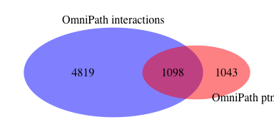
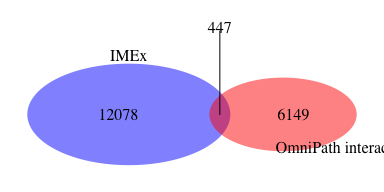

OmniPath dataset generator
========================================================

#### Load OmniPath data


I download the latest version of the OmniPath data from OmniPath website: interaction table (source-target) and post-translational modifications table (enzyme-substrate). Current file was downloaded on Thu Feb 27 13:34:24 2020. PMID: 27898060


```r
interactions_url = "http://omnipathdb.org/interactions/?fields=sources&fields=references"
ptm_url = "http://omnipathdb.org/ptms/?fields=sources&fields=references"
interactions_file = "./source_files/OmniPath_interactions.txt"
ptm_file = "./source_files/OmniPath_ptms.txt"
if(!file.exists(interactions_file)) download(interactions_url,interactions_file)
if(!file.exists(ptm_file)) download(ptm_url,ptm_file)
```


#### Interactions dataset 

Interaction table contains the following information:

```r
interactions = fread(interactions_file, colClasses = "character")
colnames(interactions)
```

```
## [1] "source"         "target"         "is_directed"    "is_stimulation"
## [5] "is_inhibition"  "sources"        "references"     "dip_url"
```


```r
interactions[,table(is_directed)]
```

```
## is_directed
##     0     1 
##  2686 46384
```

Interaction data comes from these sources:


```r
unique(as.character(interactions[, reshape2::melt(tstrsplit(sources, ";"), na.rm = T)]$value))
```

```
##  [1] "PhosphoPoint"     "Laudanna_effects" "Signor"           "BioGRID"         
##  [5] "STRING"           "InnateDB"         "DEPOD"            "phosphoELM"      
##  [9] "PhosphoSite_dir"  "HPRD-phos"        "SignaLink3"       "IntAct"          
## [13] "HPRD"             "dbPTM"            "MIMP"             "PhosphoSite"     
## [17] "TRIP"             "CA1"              "KEGG"             "SPIKE"           
## [21] "CancerCellMap"    "Laudanna_sigflow" "MatrixDB"         "Macrophage"      
## [25] "ACSN"             "DOMINO"           "ELM"              "MPPI"            
## [29] "DeathDomain"      "NRF2ome"          "ARN"              "LMPID"           
## [33] "PhosphoNetworks"  "Li2012"           "Wang"             "DIP"             
## [37] "Guide2Pharma"     "PDZBase"
```


```r
# generating interacting pairs
interactions[, pair_id_clean := apply(data.table(source,target,stringsAsFactors = F), 1,
                                               function(a) { z = sort(a)
                                               paste0(z[1],"_",z[2]) })]
# extracting references
interactions = unique(interactions)
interactions = interactions[, .(pair_id_clean, source, target, unlist(strsplit(references, ";")), sources, is_directed, is_stimulation, is_inhibition, taxon = "9606", OmniPath_interactions = 1), by = paste0(source,target)]
interactions[,paste0 := NULL]
setnames(interactions, colnames(interactions)[4],"pubid")
setnames(interactions, colnames(interactions)[c(2,3)],c("ida_clean","idb_clean"))
interactions = unique(interactions)
# filtering our interactions coming from IntAct, DIP, HPRD, STRING, InnateDB, MatrixDB and BioGRID
interactions = interactions[-unique(c(grep("BioGRID",sources), grep("IntAct",sources), grep("DIP",sources), grep("HPRD",sources), grep("STRING",sources), grep("InnateDB",sources), grep("MatrixDB",sources))),]
# saving detailed OmniPath_interactions table with standard columns
fwrite(x = interactions, 
       file = "./results/pairs_pmids_OmniPath_interactions_detailed.txt", sep = "\t")
# saving minimal OmniPath_interactions table with standard columns
interactions_s = interactions[, .(pair_id_clean, ida_clean, idb_clean, pubid, taxon, OmniPath_interactions)]
fwrite(x = unique(interactions_s), 
       file = "./results/pairs_pmids_OmniPath_interactions_minimal.txt", sep = "\t")
```

The total number of interacting pairs in the filtered by database interaction dataset: 5917

The total number of articles where evidence comes from (in the filtered by database interaction dataset): 6596  

#### Post-translational modifications dataset

Post-translational modification data comes from these sources:


```r
ptm = fread(ptm_file, colClasses = "character")
unique(as.character(ptm[, reshape2::melt(tstrsplit(sources, ";"), na.rm = T)]$value))
```

```
## [1] "phosphoELM"      "Signor"          "MIMP"            "PhosphoSite"    
## [5] "HPRD"            "PhosphoNetworks" "dbPTM"           "Li2012"
```

Post-translational modifications table contains the following information:

```r
colnames(ptm)
```

```
## [1] "enzyme"         "substrate"      "residue_type"   "residue_offset"
## [5] "modification"   "sources"        "references"
```


```r
ptm[,table(modification)]
```

```
## modification
##          acetylation           alkylation            amidation 
##                  113                    1                    2 
##        carboxylation             cleavage        deacetylation 
##                   12                   11                   11 
##        Deacetylation        demethylation    dephosphorylation 
##                    1                    2                  294 
##     deubiquitination        glycosylation        hydroxylation 
##                    2                    3                    2 
##          methylation       myristoylation          neddylation 
##                   83                    2                    2 
##       palmitoylation      phosphorylation          prenylation 
##                    4                14804                    2 
## proteolytic cleavage            sulfation          sumoylation 
##                  199                    3                   48 
##       ubiquitination 
##                   22
```


```r
# generating ptm pairs
ptm = ptm[, pair_id_clean := apply(data.table(enzyme,substrate,stringsAsFactors = F), 1,
                                               function(a) { z = sort(a)
                                               paste0(z[1],"_",z[2]) })]
# extracting references
ptm = unique(ptm)
ptm = ptm[, .(pair_id_clean, enzyme, substrate, references, sources, residue_type, residue_offset, modification, taxon = "9606", OmniPath_ptm = 1), by = paste0(enzyme, substrate, residue_offset, modification)]
ptm = cSplit(
  ptm,
  splitCols = "references",
  sep = ";",
  direction = "long",
  drop = F
)

ptm[,paste0 := NULL]
setnames(ptm, colnames(ptm)[4],"pubid")
setnames(ptm, colnames(ptm)[c(2,3)],c("ida_clean","idb_clean"))
ptm = unique(ptm)
# filtering our ptm interactions coming from HPRD
ptm = ptm[-unique(grep("HPRD",sources)),]
# saving detailed OmniPath_interactions table with standard columns
fwrite(x = ptm, 
       file = "./results/pairs_pmids_OmniPath_ptm_interactions_detailed.txt", sep = "\t")
# saving minimal OmniPath_interactions table with standard columns
ptm_s = ptm[, .(pair_id_clean, ida_clean, idb_clean, pubid, taxon, OmniPath_ptm)]
fwrite(x = unique(ptm_s), 
       file = "./results/pairs_pmids_OmniPath_ptm_interactions_minimal.txt", sep = "\t")
```

The total number of interacting pairs in the filtered by database interaction dataset: 2141  

The total number of articles where evidence comes from (in the filtered by database interaction dataset): 2606    


I create a list of PMIDs that serve as the evidence for the interaction dataset  


```r
interactions_pmids <- data.frame(unique(interactions$pubid))
write.table(interactions_pmids, "./results/OmniPath_interactions_pmids.txt", quote=F, sep ="\t", row.names = F, col.names = T)
```

6596 publications serve as the evidence for the interaction dataset   

I create a list of PMIDs that serve as the evidence for the ptm dataset  


```r
ptm_pmids <- data.frame(unique(ptm$pubid))
write.table(ptm_pmids, "./results/OmniPath_ptm_interactions_pmids.txt", quote=F, sep ="\t", row.names = F, col.names = T)
```

2606 publications serve as the evidence for the ptm dataset   

#### Compare interaction and ptm datasets

I calculate how many interactions in interaction dataset match to ptm dataset  


```r
N_interactions = length(interactions[,unique(pair_id_clean)])
N_ptm = length(ptm[,unique(pair_id_clean)])
N_overlap = sum(!is.na(match(ptm[,unique(pair_id_clean)], interactions[,unique(pair_id_clean)])))

venn.d = draw.pairwise.venn(area1 = N_interactions, area2 = N_ptm, cross.area = N_overlap, category = c("OmniPath interactions", "OmniPath ptm"), 
                          lty = rep("blank", 2), 
                          fill = c("blue", "red"), 
                          alpha = rep(0.5, 2), cat.pos = c(0, 135), 
                          cat.dist = rep(0.035, 2), 
                          cat.cex = c(1,1), scaled = TRUE, euler.d = TRUE,  margin = 0.05,
                          direct.area = TRUE,
                          cex = 1)
```

<!-- -->


#### Compare OmniPath interaction dataset and the publications evidence for it to IMEx 

I calculate how many interactions in OmniPath interaction dataset match to IMEx.  


```r
imex = fread("https://raw.githubusercontent.com/pporrasebi/darkspaceproject/master/IMEx/results/imex_full.txt", header = T, sep = "\t", colClasses = "character")
imex_human = imex[taxid_a == "9606" | taxid_b == "9606",]
N_imex = length(imex_human[,unique(pair_id_clean)])
N_OmniPath = length(interactions[,unique(pair_id_clean)])
N_overlap = sum(!is.na(match(interactions[,unique(pair_id_clean)], imex_human[,unique(pair_id_clean)])))

venn.d = draw.pairwise.venn(area1 = N_imex, area2 = N_OmniPath, cross.area = N_overlap, category = c("IMEx", "OmniPath interactions"), 
                          lty = rep("blank", 2), 
                          fill = c("blue", "red"), 
                          alpha = rep(0.5, 2), cat.pos = c(0, 135), 
                          cat.dist = rep(0.035, 2), 
                          cat.cex = c(1,1), scaled = TRUE, euler.d = TRUE,  margin = 0.05,
                          direct.area = TRUE,
                          cex = 1)
```

<!-- -->

I calculate how many publications in OmniPath match to IMEx.  


```r
N_pubid_imex = length(imex_human[,unique(pubid)])
N_pubid_OmniPath = length(interactions[,unique(pubid)])
N_pubid_overlap = sum(!is.na(match(interactions[,unique(pubid)], imex_human[,unique(pubid)])))

venn.d = draw.pairwise.venn(area1 = N_pubid_imex, area2 = N_pubid_OmniPath, cross.area = N_pubid_overlap, category = c("IMEx", "OmniPath interactions"), 
                          lty = rep("blank", 2), 
                          fill = c("blue", "red"), 
                          alpha = rep(0.5, 2), cat.pos = c(0, 135), 
                          cat.dist = rep(0.035, 2), 
                          cat.cex = c(1,1), scaled = TRUE, euler.d = TRUE,  margin = 0.05,
                          direct.area = TRUE,
                          cex = 1)
```

<!-- -->

I calculate how many interactions published in specific articles (the same interaction can have evidence from different publications) in OmniPath match to IMEx.  


```r
N_pub_int_imex = length(imex_human[,unique(paste0(pubid,"_",pair_id_clean))])
N_pub_int_OmniPath = length(interactions[,unique(paste0(pubid,"_",pair_id_clean))])
N_pub_int_overlap = sum(!is.na(match(interactions[,unique(paste0(pubid,"_",pair_id_clean))], imex_human[,unique(paste0(pubid,"_",pair_id_clean))])))

venn.d = draw.pairwise.venn(area1 = N_pub_int_imex, area2 = N_pub_int_OmniPath, cross.area = N_pub_int_overlap, category = c("IMEx", "OmniPath interactions"), 
                          lty = rep("blank", 2), 
                          fill = c("blue", "red"), 
                          alpha = rep(0.5, 2), cat.pos = c(0, 135), 
                          cat.dist = rep(0.035, 2), 
                          cat.cex = c(1,1), scaled = TRUE, euler.d = TRUE,  margin = 0.05,
                          direct.area = TRUE,
                          cex = 1)
```

<!-- -->
