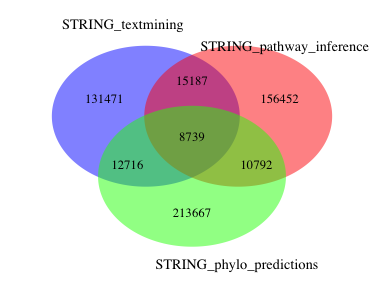
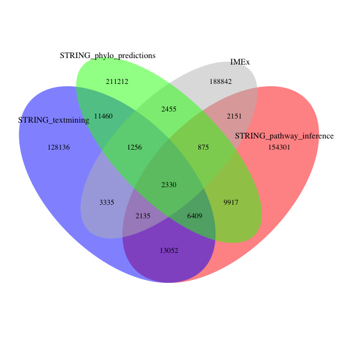

STRING dataset generator
========================================================

#### Load STRING data


I download the latest version of the STRING data for human from STRING website: MITAB2.5. Current file was downloaded on Mon Apr  3 15:16:22 2017. 


```r
# STRING_protein.links.full_url = "http://string.uzh.ch/download/protected/string_10/protein.links.full.v10/9606.protein.links.full.v10.txt.gz"
# STRING_protein.links.full_file_gz = "./source_files/9606.protein.links.full.v10.txt.gz"
# STRING_protein.links.full_file = "./source_files/9606.protein.links.full.v10.txt"
# if(!file.exists(STRING_protein.links.full_file_gz)) {
# string_get = GET(STRING_protein.links.full_url,  authenticate("pabloporras", "Rzpstqj3"))
# string = content(string_get, type = "text/tab-separated-values")
# fwrite(string, STRING_protein.links.full_file)
# gzip(filename = STRING_protein.links.full_file, destname = STRING_protein.links.full_file_gz)
# unlink(STRING_protein.links.full_file)
# }

# gunzip(filename = STRING_protein.links.full_file_gz, destname = STRING_protein.links.full_file, remove = F, overwrite = T)
# string = fread(STRING_protein.links.full_file)
# unlink(STRING_protein.links.full_file)

# filter out transferred scores
# string = string[, -grep("_transferred", colnames(string)), with = F]
```


```r
STRING_mitab_25_url = "http://string-db.org/download/psicquic-mitab_2.5.v10/9606.psicquic-mitab_2.5.v10.txt.gz"
STRING_mitab_25_file_gz = "./source_files/9606.psicquic-mitab_2.5.v10.txt.gz"
STRING_mitab_25_file = "./source_files/9606.psicquic-mitab_2.5.v10.txt"
if(!file.exists(STRING_mitab_25_file_gz)) download(STRING_mitab_25_url,STRING_mitab_25_file_gz)
gunzip(STRING_mitab_25_file_gz, remove = F, overwrite = T)
# Reading the table, cleaning
STRING_mitab = fread(STRING_mitab_25_file, colClasses = "character", header = F)
```

```
## 
Read 59.8% of 752997 rows
Read 752997 rows and 15 (of 15) columns from 0.367 GB file in 00:00:03
```

```r
unlink(STRING_mitab_25_file)
STRING_proc = STRING_mitab[,.(ida = V1, idb = V2, method = V7, taxida = V10, taxidb = V11, interaction_type = V12, database = V13, score = V15)]
STRING_proc[, ida_ENSP := gsub("^string:9606\\.","", ida)]
STRING_proc[, ida_ENSP := gsub("\\|uniprotkb:.+$","", ida_ENSP)]
STRING_proc[, idb_ENSP := gsub("^string:9606\\.","", idb)]
STRING_proc[, idb_ENSP := gsub("\\|uniprotkb:.+$","", idb_ENSP)]
STRING_proc[, score := gsub("^score:","", score)]
```


```r
string_proteins = STRING_proc[,unique(c(ida_ENSP, idb_ENSP))]
# map ENSEMBL_PROTEIN to UNIPROTKB
uniprot = UniProt.ws(taxId=9606)
# getting names of the keys and columns from Uniprot
# keytypes(uniprot)
# mapping IDs
string_proteins_up = data.table()
for(i in seq(1, length(string_proteins),500)){
ENSP2uniprot_temp <- as.data.table(select(uniprot, 
               keys = string_proteins[i:(i+500)], 
               columns = c("ENSEMBL_PROTEIN", "UNIPROTKB"),
               keytype = "ENSEMBL_PROTEIN"))
ENSP2uniprot = copy(ENSP2uniprot_temp[complete.cases(ENSP2uniprot_temp),])
string_proteins_up = rbind(string_proteins_up, ENSP2uniprot)
}
string_proteins_up = unique(string_proteins_up)

# mapping IDs for the first interactor
colnames(string_proteins_up)[2] = "ida_up"
STRING_proc = merge(x=STRING_proc,y=string_proteins_up, by.x = "ida_ENSP", by.y = "ENSEMBL_PROTEIN", all.x  = T, all.y = F)
# mapping IDs for the second interactor
colnames(string_proteins_up)[2] = "idb_up"
STRING_proc = merge(x=STRING_proc,y=string_proteins_up, by.x = "idb_ENSP", by.y = "ENSEMBL_PROTEIN", all.x = T, all.y = F)
STRING_proc = STRING_proc[complete.cases(STRING_proc)]
```


```r
STRING_proc[, sort(table(method), decreasing = T)]
```

```
## method
##                 psi-mi:"MI:0064"(interologs mapping) 
##                                               242926 
##                          psi-mi:"MI:0362"(inference) 
##                                               191170 
##             psi-mi:"MI:0087"(predictive text mining) 
##                                               168113 
## psi-mi:"MI:0045"(experimental interaction detection) 
##                                                89715 
##               psi-mi:"MI:0085"(phylogenetic profile) 
##                                                 2874 
##                      psi-mi:"MI:0036"(domain fusion) 
##                                                  114
```

```r
# generating interacting pairs
STRING_proc[, pair_id_clean := apply(data.table(ida_up,idb_up,stringsAsFactors = F), 1,
                                               function(a) { z = sort(a)
                                               paste0(z[1],"_",z[2]) })]

STRING_textmining = STRING_proc[method == "psi-mi:\"MI:0087\"(predictive text mining)",]
STRING_textmining[, sort(table(database), decreasing = T)]
```

```
## psi-mi:"MI:1014"(string) 
##                   168113
```

```r
STRING_pathway_inference = STRING_proc[method %in% c("psi-mi:\"MI:0362\"(inference)"),]
STRING_pathway_inference[, sort(table(database), decreasing = T)][1:20]
```

```
## database
##                                                 psi-mi:"MI:0467"(reactome)|psi-mi:"MI:0470"(kegg_pathways) 
##                                                                                                      62966 
##                                                                                 psi-mi:"MI:0467"(reactome) 
##                                                                                                      54243 
##                                                                            psi-mi:"MI:0470"(kegg_pathways) 
##                                                                                                      24011 
##                                                                            psi-mi:"MI:0448"(gene_ontology) 
##                                                                                                       7041 
##                                                                                      psi-mi:"MI:1107"(pid) 
##                                                                                                       4335 
##                                                      psi-mi:"MI:1107"(pid)|psi-mi:"MI:0470"(kegg_pathways) 
##                                                                                                       3002 
##                                                                                 psi-mi:"MI:1108"(biocarta) 
##                                                                                                       2218 
##                                                        psi-mi:"MI:0469"(intact)|psi-mi:"MI:0467"(reactome) 
##                                                                                                       1935 
##                                 psi-mi:"MI:0469"(intact)|psi-mi:"MI:0467"(reactome)|psi-mi:"MI:0471"(mint) 
##                                                                                                       1755 
##                                            psi-mi:"MI:0470"(kegg_pathways)|psi-mi:"MI:0448"(gene_ontology) 
##                                                                                                       1437 
##                                                 psi-mi:"MI:1108"(biocarta)|psi-mi:"MI:0470"(kegg_pathways) 
##                                                                                                       1211 
##                                                       psi-mi:"MI:0467"(reactome)|psi-mi:"MI:0463"(biogrid) 
##                                                                                                       1067 
##                 psi-mi:"MI:0467"(reactome)|psi-mi:"MI:0470"(kegg_pathways)|psi-mi:"MI:0448"(gene_ontology) 
##                                                                                                       1063 
##                        psi-mi:"MI:0469"(intact)|psi-mi:"MI:0467"(reactome)|psi-mi:"MI:0470"(kegg_pathways) 
##                                                                                                       1060 
##                           psi-mi:"MI:1107"(pid)|psi-mi:"MI:0467"(reactome)|psi-mi:"MI:0470"(kegg_pathways) 
##                                                                                                        795 
##          psi-mi:"MI:0469"(intact)|psi-mi:"MI:0738"(pride)|psi-mi:"MI:0467"(reactome)|psi-mi:"MI:1042"(pmc) 
##                                                                                                        704 
## psi-mi:"MI:0469"(intact)|psi-mi:"MI:0467"(reactome)|psi-mi:"MI:0470"(kegg_pathways)|psi-mi:"MI:0471"(mint) 
##                                                                                                        660 
##                                                   psi-mi:"MI:0469"(intact)|psi-mi:"MI:0448"(gene_ontology) 
##                                                                                                        633 
##                       psi-mi:"MI:0467"(reactome)|psi-mi:"MI:0470"(kegg_pathways)|psi-mi:"MI:0463"(biogrid) 
##                                                                                                        537 
##                                psi-mi:"MI:0469"(intact)|psi-mi:"MI:0738"(pride)|psi-mi:"MI:0467"(reactome) 
##                                                                                                        528
```

```r
STRING_phylo_predictions = STRING_proc[method %in% c("psi-mi:\"MI:0064\"(interologs mapping)","psi-mi:\"MI:0085\"(phylogenetic profile)", "psi-mi:\"MI:0036\"(domain fusion)"),]
STRING_phylo_predictions[, sort(table(database), decreasing = T)]
```

```
## psi-mi:"MI:1014"(string) 
##                   245914
```

```r
# STRING_proc = STRING_proc[-grep("intact", database),]
# STRING_proc = STRING_proc[-grep("biogrid", database),]
# STRING_proc = STRING_proc[-grep("reactome", database),]
# STRING_proc = STRING_proc[-grep("hprd", database),]
# STRING_proc = STRING_proc[-grep("mint", database),]
# STRING_proc = STRING_proc[-grep("dip", database),]
# STRING_proc = STRING_proc[-grep("bind", database),]
```


```r
# saving STRING_textmining table with standard columns
STRING_textmining = STRING_textmining[,.(pair_id_clean, ida_clean = ida_up, idb_clean = idb_up, taxon = "9606", STRING_score = score, database, STRING_textmining = 1)]
fwrite(x = unique(STRING_textmining), 
       file = "./results/pairs_STRING_textmining.txt", sep = "\t")
# saving STRING_pathway_inference table with standard columns
STRING_pathway_inference = STRING_pathway_inference[,.(pair_id_clean, ida_clean = ida_up, idb_clean = idb_up, taxon = "9606", STRING_score = score, database, STRING_pathway_inference = 1)]
fwrite(x = unique(STRING_pathway_inference), 
       file = "./results/pairs_STRING_pathway_inference.txt", sep = "\t")
# saving STRING_phylo_predictions table with standard columns
STRING_phylo_predictions = STRING_phylo_predictions[,.(pair_id_clean, ida_clean = ida_up, idb_clean = idb_up, taxon = "9606", STRING_score = score, database, STRING_phylo_predictions = 1)]
fwrite(x = unique(STRING_phylo_predictions), 
       file = "./results/pairs_STRING_phylo_predictions.txt", sep = "\t")
```

The total number of interacting pairs in the filtered by database STRING_textmining dataset: 167611

The total number of interacting pairs in the filtered by database STRING_pathway_inference dataset: 191043 

The total number of interacting pairs in the filtered by database STRING_phylo_predictions dataset: 242030 

#### Compare STRING "textmining", "pathway inference", "phylogeny and homology-based predictions" datasets

I calculate how many interactions overlap between different STRING datasets.


```r
area1 = STRING_textmining[STRING_textmining == 1,.N]
area2 = STRING_pathway_inference[STRING_pathway_inference == 1,.N]
area3 = STRING_phylo_predictions[STRING_phylo_predictions == 1,.N]
n12 = sum(!is.na(match(STRING_textmining[,unique(pair_id_clean)], STRING_pathway_inference[,unique(pair_id_clean)])))
n23 = sum(!is.na(match(STRING_pathway_inference[,unique(pair_id_clean)], STRING_phylo_predictions[,unique(pair_id_clean)])))
n13 = sum(!is.na(match(STRING_textmining[,unique(pair_id_clean)], STRING_phylo_predictions[,unique(pair_id_clean)])))
n123 = length(intersect(intersect(STRING_textmining$pair_id_clean,STRING_pathway_inference$pair_id_clean),STRING_phylo_predictions$pair_id_clean))

venn_Interactions_1 = draw.triple.venn(area1 = area1, 
                          area2 = area2, 
                          area3 = area3, 
                          n12 = n12, 
                          n23 = n23,
                          n13 = n13,
                          n123 = n123, 
                          category = c("STRING_textmining", 
                                       "STRING_pathway_inference", 
                                       "STRING_phylo_predictions"), 
                          lty = rep("blank", 3), 
                          fill = c("blue", "red", "green"), 
                          alpha = rep(0.5, 3), cat.pos = c(350, 25, 160), 
                          cat.dist = c(0.08,0.035, 0.08), 
                          cat.cex = c(0.9,0.9, 0.9), scaled = TRUE, euler.d = TRUE,  margin = 0.05,
                          print.mode =  'raw',
                          cex = 0.8
)
```

<!-- -->


#### Compare STRING datasets and IMEx 

I calculate how many interactions in STRING datasets match to IMEx.  


```r
imex = fread("https://raw.githubusercontent.com/pporrasebi/darkspaceproject/master/IMEx/results/imex_full.txt", header = T, sep = "\t", colClasses = "character")
imex_human = imex[taxid_a == "9606" | taxid_b == "9606",]

area1 = STRING_textmining[STRING_textmining == 1,.N]
area2 = STRING_pathway_inference[STRING_pathway_inference == 1,.N]
area3 = STRING_phylo_predictions[STRING_phylo_predictions == 1,.N]
area4 = imex_human[,length(unique(pair_id))]
n12 = sum(!is.na(match(STRING_textmining[,unique(pair_id_clean)], STRING_pathway_inference[,unique(pair_id_clean)])))
n13 = sum(!is.na(match(STRING_textmining[,unique(pair_id_clean)], STRING_phylo_predictions[,unique(pair_id_clean)])))
n14 = sum(!is.na(match(STRING_textmining[,unique(pair_id_clean)], imex_human[,unique(pair_id)])))
n23 = sum(!is.na(match(STRING_pathway_inference[,unique(pair_id_clean)], STRING_phylo_predictions[,unique(pair_id_clean)])))
n24 = sum(!is.na(match(STRING_pathway_inference[,unique(pair_id_clean)], imex_human[,unique(pair_id)])))
n34 = sum(!is.na(match(STRING_phylo_predictions[,unique(pair_id_clean)], imex_human[,unique(pair_id)])))
n123 = length(intersect(intersect(unique(STRING_textmining$pair_id_clean),unique(STRING_pathway_inference$pair_id_clean)),unique(STRING_phylo_predictions$pair_id_clean)))
n124 = length(intersect(intersect(unique(STRING_textmining$pair_id_clean),unique(STRING_pathway_inference$pair_id_clean)),unique(imex_human$pair_id)))
n134 = length(intersect(intersect(unique(STRING_textmining$pair_id_clean),unique(STRING_phylo_predictions$pair_id_clean)),unique(imex_human$pair_id)))
n234 = length(intersect(intersect(unique(STRING_pathway_inference$pair_id_clean),unique(STRING_phylo_predictions$pair_id_clean)),unique(imex_human$pair_id)))
n1234 = length(intersect(intersect(intersect(unique(STRING_textmining$pair_id_clean),unique(STRING_pathway_inference$pair_id_clean)),unique(STRING_phylo_predictions$pair_id_clean)), unique(imex_human$pair_id)))


venn_Interactions_1 = draw.quad.venn(area1, area2, area3, area4, n12, n13, n14, n23, n24,
    n34, n123, n124, n134, n234, n1234, 
                          category = c("STRING_textmining", 
                                       "STRING_pathway_inference", 
                                       "STRING_phylo_predictions",
                                       "IMEx"), 
                          lty = rep("blank", 4), 
                          fill = c("blue", "red", "green", "grey"), 
                          alpha = rep(0.5, 4), cat.pos = c(350, 25, 160,45), 
                          cat.dist = c(0.08,0.035, -0.08, 0.08), 
                          cat.cex = c(0.9,0.9, 0.9, 0.9), scaled = TRUE, euler.d = TRUE,  margin = 0.05,
                          print.mode =  'raw',
                          cex = 0.8
)
```

<!-- -->
