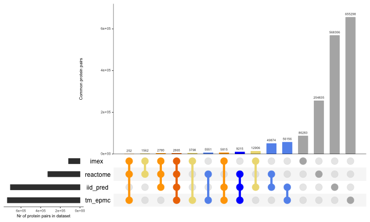
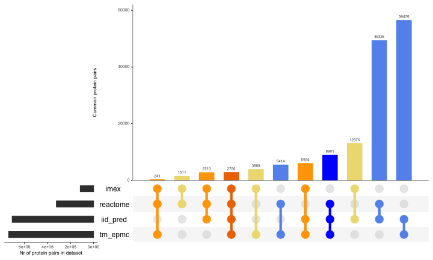
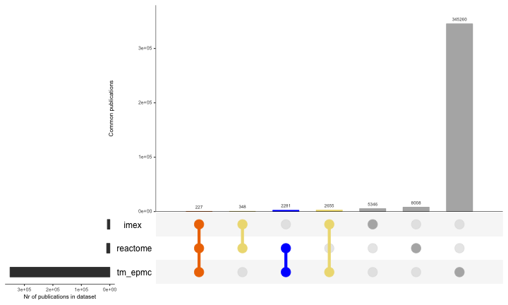
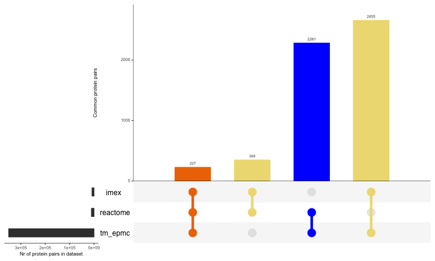

Estimating the size of the uncurated interactome
========================================================

### Synopsis

After producing tidy datasets comparing different resources to IMEx data, we put together the data and compare the overlap. 

### Part 1: Load datasets

#### IMEx dataset

I select only purely human interactions here (interactions where both proteins are human). 


```r
system("Rscript ./scripts/IMEx_ds_generator.R --save")
```

```r
imex_full <- read.delim("./results/imex_full.txt", header=T, sep="\t",colClasses="character")
imex_human <- unique(subset(imex_full,taxid_a=="9606" & taxid_b=="9606"))
library(dplyr)
imex_human$imex <- 1
imex_human_sel <- unique(select(imex_human,pair_id=pair_id_clean,pmid=pubid,imex))
imex_pairs <- unique(select(imex_human,pair_id=pair_id_clean,imex))
imex_pmids <- unique(select(imex_human,pmid=pubid,imex))
```

#### Reactome data


```r
reactome_pairs_pmids <- read.csv(gzfile("../reactome_interactions/results/pairs_pmid_reactome.txt.gz"),header=T,sep="\t",colClasses=c("character","character","numeric"))
reactome_pairs <- unique(select(reactome_pairs_pmids,pair_id,reactome))
reactome_pmids <- unique(select(reactome_pairs_pmids,pmid,reactome))
```

#### Text-mining EPMC data


```r
tm_pairs_pmids <- read.csv(gzfile("../epmc_text_mining/results/pairs_pmids_tm.txt.gz"),header=T,sep="\t",colClasses=c("character","character","numeric","numeric","numeric","numeric"))
tm_pairs_pmids_sel <- unique(select(tm_pairs_pmids,pair_id,pmid,tm_epmc=tm))
tm_pairs <- unique(select(tm_pairs_pmids,pair_id,tm_epmc=tm))
tm_pmids <- unique(select(tm_pairs_pmids,pmid,tm_epmc=tm))
```

#### IID predictions data


```r
iid_pred_pairs <- read.csv("../iid_predictions/results/pairs_iid_pred.txt",header=T,sep="\t",colClasses=c("character","numeric"))
```

### Part 2: Generating comparison dataset at the pair level


```r
all_df <- list(imex_pairs,reactome_pairs,tm_pairs,iid_pred_pairs)

comp_table <- Reduce(function(...) merge(..., all=TRUE), all_df)

# I clean and replace all NAs if present.

comp_table_final <- comp_table
comp_table_final[is.na(comp_table_final <- comp_table)] <- 0
write.table(comp_table_final,"./results/comp_table_final.txt",col.names=T,row.names=F,sep="\t",quote=F)
```

The comparison set gives a total number of 1713527 potentially interacting pairs, of which 1597266 (93.22%) are not curated in IMEx. 

I produce a plot with the summary of the overlap between the different datasets evaluated. 

##### Figure 1: Comparison between different protein association datasets


I also produce a sub-plot showing exclusively the intersections, so a more informative scale is used. 

##### Figure 2: Intersection between different protein association datasets


### Part 3: Generating comparison dataset at the publication level


```r
allpub_df <- list(imex_pmids,reactome_pmids,tm_pmids)

pubcomp_table <- Reduce(function(...) merge(..., all=TRUE), allpub_df)

# I clean and replace all NAs if present.

pubcomp_table_final <- pubcomp_table
pubcomp_table_final[is.na(pubcomp_table_final <- pubcomp_table)] <- 0
write.table(pubcomp_table_final,"./results/pubcomp_table_final.txt",col.names=T,row.names=F,sep="\t",quote=F)
```

The comparison set gives a total number of 364125 publications, of which 355549 (97.64%) are not curated in IMEx. 

I produce a plot with the summary of the overlap between the different datasets evaluated. 

##### Figure 3: Comparison between different protein association datasets at the publication level


And again, I zoom in to check only the intersections.

##### Figure 4: Intersection between different protein association datasets at the publication level


********************************************************************************************

### Appendix

#### Code for the figures

##### Figure 1: Intersection between different protein association datasets

```r
library(UpSetR)
upset(comp_table_final, 
      nsets = 4, 
      point.size = 6, 
      name.size = 12, 
      line.size = 2, 
      mainbar.y.label = "Common protein pairs", 
      sets.x.label = "Nr of protein pairs in dataset", 
      order.by="freq",
      decreasing=FALSE,
      queries = list(
              list(query = intersects, params = list("reactome","iid_pred","tm_epmc"), color = "blue", active = T),
              list(query = intersects, params = list("iid_pred","tm_epmc"), color= "cornflowerblue",active = T),
              list(query = intersects, params = list("reactome","iid_pred"), color= "cornflowerblue",active = T),
              list(query = intersects, params = list("reactome","tm_epmc"), color= "cornflowerblue",active = T),
              list(query = intersects, params = list("imex","iid_pred","reactome","tm_epmc"), color= "darkorange2",active = T),
              list(query = intersects, params = list("imex","reactome","tm_epmc"), color= "orange1",active = T),
              list(query = intersects, params = list("imex","iid_pred","tm_epmc"), color= "orange1",active = T),
              list(query = intersects, params = list("imex","iid_pred","reactome"), color= "orange1",active = T),
              list(query = intersects, params = list("imex","iid_pred"), color= "lightgoldenrod1",active = T),
              list(query = intersects, params = list("imex","reactome"), color= "lightgoldenrod1",active = T),
              list(query = intersects, params = list("imex","tm_epmc"), color= "lightgoldenrod1",active = T),
              list(query = intersects, params = list("imex"), color= "gray70",active = T),
              list(query = intersects, params = list("reactome"), color= "gray70",active = T),
              list(query = intersects, params = list("iid_pred"), color= "gray70",active = T),
              list(query = intersects, params = list("tm_epmc"), color= "gray70",active = T)))
```
##### Figure 2: Intersection between different protein association datasets (intersections only)

```r
upset(comp_table_final, 
      nsets = 4, 
      point.size = 6, 
      name.size = 12, 
      line.size = 2, 
      mainbar.y.label = "Common protein pairs", 
      sets.x.label = "Nr of protein pairs in dataset",
      order.by="freq",
      decreasing=FALSE,
      queries = list(
              list(query = intersects, params = list("reactome","iid_pred","tm_epmc"), color = "blue", active = T),
              list(query = intersects, params = list("iid_pred","tm_epmc"), color= "cornflowerblue",active = T),
              list(query = intersects, params = list("reactome","iid_pred"), color= "cornflowerblue",active = T),
              list(query = intersects, params = list("reactome","tm_epmc"), color= "cornflowerblue",active = T),
              list(query = intersects, params = list("imex","iid_pred","reactome","tm_epmc"), color= "darkorange2",active = T),
              list(query = intersects, params = list("imex","reactome","tm_epmc"), color= "orange1",active = T),
              list(query = intersects, params = list("imex","iid_pred","tm_epmc"), color= "orange1",active = T),
              list(query = intersects, params = list("imex","iid_pred","reactome"), color= "orange1",active = T),
              list(query = intersects, params = list("imex","iid_pred"), color= "lightgoldenrod1",active = T),
              list(query = intersects, params = list("imex","reactome"), color= "lightgoldenrod1",active = T),
              list(query = intersects, params = list("imex","tm_epmc"), color= "lightgoldenrod1",active = T)),
      intersections = list(
              list("reactome","iid_pred","tm_epmc"),
              list("iid_pred","tm_epmc"),
              list("reactome","iid_pred"),
              list("reactome","tm_epmc"),
              list("imex","iid_pred","reactome","tm_epmc"),
              list("imex","reactome","tm_epmc"),
              list("imex","iid_pred","tm_epmc"),
              list("imex","iid_pred","reactome"),
              list("imex","iid_pred"),
              list("imex","reactome"),
              list("imex","tm_epmc")))
```
##### Figure 3: Comparison between different protein association datasets at the publication level

```r
upset(pubcomp_table_final, 
      nsets = 4, 
      point.size = 6, 
      name.size = 12, 
      line.size = 2, 
      mainbar.y.label = "Common publications", 
      sets.x.label = "Nr of publications in dataset", 
      order.by="freq",
      decreasing=FALSE,
      queries = list(
              list(query = intersects, params = list("reactome","tm_epmc"), color = "blue", active = T),
              list(query = intersects, params = list("imex","reactome","tm_epmc"), color= "darkorange2",active = T),
              list(query = intersects, params = list("imex","reactome"), color= "lightgoldenrod2",active = T),
              list(query = intersects, params = list("imex","tm_epmc"), color= "lightgoldenrod2",active = T),
              list(query = intersects, params = list("imex"), color= "gray70",active = T),
              list(query = intersects, params = list("reactome"), color= "gray70",active = T),
              list(query = intersects, params = list("tm_epmc"), color= "gray70",active = T)))
```
##### Figure 4: Intersection between different protein association datasets at the publication level

```r
upset(pubcomp_table_final, 
      nsets = 3, 
      point.size = 6, 
      name.size = 12, 
      line.size = 2, 
      mainbar.y.label = "Common protein pairs", 
      sets.x.label = "Nr of protein pairs in dataset",
      order.by="freq",
      decreasing=FALSE,
      queries = list(
              list(query = intersects, params = list("reactome","tm_epmc"), color = "blue", active = T),
              list(query = intersects, params = list("imex","reactome","tm_epmc"), color= "darkorange2",active = T),
              list(query = intersects, params = list("imex","reactome"), color= "lightgoldenrod2",active = T),
              list(query = intersects, params = list("imex","tm_epmc"), color= "lightgoldenrod2",active = T)),
      intersections = list(
              list("reactome","tm_epmc"),
              list("imex","reactome","tm_epmc"),
              list("imex","reactome"),
              list("imex","tm_epmc")))
```
