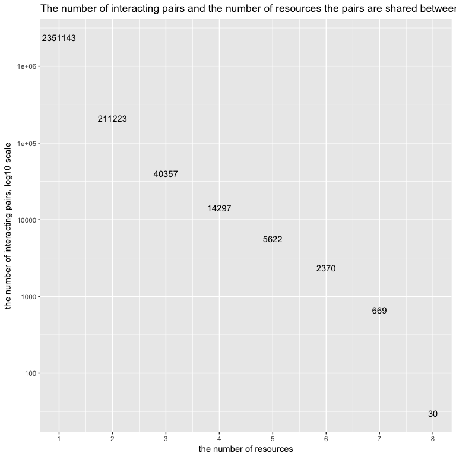
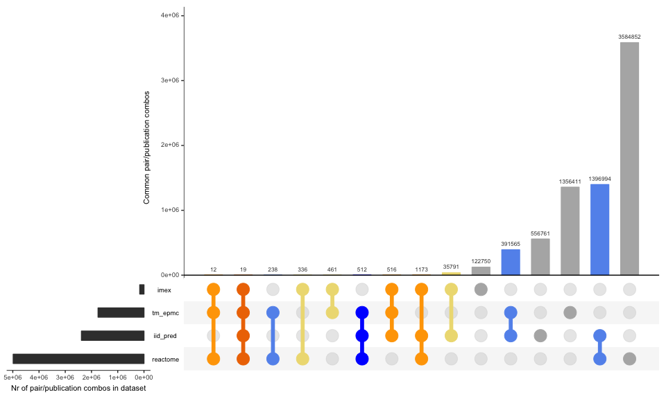
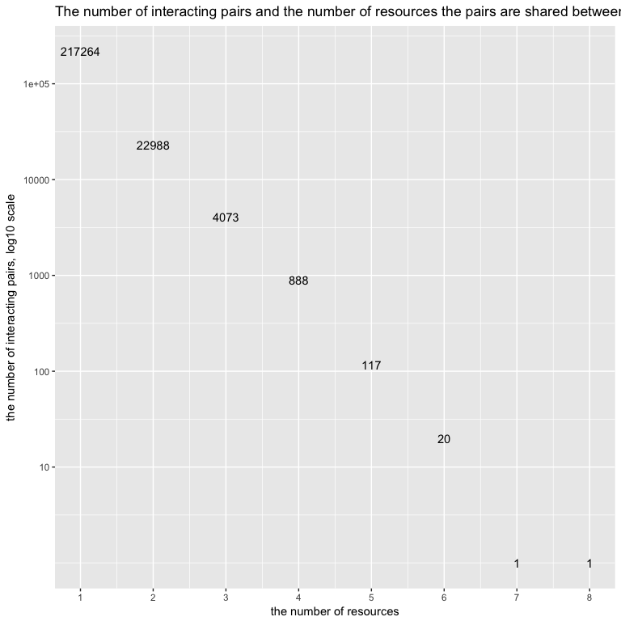
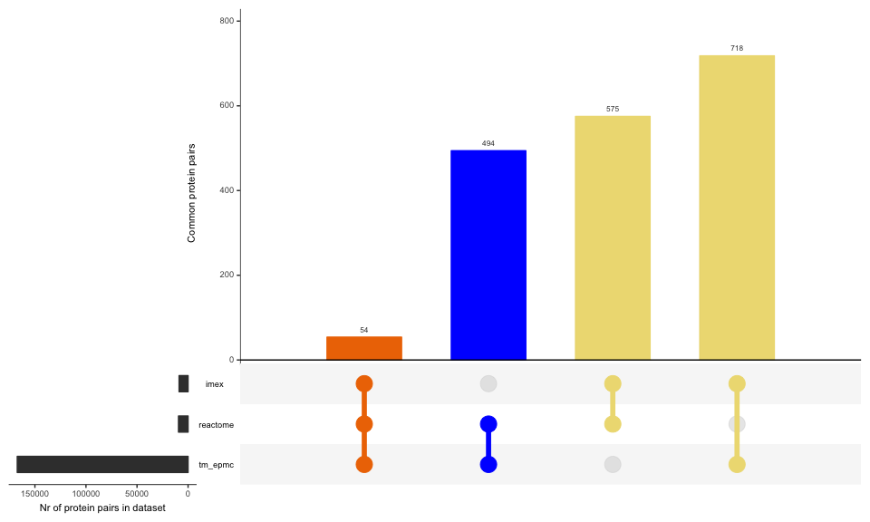
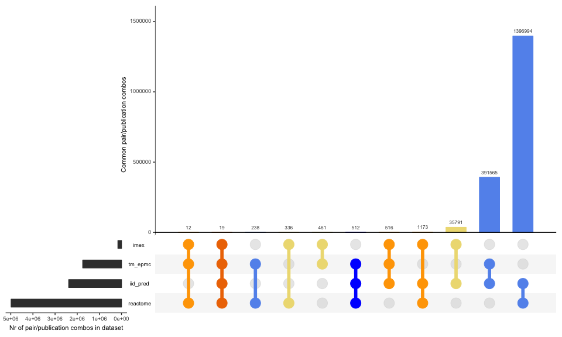

# Comparison of IMEx with other protein association datasets
Pablo Porras  
2016-12-19  

Estimating the size of the uncurated interactome
========================================================

### Synopsis

After producing tidy datasets comparing different resources to IMEx data, we put together the data and compare the overlap. 

IMPORTANT: This set of scripts assume the different referenced datasets have been freshly updated. If you need to update results of this set, please re-run the corresponding source as well. 

#### Required libraries

```r
suppressPackageStartupMessages({
library(plyr)
library(dplyr)
library(data.table)
library(UpSetR)
library(splitstackshape)
library(ggplot2)
library(shiny)
})
```
### Part 1: Load datasets

#### IMEx dataset

I select only purely human interactions here (interactions where both proteins are human). 


```r
imex_full <- fread("../IMEx/results/imex_full.txt", header=T, sep="\t",colClasses="character",data.table = T)
imex_human <- unique(subset(imex_full,taxid_a=="9606" & taxid_b=="9606"))
imex_human$imex <- 1
imex_human_sel <- unique(select(imex_human,pair_id=pair_id_clean,pmid=pubid,imex))
imex_pairs <- unique(select(imex_human,pair_id=pair_id_clean,imex))
imex_pmids <- unique(select(imex_human,pmid=pubid,imex))
```

The dataset contains 141262 protein interactions recorded in 8821 publications.

#### Reactome data


```r
setwd("../reactome_interactions/results/")
system("gunzip -k pairs_pmid_reactome.txt.gz")
reactome_pairs_pmids <- fread("pairs_pmid_reactome.txt",header=T,sep="\t",colClasses=c("character","character","numeric"),data.table = T)
system("rm pairs_pmid_reactome.txt")
setwd("../../dsp_comparison/")

reactome_pairs <- unique(select(reactome_pairs_pmids,pair_id,reactome))
reactome_pmids <- unique(select(reactome_pairs_pmids,pmid,reactome))
```

The reactome dataset contains 430095 protein associations recorded in 9381 publications. 

#### Text-mining EPMC data


```r
setwd("../epmc_text_mining/results/")
system("gunzip -k pairs_pmids_tm.txt.gz")
tm_pairs_pmids <- fread("pairs_pmids_tm.txt",header=T,sep="\t",colClasses=c("character","character","numeric"),data.table = T)
```

```
## 
Read 93.7% of 1749734 rows
Read 1749734 rows and 3 (of 3) columns from 0.041 GB file in 00:00:03
```

```r
system("rm pairs_pmids_tm.txt")
setwd("../../dsp_comparison/")

tm_pairs_pmids_sel <- unique(select(tm_pairs_pmids,pair_id,pmid,tm_epmc=tm))
tm_pairs <- unique(select(tm_pairs_pmids,pair_id,tm_epmc=tm))
tm_pmids <- unique(select(tm_pairs_pmids,pmid,tm_epmc=tm))
```

The text-mining EPMC dataset contains 959438 protein associations recorded in 167311 publications.

#### IID predictions data


```r
iid_pred_pairs <- fread("../iid_predictions/results/pairs_iid_pred.txt",header=T,sep="\t",colClasses=c("character","numeric"),data.table=T)
```

The IID-predictions dataset contains 707917 protein associations.

#### Text-mining EVEX data


```r
setwd("../EVEX/results/")
EVEX_pairs_pmids <- fread("pairs_pmids_EVEX_shallow.txt",header=T,sep="\t",colClasses=c("character","character","character","character","character","numeric"),data.table = T)
setwd("../../dsp_comparison/")

EVEX_pairs_pmids_sel <- unique(select(EVEX_pairs_pmids, pair_id=pair_id_clean, pmid=pubid,EVEX))
EVEX_pairs <- unique(select(EVEX_pairs_pmids, pair_id=pair_id_clean,EVEX))
EVEX_pmids <- unique(select(EVEX_pairs_pmids, pmid=pubid,EVEX))
```

The text-mining EVEX dataset contains 517258 protein associations recorded in 54247 publications.

#### BioGRID data


```r
setwd("../BioGRID/results/")
BioGRID_pairs_pmids <- fread("pairs_pmids_biogrid.txt",header=T,sep="\t",colClasses=c("character","character","numeric"),data.table = T)
setwd("../../dsp_comparison/")

BioGRID_pairs_pmids_sel <- unique(select(BioGRID_pairs_pmids, pair_id=pair_id_clean, pmid=pubid, BioGRID = biogrid))
BioGRID_pairs <- unique(select(BioGRID_pairs_pmids, pair_id=pair_id_clean,BioGRID = biogrid))
BioGRID_pmids <- unique(select(BioGRID_pairs_pmids, pmid=pubid,BioGRID = biogrid))
```

The BioGRID dataset contains 221403 protein associations recorded in 25307 publications.

#### GO IPI data (EBI_GOA_nonIntAct)


```r
setwd("../GO_IPI/results/")
GO_IPI_pairs_pmids <- fread("pairs_pmids_EBI_GOA_nonIntAct.txt",header=T,sep="\t",colClasses=c("character","character","numeric"),data.table = T)
setwd("../../dsp_comparison/")

GO_IPI_pairs_pmids_sel <- unique(select(GO_IPI_pairs_pmids, pair_id=pair_id_clean, pmid=pubid, GO_IPI = EBI_GOA_nonIntAct))
GO_IPI_pairs <- unique(select(GO_IPI_pairs_pmids, pair_id=pair_id_clean,GO_IPI = EBI_GOA_nonIntAct))
GO_IPI_pmids <- unique(select(GO_IPI_pairs_pmids, pmid=pubid,GO_IPI = EBI_GOA_nonIntAct))
```

The BioGRID dataset contains 10215 protein associations recorded in 5459 publications.

#### OmniPath interaction data 


```r
setwd("../OmniPath/results/")
OmniPath_interaction_pairs_pmids <- fread("pairs_pmids_OmniPath_interactions_minimal.txt",header=T,sep="\t",colClasses=c("character","character","character","character","character","numeric"),data.table = T)
setwd("../../dsp_comparison/")

OmniPath_interaction_pairs_pmids_sel <- unique(select(OmniPath_interaction_pairs_pmids, pair_id=pair_id_clean, pmid=pubid, OmniPath_interactions))
OmniPath_interaction_pairs <- unique(select(OmniPath_interaction_pairs_pmids, pair_id=pair_id_clean,OmniPath_interactions))
OmniPath_interaction_pmids <- unique(select(OmniPath_interaction_pairs_pmids, pmid=pubid,OmniPath_interactions))
```

The BioGRID dataset contains 5917 protein associations recorded in 6596 publications.

#### OmniPath ptm (post-translational modifications) data 


```r
setwd("../OmniPath/results/")
OmniPath_ptm_pairs_pmids <- fread("pairs_pmids_OmniPath_ptm_interactions_minimal.txt",header=T,sep="\t",colClasses=c("character","character","character","character","character","numeric"),data.table = T)
setwd("../../dsp_comparison/")

OmniPath_ptm_pairs_pmids_sel <- unique(select(OmniPath_ptm_pairs_pmids, pair_id=pair_id_clean, pmid=pubid, OmniPath_ptm))
OmniPath_ptm_pairs <- unique(select(OmniPath_ptm_pairs_pmids, pair_id=pair_id_clean,OmniPath_ptm))
OmniPath_ptm_pmids <- unique(select(OmniPath_ptm_pairs_pmids, pmid=pubid,OmniPath_ptm))
```

The BioGRID dataset contains 5596 protein associations recorded in 2609 publications.

### Part 2: Generating comparison dataset at the pair level


```r
all_df <- list(imex_pairs,reactome_pairs,tm_pairs,iid_pred_pairs, EVEX_pairs, BioGRID_pairs, GO_IPI_pairs, OmniPath_interaction_pairs, OmniPath_ptm_pairs)

comp_table <- Reduce(function(...) merge(..., all=TRUE), all_df)

# I clean and replace all NAs if present.

comp_table_final <- comp_table
comp_table_final[is.na(comp_table_final <- comp_table)] <- 0
comp_table_final = unique(comp_table_final)
fwrite(comp_table_final,"./results/comp_table_final.txt",col.names=T,row.names=F,sep="\t",quote=F)
system("gzip ./results/comp_table_final.txt --force")
```

The comparison set gives a total number of 2625711 potentially interacting pairs, of which 2484449 (94.62%) are not curated in IMEx. 

I produce a plot with the summary of the overlap between the different datasets evaluated. 


```r
groups = colnames(comp_table_final)[2:ncol(comp_table_final)]
comp_table_final[, overlaps := paste0(imex, reactome, tm_epmc, iid_pred, EVEX, BioGRID, GO_IPI, OmniPath_interactions, OmniPath_ptm)]
```

```
##                        pair_id imex reactome tm_epmc iid_pred EVEX BioGRID
##       1: A0A023T695_A0A024R3Z2    0        0       0        0    1       0
##       2: A0A023T695_A0A0S2Z5A5    0        0       0        0    1       0
##       3:     A0A023T695_B1AMS2    0        0       0        0    1       0
##       4:     A0A023T695_B5ME97    0        0       0        0    1       0
##       5:     A0A023T695_B7Z277    0        0       0        0    1       0
##      ---                                                                  
## 2625707:               _Q9NPE3    0        0       0        0    0       0
## 2625708:               _Q9NX24    0        0       0        0    0       0
## 2625709:               _Q9NY12    0        0       0        0    0       0
## 2625710:               _Q9P0L0    1        0       0        0    0       0
## 2625711:               _Q9Y468    1        0       0        0    0       0
##          GO_IPI OmniPath_interactions OmniPath_ptm  overlaps
##       1:      0                     0            0 000010000
##       2:      0                     0            0 000010000
##       3:      0                     0            0 000010000
##       4:      0                     0            0 000010000
##       5:      0                     0            0 000010000
##      ---                                                    
## 2625707:      1                     0            0 000000100
## 2625708:      1                     0            0 000000100
## 2625709:      1                     0            0 000000100
## 2625710:      0                     0            0 100000000
## 2625711:      0                     0            0 100000000
```

```r
comp_table_final[, N_overlaps := sum(imex, reactome, tm_epmc, iid_pred, EVEX, BioGRID, GO_IPI, OmniPath_interactions, OmniPath_ptm), by = pair_id]
```

```
##                        pair_id imex reactome tm_epmc iid_pred EVEX BioGRID
##       1: A0A023T695_A0A024R3Z2    0        0       0        0    1       0
##       2: A0A023T695_A0A0S2Z5A5    0        0       0        0    1       0
##       3:     A0A023T695_B1AMS2    0        0       0        0    1       0
##       4:     A0A023T695_B5ME97    0        0       0        0    1       0
##       5:     A0A023T695_B7Z277    0        0       0        0    1       0
##      ---                                                                  
## 2625707:               _Q9NPE3    0        0       0        0    0       0
## 2625708:               _Q9NX24    0        0       0        0    0       0
## 2625709:               _Q9NY12    0        0       0        0    0       0
## 2625710:               _Q9P0L0    1        0       0        0    0       0
## 2625711:               _Q9Y468    1        0       0        0    0       0
##          GO_IPI OmniPath_interactions OmniPath_ptm  overlaps N_overlaps
##       1:      0                     0            0 000010000          1
##       2:      0                     0            0 000010000          1
##       3:      0                     0            0 000010000          1
##       4:      0                     0            0 000010000          1
##       5:      0                     0            0 000010000          1
##      ---                                                               
## 2625707:      1                     0            0 000000100          1
## 2625708:      1                     0            0 000000100          1
## 2625709:      1                     0            0 000000100          1
## 2625710:      0                     0            0 100000000          1
## 2625711:      0                     0            0 100000000          1
```

```r
comp_table_final[, N_per_overlaps := .N, by = overlaps]
```

```
##                        pair_id imex reactome tm_epmc iid_pred EVEX BioGRID
##       1: A0A023T695_A0A024R3Z2    0        0       0        0    1       0
##       2: A0A023T695_A0A0S2Z5A5    0        0       0        0    1       0
##       3:     A0A023T695_B1AMS2    0        0       0        0    1       0
##       4:     A0A023T695_B5ME97    0        0       0        0    1       0
##       5:     A0A023T695_B7Z277    0        0       0        0    1       0
##      ---                                                                  
## 2625707:               _Q9NPE3    0        0       0        0    0       0
## 2625708:               _Q9NX24    0        0       0        0    0       0
## 2625709:               _Q9NY12    0        0       0        0    0       0
## 2625710:               _Q9P0L0    1        0       0        0    0       0
## 2625711:               _Q9Y468    1        0       0        0    0       0
##          GO_IPI OmniPath_interactions OmniPath_ptm  overlaps N_overlaps
##       1:      0                     0            0 000010000          1
##       2:      0                     0            0 000010000          1
##       3:      0                     0            0 000010000          1
##       4:      0                     0            0 000010000          1
##       5:      0                     0            0 000010000          1
##      ---                                                               
## 2625707:      1                     0            0 000000100          1
## 2625708:      1                     0            0 000000100          1
## 2625709:      1                     0            0 000000100          1
## 2625710:      0                     0            0 100000000          1
## 2625711:      0                     0            0 100000000          1
##          N_per_overlaps
##       1:         459903
##       2:         459903
##       3:         459903
##       4:         459903
##       5:         459903
##      ---               
## 2625707:           2908
## 2625708:           2908
## 2625709:           2908
## 2625710:          57642
## 2625711:          57642
```

```r
comp_table_final[, N_per_N_overlaps := .N, by = N_overlaps]
```

```
##                        pair_id imex reactome tm_epmc iid_pred EVEX BioGRID
##       1: A0A023T695_A0A024R3Z2    0        0       0        0    1       0
##       2: A0A023T695_A0A0S2Z5A5    0        0       0        0    1       0
##       3:     A0A023T695_B1AMS2    0        0       0        0    1       0
##       4:     A0A023T695_B5ME97    0        0       0        0    1       0
##       5:     A0A023T695_B7Z277    0        0       0        0    1       0
##      ---                                                                  
## 2625707:               _Q9NPE3    0        0       0        0    0       0
## 2625708:               _Q9NX24    0        0       0        0    0       0
## 2625709:               _Q9NY12    0        0       0        0    0       0
## 2625710:               _Q9P0L0    1        0       0        0    0       0
## 2625711:               _Q9Y468    1        0       0        0    0       0
##          GO_IPI OmniPath_interactions OmniPath_ptm  overlaps N_overlaps
##       1:      0                     0            0 000010000          1
##       2:      0                     0            0 000010000          1
##       3:      0                     0            0 000010000          1
##       4:      0                     0            0 000010000          1
##       5:      0                     0            0 000010000          1
##      ---                                                               
## 2625707:      1                     0            0 000000100          1
## 2625708:      1                     0            0 000000100          1
## 2625709:      1                     0            0 000000100          1
## 2625710:      0                     0            0 100000000          1
## 2625711:      0                     0            0 100000000          1
##          N_per_overlaps N_per_N_overlaps
##       1:         459903          2351143
##       2:         459903          2351143
##       3:         459903          2351143
##       4:         459903          2351143
##       5:         459903          2351143
##      ---                                
## 2625707:           2908          2351143
## 2625708:           2908          2351143
## 2625709:           2908          2351143
## 2625710:          57642          2351143
## 2625711:          57642          2351143
```

```r
N_overlaps = unique(comp_table_final[,.(N_overlaps, N_per_N_overlaps)])
N_overlaps = N_overlaps[order(N_per_N_overlaps, decreasing = T),]
qplot(label = N_overlaps$N_per_N_overlaps, y = N_overlaps$N_per_N_overlaps, x = N_overlaps$N_overlaps,  geom = "text") + scale_y_log10(labels = 10^c(1:7), breaks = 10^c(1:7)) +
        ggtitle("The number of interacting pairs and the number of resources the pairs are shared between") + ylab("the number of interacting pairs, log10 scale")+ xlab("the number of resources")+scale_x_continuous(labels = N_overlaps$N_overlaps, breaks = N_overlaps$N_overlaps)
```

<!-- -->

```r
overlaps = unique(comp_table_final[,.(overlaps, N_per_overlaps)])
overlaps = overlaps[order(N_per_overlaps, decreasing = T),]
```

### Interactive plot below shows the overlaps between selected resources (interacting pairs)


```r
# checkboxGroupInput("groups_sel", NULL, choices=groups,
#                selected=groups[1:4])
shinyApp(
ui = fluidPage(
        sidebarPanel(
                { 
                        library(ggplot2)
                        library(data.table)
                        library(R.utils)
                        gunzip("./results/comp_table_final.txt.gz", overwrite =T, remove =F)
                comp_table_final = fread("./results/comp_table_final.txt")
groups = colnames(comp_table_final)[2:ncol(comp_table_final)]
comp_table_final[, overlaps := paste0(imex, reactome, tm_epmc, iid_pred, EVEX, BioGRID, GO_IPI, OmniPath_interactions, OmniPath_ptm)]
comp_table_final[, N_overlaps := sum(imex, reactome, tm_epmc, iid_pred, EVEX, BioGRID, GO_IPI, OmniPath_interactions, OmniPath_ptm), by = pair_id]
comp_table_final[, N_per_overlaps := .N, by = overlaps]
comp_table_final[, N_per_N_overlaps := .N, by = N_overlaps]

N_overlaps = unique(comp_table_final[,.(N_overlaps, N_per_N_overlaps)])
N_overlaps = N_overlaps[order(N_per_N_overlaps, decreasing = T),]
overlaps = unique(comp_table_final[,.(overlaps, N_per_overlaps)])
overlaps = overlaps[order(N_per_overlaps, decreasing = T),]},
    selectInput("groups_sel1", "Choose a dataset 1:",
              choices = groups, selected = groups[1]),
    selectInput("groups_sel2", "Choose a dataset 2:",
              choices = groups, selected = groups[2]),
    selectInput("groups_sel3", "Choose a dataset 3:",
              choices = groups, selected = groups[3]),
    selectInput("groups_sel4", "Choose a dataset 4:",
              choices = groups, selected = groups[4])),
mainPanel(
        tabsetPanel(
    tabPanel("simplePlot", plotOutput("simplePlot")),
    tabPanel("detailedPlot", plotOutput("detailedPlot")))
  )
),
server = function(input, output) {
        
# labels look like this "0101"
output$simplePlot <-renderPlot({
        
     groups_sel1_4 = c(input$groups_sel1,input$groups_sel2,input$groups_sel3,input$groups_sel4)
     sel1 = which(colnames(comp_table_final) == input$groups_sel1)
     sel2 = which(colnames(comp_table_final) == input$groups_sel2)
     sel3 = which(colnames(comp_table_final) == input$groups_sel3)
     sel4 = which(colnames(comp_table_final) == input$groups_sel4)
     sel = c(sel1,sel2,sel3,sel4)
     sel_plot = comp_table_final[,sel,with = FALSE]
     setnames(sel_plot, colnames(sel_plot), c("V1", "V2", "V3", "V4"))
     sel_plot[, overlaps := paste0(V1, V2, V3, V4)]
     sel_plot[, N_per_overlaps := .N, by = overlaps]
     if("imex" %in% groups_sel1_4) which(groups_sel1_4 == "imex")
     inIMEx = sel_plot[, which(groups_sel1_4 == "imex"),with = FALSE]
     sel_plot[, inIMEx := inIMEx]
     overlaps = unique(sel_plot[,.(overlaps, N_per_overlaps, inIMEx)])
     overlaps = overlaps[order(N_per_overlaps, decreasing = T),]
     qplot(label = overlaps$overlaps, y = overlaps$N_per_overlaps, x = overlaps$overlaps, color = overlaps$inIMEx,  geom = "point") + scale_y_log10() +
        ggtitle("The number of interacting pairs \n in the combination of resources the pairs are shared between") + ylab("the number of interacting pairs, log10 scale")+ xlab("the combination of resources")+scale_x_discrete(labels = N_overlaps$N_overlaps, breaks = N_overlaps$N_overlaps)+
             geom_text(aes(y = overlaps$N_per_overlaps+overlaps$N_per_overlaps*0.3, label = overlaps$N_per_overlaps))+
             geom_text(aes(y = overlaps$N_per_overlaps-overlaps$N_per_overlaps*0.3, label = overlaps$overlaps))+
             geom_text(aes(x=14,y=max(overlaps$N_per_overlaps)-max(overlaps$N_per_overlaps)*0.5,label = paste(input$groups_sel1, "\n", input$groups_sel2, "\n", input$groups_sel3, "\n", input$groups_sel4, "\n")),colour = "black")+ theme(legend.position="none")
     }, width = 1000, height = 600)
# labels explain the content
output$detailedPlot <-renderPlot({
        groups_sel1_4 = c(input$groups_sel1,input$groups_sel2,input$groups_sel3,input$groups_sel4)
     sel1 = which(colnames(comp_table_final) == input$groups_sel1)
     sel2 = which(colnames(comp_table_final) == input$groups_sel2)
     sel3 = which(colnames(comp_table_final) == input$groups_sel3)
     sel4 = which(colnames(comp_table_final) == input$groups_sel4)
     sel = c(sel1,sel2,sel3,sel4)
     sel_plot = comp_table_final[,sel,with = FALSE]
     setnames(sel_plot, colnames(sel_plot), c("V1", "V2", "V3", "V4"))
     
     sel_plot[V1 == 1, V1_n := input$groups_sel1];sel_plot[V1 == 0, V1_n := "none"]
     sel_plot[V2 == 1, V2_n := input$groups_sel2];sel_plot[V2 == 0, V2_n := "none"]
     sel_plot[V3 == 1, V3_n := input$groups_sel3];sel_plot[V3 == 0, V3_n := "none"]
     sel_plot[V4 == 1, V4_n := input$groups_sel4];sel_plot[V4 == 0, V4_n := "none"]
     
     sel_plot[, overlap_names := paste(V1_n, V2_n, V3_n, V4_n, sep = "_g_")]
     sel_plot[, overlaps := paste0(V1, V2, V3, V4)]
     sel_plot[, N_per_overlaps := .N, by = overlaps]
     if("imex" %in% groups_sel1_4) which(groups_sel1_4 == "imex")
     inIMEx = sel_plot[, which(groups_sel1_4 == "imex"),with = FALSE]
     sel_plot[, inIMEx := inIMEx]
     overlaps = unique(sel_plot[,.(overlaps, N_per_overlaps,inIMEx, overlap_names)])
     overlaps = overlaps[order(N_per_overlaps, decreasing = T),]
     overlaps[, overlap_names := gsub("none_g_","",overlap_names)]
     overlaps[, overlap_names := gsub("_g_none_g_","_g_",overlap_names)]
     overlaps[, overlap_names := gsub("_g_none","",overlap_names)]
     overlaps[, overlap_names := gsub("_g_","\n",overlap_names)]
     qplot(label = overlaps$overlaps, y = overlaps$N_per_overlaps, x = overlaps$overlaps, color = overlaps$inIMEx,  geom = "point") + scale_y_log10() +
        ggtitle("The number of interacting pairs \n in the combination of resources the pairs are shared between") + ylab("the number of interacting pairs, log10 scale")+ xlab("the combination of resources")+scale_x_discrete(labels = N_overlaps$N_overlaps, breaks = N_overlaps$N_overlaps)+
             geom_text(aes(y = overlaps$N_per_overlaps+overlaps$N_per_overlaps*0.3, label = overlaps$N_per_overlaps))+
             geom_text(aes(y = overlaps$N_per_overlaps-overlaps$N_per_overlaps*0.3, x = overlaps$overlaps, label = overlaps$overlap_names))+
             geom_text(aes(x=14,y=max(overlaps$N_per_overlaps)-max(overlaps$N_per_overlaps)*0.5,label = paste(input$groups_sel1, "\n", input$groups_sel2, "\n", input$groups_sel3, "\n", input$groups_sel4, "\n")),colour = "black")+ theme(legend.position="none")
     }, width = 1000, height = 600)
})
```

```
## Loading required package: R.oo
```

```
## Loading required package: R.methodsS3
```

```
## R.methodsS3 v1.7.1 (2016-02-15) successfully loaded. See ?R.methodsS3 for help.
```

```
## R.oo v1.21.0 (2016-10-30) successfully loaded. See ?R.oo for help.
```

```
## 
## Attaching package: 'R.oo'
```

```
## The following object is masked from 'package:shiny':
## 
##     printStackTrace
```

```
## The following objects are masked from 'package:methods':
## 
##     getClasses, getMethods
```

```
## The following objects are masked from 'package:base':
## 
##     attach, detach, gc, load, save
```

```
## R.utils v2.5.0 (2016-11-07) successfully loaded. See ?R.utils for help.
```

```
## 
## Attaching package: 'R.utils'
```

```
## The following objects are masked from 'package:shiny':
## 
##     setProgress, validate
```

```
## The following object is masked from 'package:utils':
## 
##     timestamp
```

```
## The following objects are masked from 'package:base':
## 
##     cat, commandArgs, getOption, inherits, isOpen, parse, warnings
```

<!--html_preserve--><div style="width: 100% ; height: 400px ; text-align: center; box-sizing: border-box; -moz-box-sizing: border-box; -webkit-box-sizing: border-box;" class="muted well">Shiny applications not supported in static R Markdown documents</div><!--/html_preserve-->

```r
#renderTable({
#  head(cars, input$rows)
#})
```


##### Figure 1: Comparison between different protein association datasets


I also produce a sub-plot showing exclusively the intersections, so a more informative scale is used. 

##### Figure 2: Intersection between different protein association datasets
<!-- -->

### Part 3: Generating comparison dataset at the publication level


```r
allpub_df <- list(imex_pmids,reactome_pmids,tm_pmids, EVEX_pmids, BioGRID_pmids, GO_IPI_pmids, OmniPath_interaction_pmids, OmniPath_ptm_pmids)

pubcomp_table <- Reduce(function(...) merge(..., all=TRUE), allpub_df)

# I clean and replace all NAs if present.

pubcomp_table_final <- pubcomp_table
pubcomp_table_final[is.na(pubcomp_table_final <- pubcomp_table)] <- 0
fwrite(pubcomp_table_final,"./results/pubcomp_table_final.txt",col.names=T,row.names=F,sep="\t",quote=F)
system("gzip ./results/pubcomp_table_final.txt --force")
```

The comparison set gives a total number of 245352 publications, of which 236531 (96.4%) are not curated in IMEx. 

I produce a plot with the summary of the overlap between the different datasets evaluated. 

### Interactive plot below shows the overlaps between selected resources (publications)


```r
pubgroups = colnames(pubcomp_table_final)[2:ncol(pubcomp_table_final)]
pubcomp_table_final[, puboverlaps := paste0(imex, reactome, tm_epmc, EVEX, BioGRID, GO_IPI, OmniPath_interactions, OmniPath_ptm)]
```

```
##                   pmid imex reactome tm_epmc EVEX BioGRID GO_IPI
##      1:                   0        0       1    1       0      0
##      2:              -    0        0       0    0       0      0
##      3:       10021361    0        1       0    0       1      0
##      4:       10021369    0        0       0    0       1      0
##      5:       10022118    0        0       0    0       1      0
##     ---                                                         
## 245348: unassigned1304    1        0       0    0       0      0
## 245349: unassigned1312    1        0       0    0       0      0
## 245350:    unassigned5    1        0       0    0       0      0
## 245351:   unassigned85    1        0       0    0       0      0
## 245352:  unassigned959    1        0       0    0       0      0
##         OmniPath_interactions OmniPath_ptm puboverlaps
##      1:                     1            1    00110011
##      2:                     0            1    00000001
##      3:                     0            0    01001000
##      4:                     0            0    00001000
##      5:                     0            0    00001000
##     ---                                               
## 245348:                     0            0    10000000
## 245349:                     0            0    10000000
## 245350:                     0            0    10000000
## 245351:                     0            0    10000000
## 245352:                     0            0    10000000
```

```r
pubcomp_table_final[, N_puboverlaps := sum(imex, reactome, tm_epmc, EVEX, BioGRID, GO_IPI, OmniPath_interactions, OmniPath_ptm), by = pmid]
```

```
##                   pmid imex reactome tm_epmc EVEX BioGRID GO_IPI
##      1:                   0        0       1    1       0      0
##      2:              -    0        0       0    0       0      0
##      3:       10021361    0        1       0    0       1      0
##      4:       10021369    0        0       0    0       1      0
##      5:       10022118    0        0       0    0       1      0
##     ---                                                         
## 245348: unassigned1304    1        0       0    0       0      0
## 245349: unassigned1312    1        0       0    0       0      0
## 245350:    unassigned5    1        0       0    0       0      0
## 245351:   unassigned85    1        0       0    0       0      0
## 245352:  unassigned959    1        0       0    0       0      0
##         OmniPath_interactions OmniPath_ptm puboverlaps N_puboverlaps
##      1:                     1            1    00110011             4
##      2:                     0            1    00000001             1
##      3:                     0            0    01001000             2
##      4:                     0            0    00001000             1
##      5:                     0            0    00001000             1
##     ---                                                             
## 245348:                     0            0    10000000             1
## 245349:                     0            0    10000000             1
## 245350:                     0            0    10000000             1
## 245351:                     0            0    10000000             1
## 245352:                     0            0    10000000             1
```

```r
pubcomp_table_final[, N_per_puboverlaps := .N, by = puboverlaps]
```

```
##                   pmid imex reactome tm_epmc EVEX BioGRID GO_IPI
##      1:                   0        0       1    1       0      0
##      2:              -    0        0       0    0       0      0
##      3:       10021361    0        1       0    0       1      0
##      4:       10021369    0        0       0    0       1      0
##      5:       10022118    0        0       0    0       1      0
##     ---                                                         
## 245348: unassigned1304    1        0       0    0       0      0
## 245349: unassigned1312    1        0       0    0       0      0
## 245350:    unassigned5    1        0       0    0       0      0
## 245351:   unassigned85    1        0       0    0       0      0
## 245352:  unassigned959    1        0       0    0       0      0
##         OmniPath_interactions OmniPath_ptm puboverlaps N_puboverlaps
##      1:                     1            1    00110011             4
##      2:                     0            1    00000001             1
##      3:                     0            0    01001000             2
##      4:                     0            0    00001000             1
##      5:                     0            0    00001000             1
##     ---                                                             
## 245348:                     0            0    10000000             1
## 245349:                     0            0    10000000             1
## 245350:                     0            0    10000000             1
## 245351:                     0            0    10000000             1
## 245352:                     0            0    10000000             1
##         N_per_puboverlaps
##      1:                12
##      2:               502
##      3:               561
##      4:             12455
##      5:             12455
##     ---                  
## 245348:              3423
## 245349:              3423
## 245350:              3423
## 245351:              3423
## 245352:              3423
```

```r
pubcomp_table_final[, N_per_N_puboverlaps := .N, by = N_puboverlaps]
```

```
##                   pmid imex reactome tm_epmc EVEX BioGRID GO_IPI
##      1:                   0        0       1    1       0      0
##      2:              -    0        0       0    0       0      0
##      3:       10021361    0        1       0    0       1      0
##      4:       10021369    0        0       0    0       1      0
##      5:       10022118    0        0       0    0       1      0
##     ---                                                         
## 245348: unassigned1304    1        0       0    0       0      0
## 245349: unassigned1312    1        0       0    0       0      0
## 245350:    unassigned5    1        0       0    0       0      0
## 245351:   unassigned85    1        0       0    0       0      0
## 245352:  unassigned959    1        0       0    0       0      0
##         OmniPath_interactions OmniPath_ptm puboverlaps N_puboverlaps
##      1:                     1            1    00110011             4
##      2:                     0            1    00000001             1
##      3:                     0            0    01001000             2
##      4:                     0            0    00001000             1
##      5:                     0            0    00001000             1
##     ---                                                             
## 245348:                     0            0    10000000             1
## 245349:                     0            0    10000000             1
## 245350:                     0            0    10000000             1
## 245351:                     0            0    10000000             1
## 245352:                     0            0    10000000             1
##         N_per_puboverlaps N_per_N_puboverlaps
##      1:                12                 888
##      2:               502              217264
##      3:               561               22988
##      4:             12455              217264
##      5:             12455              217264
##     ---                                      
## 245348:              3423              217264
## 245349:              3423              217264
## 245350:              3423              217264
## 245351:              3423              217264
## 245352:              3423              217264
```

```r
N_puboverlaps = unique(pubcomp_table_final[,.(N_puboverlaps, N_per_N_puboverlaps)])
N_puboverlaps = N_puboverlaps[order(N_per_N_puboverlaps, decreasing = T),]
qplot(label = N_puboverlaps$N_per_N_puboverlaps, y = N_puboverlaps$N_per_N_puboverlaps, x = N_puboverlaps$N_puboverlaps,  geom = "text") + scale_y_log10(labels = 10^c(1:7), breaks = 10^c(1:7)) +
        ggtitle("The number of interacting pairs and the number of resources the pairs are shared between") + ylab("the number of interacting pairs, log10 scale")+ xlab("the number of resources")+scale_x_continuous(labels = N_puboverlaps$N_puboverlaps, breaks = N_puboverlaps$N_puboverlaps)
```

<!-- -->

```r
puboverlaps = unique(pubcomp_table_final[,.(puboverlaps, N_per_puboverlaps)])
puboverlaps = puboverlaps[order(N_per_puboverlaps, decreasing = T),]
```


```r
# checkboxGroupInput("groups_sel", NULL, choices=pubgroups,
#                selected=pubgroups[1:4])
sidebarPanel(
    selectInput("pubgroups_sel1", "Choose a dataset 1:",
              choices = pubgroups, selected = pubgroups[1]),
    selectInput("pubgroups_sel2", "Choose a dataset 2:",
              choices = pubgroups, selected = pubgroups[2]),
    selectInput("pubgroups_sel3", "Choose a dataset 3:",
              choices = pubgroups, selected = pubgroups[3]),
    selectInput("pubgroups_sel4", "Choose a dataset 4:",
              choices = pubgroups, selected = pubgroups[4])
)

# labels look like this "0101"
renderPlot({
        pubgroups_sel1_4 = c(input$pubgroups_sel1,input$pubgroups_sel2,input$pubgroups_sel3,input$pubgroups_sel4)
     sel1 = which(colnames(pubcomp_table_final) == input$pubgroups_sel1)
     sel2 = which(colnames(pubcomp_table_final) == input$pubgroups_sel2)
     sel3 = which(colnames(pubcomp_table_final) == input$pubgroups_sel3)
     sel4 = which(colnames(pubcomp_table_final) == input$pubgroups_sel4)
     sel = c(sel1,sel2,sel3,sel4)
     sel_plot = pubcomp_table_final[,sel,with = FALSE]
     setnames(sel_plot, colnames(sel_plot), c("V1", "V2", "V3", "V4"))
     sel_plot[, puboverlaps := paste0(V1, V2, V3, V4)]
     sel_plot[, N_per_puboverlaps := .N, by = puboverlaps]
     if("imex" %in% pubgroups_sel1_4) which(pubgroups_sel1_4 == "imex")
     inIMEx = sel_plot[, which(pubgroups_sel1_4 == "imex"),with = FALSE]
     sel_plot[, inIMEx := inIMEx]
     puboverlaps = unique(sel_plot[,.(puboverlaps, N_per_puboverlaps, inIMEx)])
     puboverlaps = puboverlaps[order(N_per_puboverlaps, decreasing = T),]
     qplot(label = puboverlaps$puboverlaps, y = puboverlaps$N_per_puboverlaps, x = puboverlaps$puboverlaps, color = puboverlaps$inIMEx,  geom = "point") + scale_y_log10() +
        ggtitle("The number of publications \n in the combination of resources the pairs are shared between") + ylab("the number of interacting pairs, log10 scale")+ xlab("the combination of resources")+scale_x_discrete(labels = N_puboverlaps$N_puboverlaps, breaks = N_puboverlaps$N_puboverlaps)+
             geom_text(aes(y = puboverlaps$N_per_puboverlaps+puboverlaps$N_per_puboverlaps*0.3, label = puboverlaps$N_per_puboverlaps))+
             geom_text(aes(y = puboverlaps$N_per_puboverlaps-puboverlaps$N_per_puboverlaps*0.3, label = puboverlaps$puboverlaps))+
             geom_text(aes(x=14,y=max(puboverlaps$N_per_puboverlaps)-max(puboverlaps$N_per_puboverlaps)*0.5,label = paste(input$pubgroups_sel1, "\n", input$pubgroups_sel2, "\n", input$pubgroups_sel3, "\n", input$pubgroups_sel4, "\n")),colour = "black")+ theme(legend.position="none")
     }, width = 1000, height = 600)

# labels explain the content
renderPlot({
        pubgroups_sel1_4 = c(input$pubgroups_sel1,input$pubgroups_sel2,input$pubgroups_sel3,input$pubgroups_sel4)
     sel1 = which(colnames(pubcomp_table_final) == input$pubgroups_sel1)
     sel2 = which(colnames(pubcomp_table_final) == input$pubgroups_sel2)
     sel3 = which(colnames(pubcomp_table_final) == input$pubgroups_sel3)
     sel4 = which(colnames(pubcomp_table_final) == input$pubgroups_sel4)
     sel = c(sel1,sel2,sel3,sel4)
     sel_plot = pubcomp_table_final[,sel,with = FALSE]
     setnames(sel_plot, colnames(sel_plot), c("V1", "V2", "V3", "V4"))
     
     sel_plot[V1 == 1, V1_n := input$pubgroups_sel1];sel_plot[V1 == 0, V1_n := "none"]
     sel_plot[V2 == 1, V2_n := input$pubgroups_sel2];sel_plot[V2 == 0, V2_n := "none"]
     sel_plot[V3 == 1, V3_n := input$pubgroups_sel3];sel_plot[V3 == 0, V3_n := "none"]
     sel_plot[V4 == 1, V4_n := input$pubgroups_sel4];sel_plot[V4 == 0, V4_n := "none"]
     
     sel_plot[, overlap_names := paste(V1_n, V2_n, V3_n, V4_n, sep = "_g_")]
     sel_plot[, puboverlaps := paste0(V1, V2, V3, V4)]
     sel_plot[, N_per_puboverlaps := .N, by = puboverlaps]
     if("imex" %in% pubgroups_sel1_4) which(pubgroups_sel1_4 == "imex")
     inIMEx = sel_plot[, which(pubgroups_sel1_4 == "imex"),with = FALSE]
     sel_plot[, inIMEx := inIMEx]
     puboverlaps = unique(sel_plot[,.(puboverlaps, N_per_puboverlaps,inIMEx, overlap_names)])
     puboverlaps = puboverlaps[order(N_per_puboverlaps, decreasing = T),]
     puboverlaps[, overlap_names := gsub("none_g_","",overlap_names)]
     puboverlaps[, overlap_names := gsub("_g_none_g_","_g_",overlap_names)]
     puboverlaps[, overlap_names := gsub("_g_none","",overlap_names)]
     puboverlaps[, overlap_names := gsub("_g_","\n",overlap_names)]
     qplot(label = puboverlaps$puboverlaps, y = puboverlaps$N_per_puboverlaps, x = puboverlaps$puboverlaps, color = puboverlaps$inIMEx,  geom = "point") + scale_y_log10() +
        ggtitle("The number of publications \n in the combination of resources the pairs are shared between") + ylab("the number of interacting pairs, log10 scale")+ xlab("the combination of resources")+scale_x_discrete(labels = N_puboverlaps$N_puboverlaps, breaks = N_puboverlaps$N_puboverlaps)+
             geom_text(aes(y = puboverlaps$N_per_puboverlaps+puboverlaps$N_per_puboverlaps*0.3, label = puboverlaps$N_per_puboverlaps))+
             geom_text(aes(y = puboverlaps$N_per_puboverlaps-puboverlaps$N_per_puboverlaps*0.3, x = puboverlaps$puboverlaps, label = puboverlaps$overlap_names))+
             geom_text(aes(x=14,y=max(puboverlaps$N_per_puboverlaps)-max(puboverlaps$N_per_puboverlaps)*0.5,label = paste(input$pubgroups_sel1, "\n", input$pubgroups_sel2, "\n", input$pubgroups_sel3, "\n", input$pubgroups_sel4, "\n")),colour = "black")+ theme(legend.position="none")
     }, width = 1000, height = 600)

#renderTable({
#  head(cars, input$rows)
#})
```


##### Figure 3: Comparison between different protein association datasets at the publication level


And again, I zoom in to check only the intersections.

##### Figure 4: Intersection between different protein association datasets at the publication level
<!-- -->

### Part 4: Generating comparison dataset at the pair level taking the publication into account


```r
prepubpaircomp_table_1 <- unique(merge(imex_human_sel,reactome_pairs_pmids,by=c("pair_id","pmid"),all=T))
prepubpaircomp_table_2 <- unique(merge(prepubpaircomp_table_1,tm_pairs_pmids_sel,by=c("pair_id","pmid"),all=T))
pubpaircomp_table <- unique(merge(prepubpaircomp_table_2,iid_pred_pairs,by=c("pair_id"),all=T))

# I clean and replace all NAs if present.

pubpaircomp_table_form <- pubpaircomp_table
pubpaircomp_table_form[is.na(pubpaircomp_table_form <- pubpaircomp_table)] <- 0
```

The comparison set gives a total number of 7448391 protein association pairs, of which 7287333 (97.84%) are not curated in IMEx. In all these pairs the publication from which they were derived was also matched, so the overlaps and numbers differ from my previous comparisons. 

I produce a plot with the summary of the overlap between the different datasets evaluated. 

##### Figure 5: Comparison between different protein association datasets at the pair+publication level
<!-- -->

And again, a sub-plot showing exclusively the intersections, for better comparison.  

##### Figure 6: Intersection between different protein association datasets at the pair+publication level
<!-- -->

### Part 6: Checking how many of the pair/publication combos involved uncurated proteins

I use a list of proteins non-curated in IMEx produced by Vitalii Kleschevnikov (IntAct group). He produced several versions of this list, using the different versions of the UniProtKB as reference. 

##### Pre-formatting pair/puplication combo comparisons

I need to preformat the 'pubpaircomp_table_final' data frame to compare it with VK lists.


```r
pubpaircomp_table_check_pt1 <- pubpaircomp_table_form
pubpaircomp_table_check_pt1$prots <- pubpaircomp_table_form$pair_id
pubpaircomp_table_check_pt2 <- cSplit(pubpaircomp_table_check_pt1, "prots", sep = "_", direction = "long")
```

##### Upload IMEx non-curated protein lists

I do not use the list that considers isoforms, since they were not considered in any of the datasets used in the comparison. 

```r
noimex_spnoisof <- unique(fread("./imex_non_curated/Swissprot_without_isoforms_missing_in_IntAct.txt",header=F,colClasses = "character",data.table = F))

noimex_upnoisof <- unique(fread("./imex_non_curated/UniprotKB_without_isoforms_missing_in_IntAct.txt",header=F,colClasses = "character",data.table = F))
```

##### Check how many of the proteins are missing from IMEx

I will identify those pairs that have proteins that have not been 

```r
pubpaircomp_table_check_pt3 <- mutate(pubpaircomp_table_check_pt2,
                                  noncur_prot = 
                                          ifelse(
                                                  prots %in% noimex_upnoisof$V1,
                                                  1,
                                                  0))

pubpaircomp_noncur_pairs <- unique(subset(pubpaircomp_table_check_pt3,noncur_prot==1,select= c("pair_id","noncur_prot")))

pubpaircomp_table_check_pt4 <- unique(merge(pubpaircomp_table_form,pubpaircomp_noncur_pairs,by="pair_id",all.x = T,all.y = F))
pubpaircomp_table_final <- pubpaircomp_table_check_pt4
pubpaircomp_table_final[is.na(pubpaircomp_table_final <- pubpaircomp_table_check_pt4)] <- 0
        
write.table(pubpaircomp_table_final,"./results/pubpaircomp_table_final.txt",col.names=T,row.names=F,sep="\t",quote=F)

setwd("./results")
system("tar -czvf pubpaircomp_table_final.txt.tar.gz pubpaircomp_table_final.txt && rm pubpaircomp_table_final.txt")
setwd("../")
```

##### Generate new 'low-hanging fruit' list

I check the "low hanging fruit": those pair/publication combos that were not found in IMEx, but were identified in the other three resources, plus a column stating if the pair contains non-curated proteins or not. 


```r
lhf <- unique(subset(pubpaircomp_table_final,
                     imex == 0 &
                             reactome == 1 &
                             tm_epmc == 1 &
                             iid_pred == 1))

lhf <- arrange(lhf,desc(noncur_prot),desc(pmid))

lhf_pairs <- unique(select(lhf,pair_id))
lhf_pmids <- unique(select(lhf,pmid))

write.table(lhf,"./results/lhf_list.txt",col.names=T,row.names = F,sep="\t",quote=F)
```

There are 426 pairs recorded in 190 publications that are not curated in IMEx but are found in the other datasets. 


### Part 7: Test sets for Reactome and text-mined datasets

I generate a couple of random samples from the subset of the text-mined and Reactome datasets that is not represented in IMEx. These samples are to be checked by curators to estimate what is the percentage of true/false positives in these datasets. I decide to just provide the PMIDs and request curators to check if the PMID contains interactors and identify the proteins if that's so. 


```r
pubpairs_not_imex <- pubpaircomp_table_final[pubpaircomp_table_final$imex==0 & pubpaircomp_table_final$pair_id != "",]
pubpairs_not_imex_sel <- unique(select(pubpairs_not_imex,pmid,pair_id))

publs_not_imex <- unique(select(pubpairs_not_imex,pmid,imex,reactome,tm_epmc,iid_pred,noncur_prot))

set.seed(88)

reactpubl_not_imex <- publs_not_imex[publs_not_imex$reactome==1,]
reactpubl_sample <- reactpubl_not_imex[sample(1:nrow(reactpubl_not_imex),100),]
react_sample <- unique(merge(reactpubl_sample,pubpairs_not_imex_sel,by="pmid"))

tmpubl_not_imex <- publs_not_imex[publs_not_imex$tm_epmc==1,]
tmpubl_sample <- tmpubl_not_imex[sample(1:nrow(tmpubl_not_imex),100),]
tm_sample <- unique(merge(tmpubl_sample,pubpairs_not_imex_sel,by="pmid"))

write.table(reactpubl_sample,"./results/reactpubl_sample.txt",col.names = T,row.names = F,sep="\t",quote=F)
write.table(tmpubl_sample,"./results/tmpubl_sample.txt",col.names = T,row.names = F,sep="\t",quote=F)
```

Low-hanging fruit and Reactome/TM evaluation lists can be checked and accessed at https://docs.google.com/spreadsheets/d/1tL1HtVD3-BxHxKuXbIYhcFjmCptGVEOD5aFJCZw6CZk/edit?usp=sharing. 

********************************************************************************************
