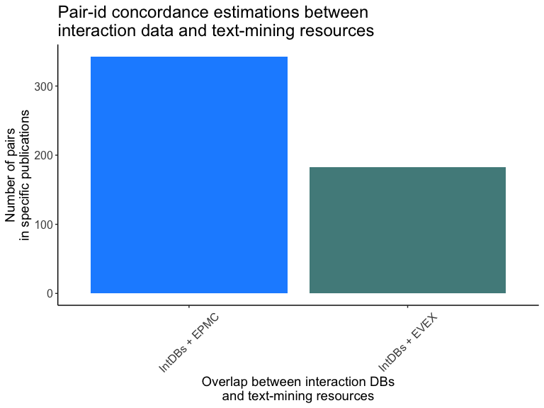

Estimating the size of the uncurated interactome
========================================================

### Synopsis

After producing tidy datasets comparing different resources to IMEx data, we put together the data and compare the overlap. 

IMPORTANT: This set of scripts assume the different referenced datasets have been freshly updated. If you need to update results of this set, please re-run the corresponding source as well. 

#### Required libraries & functions

```r
# install packages if some are not already installed
packages = c("plyr","dplyr","data.table","UpSetR", "splitstackshape", "ggplot2", "shiny", "htmlwidgets")
if(mean(packages %in% installed.packages()) != 1){
        install.packages(packages[!packages %in% installed.packages()])
}
suppressPackageStartupMessages({
library(plyr)
library(dplyr)
library(data.table)
library(UpSetR)
library(splitstackshape)
library(ggplot2)
library(htmlwidgets)
library(VennDiagram)
})

# As taken from https://stackoverflow.com/questions/7235657/fastest-way-to-replace-nas-in-a-large-data-table
f_narepl = function(DT) {
  for (i in names(DT))
    DT[is.na(get(i)), (i):=0]
}
```
### Part 1: Load datasets

#### Interaction datasets

##### IMEx dataset

I select only purely human interactions here (interactions where both proteins are human). 


```r
imex_full <- fread("../IMEx/results/imex_full.txt", header=T, sep="\t",colClasses="character",data.table = T)
imex_human <- unique(subset(imex_full,taxid_a=="9606" & taxid_b=="9606"))
imex_human$imex <- 1
imex_human_sel <- unique(select(imex_human,pair_id=pair_id_clean,pmid=pubid,imex))
imex_pairs <- unique(select(imex_human,pair_id=pair_id_clean,imex))
imex_pmids <- unique(select(imex_human,pmid=pubid,imex))
```

The dataset contains 267784 protein interactions recorded in 10125 publications.

##### BioGRID data


```r
setwd("../BioGRID/results/")
BioGRID_pairs_pmids <- fread("pairs_pmids_biogrid.txt",header=T,sep="\t",colClasses=c("character","character","numeric"),data.table = T)
setwd("../../dsp_comparison/")

BioGRID_pairs_pmids_sel <- unique(select(BioGRID_pairs_pmids, pair_id=pair_id_clean, pmid=pubid, BioGRID = biogrid))
BioGRID_pairs <- unique(select(BioGRID_pairs_pmids, pair_id=pair_id_clean,BioGRID = biogrid))
BioGRID_pmids <- unique(select(BioGRID_pairs_pmids, pmid=pubid,BioGRID = biogrid))
```

The BioGRID dataset contains 247094 protein associations recorded in 25213 publications.

##### GO IPI data (EBI_GOA_nonIntAct)


```r
setwd("../GO_IPI/results/")
GO_IPI_pairs_pmids <- fread("pairs_pmids_EBI_GOA_nonIntAct.txt",header=T,sep="\t",colClasses=c("character","character","numeric"),data.table = T)
setwd("../../dsp_comparison/")

GO_IPI_pairs_pmids_sel <- unique(select(GO_IPI_pairs_pmids, pair_id=pair_id_clean, pmid=pubid, GO_IPI = EBI_GOA_nonIntAct))
GO_IPI_pairs <- unique(select(GO_IPI_pairs_pmids, pair_id=pair_id_clean,GO_IPI = EBI_GOA_nonIntAct))
GO_IPI_pmids <- unique(select(GO_IPI_pairs_pmids, pmid=pubid,GO_IPI = EBI_GOA_nonIntAct))
```

The GO IPI dataset contains 10456 protein associations recorded in 5827 publications.

#### Pathway datasets

##### Reactome data


```r
setwd("../reactome_interactions/results/")
system("gunzip -k pairs_pmid_reactome.txt.gz")
reactome_pairs_pmids <- fread("pairs_pmid_reactome.txt",header=T,sep="\t",colClasses=c("character","character","numeric"),data.table = T)
system("rm pairs_pmid_reactome.txt")
setwd("../../dsp_comparison/")

reactome_pairs <- unique(select(reactome_pairs_pmids,pair_id,reactome))
reactome_pmids <- unique(select(reactome_pairs_pmids,pmid,reactome))
```

The reactome dataset contains 16486 protein associations recorded in 9410 publications. 
##### OmniPath interaction data 


```r
setwd("../OmniPath/results/")
OmniPath_interaction_pairs_pmids <- fread("pairs_pmids_OmniPath_interactions_minimal.txt",header=T,sep="\t",colClasses=c("character","character","character","character","character","numeric"),data.table = T)
setwd("../../dsp_comparison/")

OmniPath_interaction_pairs_pmids_sel <- unique(select(OmniPath_interaction_pairs_pmids, pair_id=pair_id_clean, pmid=pubid, OmniPath_interactions))
OmniPath_interaction_pairs <- unique(select(OmniPath_interaction_pairs_pmids, pair_id=pair_id_clean,OmniPath_interactions))
OmniPath_interaction_pmids <- unique(select(OmniPath_interaction_pairs_pmids, pmid=pubid,OmniPath_interactions))
```

The OmniPath-interactions dataset contains 5917 protein associations recorded in 6596 publications.

##### OmniPath ptm (post-translational modifications) data 


```r
setwd("../OmniPath/results/")
OmniPath_ptm_pairs_pmids <- fread("pairs_pmids_OmniPath_ptm_interactions_minimal.txt",header=T,sep="\t",colClasses=c("character","character","character","character","character","numeric"),data.table = T)
setwd("../../dsp_comparison/")

OmniPath_ptm_pairs_pmids_sel <- unique(select(OmniPath_ptm_pairs_pmids, pair_id=pair_id_clean, pmid=pubid, OmniPath_ptm))
OmniPath_ptm_pairs <- unique(select(OmniPath_ptm_pairs_pmids, pair_id=pair_id_clean,OmniPath_ptm))
OmniPath_ptm_pmids <- unique(select(OmniPath_ptm_pairs_pmids, pmid=pubid,OmniPath_ptm))
```

The OmniPath-ptms dataset contains 2141 protein associations recorded in 2606 publications.

##### Pathway-inferred STRING data

```r
string_pi <- fread("../STRING/results/pairs_STRING_pathway_inference.txt",header=T,colClasses=c("character","character","character","character","numeric","numeric"),data.table = T)
string_pi_pairs <- unique(string_pi[,.(STRING_pi_score_ave=mean(STRING_score),STRING_pi=STRING_pathway_inference),by=pair_id_clean])
string_pi_pairs <- string_pi_pairs[,.(pair_id=pair_id_clean,STRING_pi_score_ave,STRING_pi)]
```

The STRING pathway-inference dataset contains 323621 protein associations, no PMIDs provided in this case.

#### Text-mining datasets

##### Text-mining EPMC data


```r
setwd("../epmc_text_mining/results/")
system("gunzip -k pairs_pmids_tm.txt.gz")
tm_pairs_pmids <- fread("pairs_pmids_tm.txt",header=T,sep="\t",colClasses=c("character","character","numeric","character","numeric","numeric"),data.table = T)
system("rm pairs_pmids_tm.txt")
setwd("../../dsp_comparison/")

tm_pairs_pmids_sel <- unique(tm_pairs_pmids[,.(pair_id,pmid,tm_epmc=tm,tm_pr_times_found,tm_dm_times_found,method_term)])
tm_pairs <- unique(tm_pairs_pmids[,.(tm_epmc=tm,tm_pr_total_times_found=sum(tm_pr_times_found)),by=pair_id])
tm_pmids <- unique(tm_pairs_pmids[,.(pmid,tm_epmc=tm,tm_dm_times_found)])
```

The text-mining EPMC dataset contains 151677 protein associations recorded in 52363 publications.

##### Text-mining EVEX data

EVEX provides a confidence score, thehigher the score, the more likely the pair identified in a given publication is to be true. Negative values have no special meaning. 

```r
setwd("../EVEX/results/")
EVEX_pairs_pmids <- fread("pairs_pmids_EVEX_minimal.txt",header=T,sep="\t",colClasses=c("character","character","character","character","character","numeric","numeric"),data.table = T)
setwd("../../dsp_comparison/")

EVEX_pairs_pmids_sel <- unique(EVEX_pairs_pmids[, .(pair_id=pair_id_clean, pmid=pubid,EVEX,evex_score)])
EVEX_pairs <- unique(EVEX_pairs_pmids[, .(EVEX,evex_score_ave=mean(evex_score)),by=pair_id_clean])
EVEX_pairs <- EVEX_pairs[,.(pair_id=pair_id_clean,EVEX,evex_score_ave)]
EVEX_pmids <- unique(EVEX_pairs_pmids[,.(EVEX,evex_score_ave=mean(evex_score)),by=pubid])
EVEX_pmids <- EVEX_pmids[,.(pmid=pubid,EVEX,evex_score_ave)]
```

The text-mining EVEX dataset contains 536341 protein associations recorded in 54315 publications.

##### Text-mining STRING data

```r
string_tm <- fread("../STRING/results/pairs_STRING_textmining.txt",header=T,colClasses=c("character","character","character","character","numeric","numeric"),data.table = T)
string_tm_pairs <- unique(string_tm[,.(STRING_tm_score_ave=mean(STRING_score),STRING_textmining),by=pair_id_clean])
string_tm_pairs <- string_tm_pairs[,.(pair_id=pair_id_clean,STRING_tm_score_ave,STRING_textmining)]

setwd("../STRING/results/")
system("unzip -j pairs_STRING_textmining_pmid.txt.zip")
string_tm_pairs_pmid <- fread("pairs_STRING_textmining_pmid.txt",header=T,sep="\t",colClasses=c("character","character","character","character","character","numeric","character","numeric"),data.table = T)
system("rm pairs_STRING_textmining_pmid.txt")
setwd("../../dsp_comparison/")

string_tm_pairs_pmids <- unique(string_tm_pairs_pmid[,.(STRING_tm_score_ave=mean(STRING_score),STRING_textmining,pmid),by=pair_id_clean])
string_tm_pairs_pmids <- string_tm_pairs_pmids[,.(pair_id=pair_id_clean,pmid,STRING_tm_score_ave,STRING_textmining)]
```

The STRING text-mining dataset contains 295047 protein associations. PMIDs were provided separately and amount for 14598886 pair-PMID relations. 

#### Prediction datasets

##### IID predictions data


```r
iid_pred_pairs <- fread("../iid_predictions/results/pairs_iid_pred.txt",header=T,sep="\t",colClasses=c("character","numeric"),data.table=T)
```

The IID-predictions dataset contains 703385 protein associations.

##### STRING predictions data

```r
string_phylo <- fread("../STRING/results/pairs_STRING_phylo_predictions.txt",header=T,sep="\t",colClasses=c("character","character","character","character","numeric","numeric"),data.table = T)
string_phylo_pairs <- unique(string_phylo[,.(STRING_phylo_score_ave=mean(STRING_score),STRING_phylo=STRING_phylo_predictions),by=pair_id_clean])
string_phylo_pairs <- string_phylo_pairs[,.(pair_id=pair_id_clean,STRING_phylo_score_ave,STRING_phylo)]
```

The STRING phylogenetic predictions dataset contains 19302 protein associations.

### Part 2: Generating comparison dataset at the pair level


```r
# Code below generates (to allow any number and any column names) and evaluates this:
# paste0("all_df <- list(",paste0(grep("_pairs$", ls(), value = T), collapse= ","),")")
# eval(parse(text=paste0("all_df <- list(",paste0(grep("_pairs$", ls(), value = T), collapse= ","),")")))
# results in errors upstream

all_df <- list(imex_pairs,reactome_pairs,tm_pairs,iid_pred_pairs, EVEX_pairs, BioGRID_pairs, GO_IPI_pairs, OmniPath_interaction_pairs, OmniPath_ptm_pairs,string_phylo_pairs,string_pi_pairs,string_tm_pairs)

paircomp_table <- Reduce(function(...) merge(..., all=TRUE), all_df)

# I clean and replace all NAs if present.

paircomp_table_final <- paircomp_table
paircomp_table_final[is.na(paircomp_table_final <- paircomp_table)] <- 0
paircomp_table_final = unique(paircomp_table_final)
fwrite(paircomp_table_final,"./results/paircomp_table_final.txt",col.names=T,row.names=F,sep="\t",quote=F)
system("gzip ./results/paircomp_table_final.txt --force")
unlink("./results/paircomp_table_final.txt")
```

The comparison set gives a total number of 1932907 potentially interacting pairs, of which 1665123 (86.15%) are not curated in IMEx. 

### Part 3: Generating comparison dataset at the publication level


```r
allpub_df <- list(imex_pmids,reactome_pmids,tm_pmids, EVEX_pmids, BioGRID_pmids, GO_IPI_pmids, OmniPath_interaction_pmids, OmniPath_ptm_pmids)

pubcomp_table <- Reduce(function(...) merge(..., all=TRUE), allpub_df)

# I clean and replace all NAs if present.

pubcomp_table_final <- pubcomp_table
pubcomp_table_final[is.na(pubcomp_table_final <- pubcomp_table)] <- 0
fwrite(pubcomp_table_final,"./results/pubcomp_table_final.txt",col.names=T,row.names=F,sep="\t",quote=F)
system("gzip ./results/pubcomp_table_final.txt --force")
```

The comparison set gives a total number of 138330 publications, of which 128205 (92.68%) are not curated in IMEx. 

### Part 4: Generating comparison dataset at the pair level taking the publication into account


```r
allpubpair_df <- list(imex_human_sel,reactome_pairs_pmids,tm_pairs_pmids_sel, EVEX_pairs_pmids_sel, BioGRID_pairs_pmids_sel, GO_IPI_pairs_pmids_sel, OmniPath_interaction_pairs_pmids_sel, OmniPath_ptm_pairs_pmids_sel, string_tm_pairs_pmids)

prepubpaircomp_table_1 <- Reduce(function(...) merge(..., by=c("pair_id","pmid"), all=TRUE), allpubpair_df)

paironly_df <- list(iid_pred_pairs,string_pi_pairs,string_phylo_pairs)

prepubpaircomp_table_2 <- Reduce(function(...) merge(..., by=c("pair_id"), all=TRUE), paironly_df)

pubpaircomp_table <- unique(merge(prepubpaircomp_table_1,prepubpaircomp_table_2,by=c("pair_id"),all=T))

# I clean and replace all NAs if present.

pubpaircomp_table_form <- pubpaircomp_table
pubpaircomp_table_form[is.na(pubpaircomp_table_form <- pubpaircomp_table)] <- 0
pubpaircomp_table_form <- pubpaircomp_table_form[,.(
  pair_id,
  pmid,
  imex,
  reactome,
  tm_epmc,
  tm_pr_times_found,
  tm_dm_times_found,
  tm_method_term = method_term,
  EVEX,
  evex_score,
  STRING_tm_score_ave,
  STRING_textmining,
  BioGRID,
  GO_IPI,
  OmniPath_interactions,
  OmniPath_ptm,
  iid_pred,
  STRING_pi_score_ave,
  STRING_pi,
  STRING_phylo_score_ave,
  STRING_phylo
)]

pubpaircomp_table_eval <- pubpaircomp_table_form[,eval:=paste(
  imex,
  reactome,
  tm_epmc,
  EVEX,
  STRING_textmining,
  BioGRID,
  GO_IPI,
  OmniPath_interactions,
  OmniPath_ptm,
  iid_pred,
  STRING_pi,
  STRING_phylo
)]

check <- data.table(table(pubpaircomp_table_eval$eval,useNA = "ifany"))

# This check found that most records are caused by pair-publication combinations only found in STRING. We decide to discard those, since they are just co-occurrences in publication abstracts. 
pubpaircomp_table_form <- pubpaircomp_table_eval[eval != "0 0 0 0 1 0 0 0 0 0 0 0"]
```

The comparison set gives a total number of 7437548 protein association pairs, of which 7135046 (95.93%) are not curated in IMEx. In all these pairs the publication from which they were derived was also matched, so the overlaps and numbers differ from my previous comparisons. 

### Part 5: Checking how many of the pair/publication combos involved uncurated proteins

I use a list of proteins non-curated in IMEx produced by Vitalii Kleschevnikov (IntAct group). He produced several versions of this list, using the different versions of the UniProtKB as reference. 

##### Pre-formatting pair/puplication combo comparisons

I need to preformat the 'pubpaircomp_table_final' data frame to compare it with VK lists.


```r
pubpaircomp_table_check_pt1 <- pubpaircomp_table_form

pubpaircomp_table_check_pt1.1.1 <- pubpaircomp_table_check_pt1[,prots:=gsub("_.*","",pair_id)]

pubpaircomp_table_check_pt1.1.2 <- pubpaircomp_table_check_pt1[,prots:=gsub(".*_","",pair_id)]

fwrite(
       pubpaircomp_table_check_pt1.1.1,
       "./results/pubpaircomp_table_check_pt1_1_1.txt",
       col.names = T,
       row.names = F,
       quote = F,
       sep = "\t"
)

fwrite(
       pubpaircomp_table_check_pt1.1.2,
       "./results/pubpaircomp_table_check_pt1_1_2.txt",
       col.names = F,
       row.names = F,
       quote = F,
       sep = "\t"
)

system("cat ./results/pubpaircomp_table_check_pt1_1_1.txt ./results/pubpaircomp_table_check_pt1_1_2.txt > ./results/pubpaircomp_table_check_pt2.txt")
system("rm ./results/pubpaircomp_table_check_pt1_1_1.txt")
system("rm ./results/pubpaircomp_table_check_pt1_1_2.txt")


pubpaircomp_table_check_pt2 <- fread(
        "./results/pubpaircomp_table_check_pt2.txt",
        header = T,
        colClasses = "character",
        stringsAsFactors = F,
        sep = "\t"
)
system("rm ./results/pubpaircomp_table_check_pt2.txt")
```

##### Upload IMEx non-curated protein lists

I do not use the list that considers isoforms, since they were not considered in any of the datasets used in the comparison. 

```r
noimex_spnoisof <- unique(fread("./imex_non_curated/Swissprot_without_isoforms_missing_in_IntAct.txt",header=F,colClasses = "character",data.table = F))

noimex_upnoisof <- unique(fread("./imex_non_curated/UniprotKB_without_isoforms_missing_in_IntAct.txt",header=F,colClasses = "character",data.table = F))
```

##### Check how many of the proteins are missing from IMEx

I will identify those pairs that have proteins that have not been 

```r
pubpaircomp_table_check_pt3 <- mutate(pubpaircomp_table_check_pt2,
                                  noncur_prot = 
                                          ifelse(
                                                  prots %in% noimex_upnoisof$V1,
                                                  1,
                                                  0))

pubpaircomp_noncur_pairs <- unique(subset(pubpaircomp_table_check_pt3,noncur_prot==1,select= c("pair_id","noncur_prot")))

pubpaircomp_table_form <- data.table(pubpaircomp_table_form, key = "pair_id")
pubpaircomp_noncur_pairs <- data.table(pubpaircomp_noncur_pairs, key = "pair_id")


pubpaircomp_table_check_pt4 <- unique(merge(
  pubpaircomp_table_form,
  pubpaircomp_noncur_pairs,
  by="pair_id",
  all.x = T,
  all.y = F))

# This does not work due to memory limits. 
noncur_pairs <- unique(pubpaircomp_noncur_pairs$pair_id)
pubpaircomp_table_form$noncur_prot <- "0"
pubpaircomp_table_form[pair_id %in% noncur_pairs]$noncur_prot <- "1"
pubpaircomp_table_check_pt4 <- pubpaircomp_table_form[pair_id %in% noncur_pairs]

pubpaircomp_table_final <- pubpaircomp_table_check_pt4

pubpaircomp_table_final <- pubpaircomp_table_form
f_narepl(pubpaircomp_table_final)
        
write.table(pubpaircomp_table_final,"./results/pubpaircomp_table_final.txt",col.names=T,row.names=F,sep="\t",quote=F)

setwd("./results")
system("tar -czvf pubpaircomp_table_final.txt.tar.gz pubpaircomp_table_final.txt && rm pubpaircomp_table_final.txt")
setwd("../")
```

### Part 6: Test sets for Reactome and text-mined datasets

I generate a couple of random samples from the subset of the text-mined and Reactome datasets that is not represented in IMEx. These samples are to be checked by curators to estimate what is the percentage of true/false positives in these datasets. I decide to just provide the PMIDs and request curators to check if the PMID contains interactors and identify the proteins if that's so. 


```r
pubpairs_not_imex <- pubpaircomp_table_final[imex==0 & pair_id != "",]
pubpairs_not_imex_sel <- unique(select(pubpairs_not_imex,pmid,pair_id))

publs_not_imex <- unique(select(pubpairs_not_imex,pmid,imex,reactome,tm_epmc,iid_pred,noncur_prot))

set.seed(88)

reactpubl_not_imex <- publs_not_imex[publs_not_imex$reactome==1,]
reactpubl_sample <- reactpubl_not_imex[sample(1:nrow(reactpubl_not_imex),100),]
react_sample <- unique(merge(reactpubl_sample,pubpairs_not_imex_sel,by="pmid"))

tmpubl_not_imex <- publs_not_imex[publs_not_imex$tm_epmc==1,]
tmpubl_sample <- tmpubl_not_imex[sample(1:nrow(tmpubl_not_imex),500),]
tm_sample <- unique(merge(tmpubl_sample,pubpairs_not_imex_sel,by="pmid"))

write.table(reactpubl_sample,"./results/reactpubl_sample.txt",col.names = T,row.names = F,sep="\t",quote=F)
write.table(tmpubl_sample,"./results/tmpubl_sample.txt",col.names = T,row.names = F,sep="\t",quote=F)
```

Low-hanging fruit and Reactome/TM evaluation lists can be checked and accessed at https://docs.google.com/spreadsheets/d/1tL1HtVD3-BxHxKuXbIYhcFjmCptGVEOD5aFJCZw6CZk/edit?usp=sharing. 

### Part 7: Testing for accuracy of pair identification

First I put together a table for full comparison. 

```r
pubpair_pair_acc_pt1 <- unique(merge(pubpaircomp_table_final,
                                     pubcomp_table_final,
                                     by="pmid",
                                     all = T,
                                     allow.cartesian = T)) 

# Select only publication curated in IMEx
pubpair_pair_acc_pt2 <- pubpair_pair_acc_pt1[imex.y=="1",
                                             .(pmid,
                                               pair_id,
                                               pubpair_intdbs = ifelse(
                                                       imex.x=="1" | 
                                                       GO_IPI.x == "1" | 
                                                       BioGRID.x == "1",
                                                                    "1",
                                                                    "0"),
                                               pubpair_imex = imex.x,
                                               pubpair_biogrid = BioGRID.x,
                                               pubpair_goipi = GO_IPI.x,
                                               pubpair_tm_epmc = tm_epmc.x,
                                               pubpair_tm_evex = EVEX.x,
                                               pubpair_tm_string = STRING_textmining,
                                               pubpair_pw_reactome = reactome.x,
                                               pubpair_pw_op_ints = OmniPath_interactions.x,
                                               pubpair_pw_op_ptm = OmniPath_ptm.x,
                                               pubpair_pred_string = STRING_pi,
                                               pubpair_pred_iid = iid_pred,
                                               pub_imex = imex.y,
                                               pub_biogrid = BioGRID.y,
                                               pub_goipi = GO_IPI.y,
                                               pub_tm_epmc = tm_epmc.y,
                                               pub_tm_evex = EVEX.y,
                                               pub_pw_reactome = reactome.y,
                                               pub_pw_op_ints = OmniPath_interactions.y,
                                               pub_pw_op_ptm = OmniPath_ptm.y)]
```

##### Pair-id concordance estimations between interaction DBs

```r
pubpair_pair_acc_intDBs <- unique(pubpair_pair_acc_pt2[,
                                             .(pmid,
                                               pair_id,
                                               pubpair_intdbs,
                                               pubpair_imex,
                                               pubpair_biogrid,
                                               pubpair_goipi,
                                               pub_imex,
                                               pub_biogrid,
                                               pub_goipi)])

# pubpair_pair_acc_intDBs_check <- unique(pubpair_pair_acc_intDBs[pub_imex=="1" & pub_biogrid=="1" & pub_goipi=="1",
#                                                                 .(pubpair_intdbs_check = paste(unique(pubpair_intdbs),collapse="|")),
#                                                                 by="pmid"])
# table(pubpair_pair_acc_intDBs_check$pubpair_intdbs_check,useNA = "ifany")

pubpair_pair_acc_intDBs_eval_pt1 <- unique(pubpair_pair_acc_intDBs[pub_imex=="1" & 
                                                                       pub_biogrid=="1" & 
                                                                       pub_goipi=="1" & 
                                                                       pubpair_intdbs == "1",
                                                               .(pmid,
                                                                 pair_id,
                                                                 pubpair_imex,
                                                                 pubpair_biogrid,
                                                                 pubpair_goipi)])
pubpair_pair_acc_intDBs_eval <- unique(pubpair_pair_acc_intDBs_eval_pt1[,
                                                                        .(pmid,
                                                                          pair_id,
                                                                          pair_check = ifelse(
                                                                                  pubpair_imex == "1" &
                                                                                          pubpair_biogrid == "1" &
                                                                                          pubpair_goipi == "1",
                                                                                  "full agreement",
                                                                                  ifelse(
                                                                                          pubpair_imex == "1" &
                                                                                          pubpair_biogrid == "0" &
                                                                                          pubpair_goipi == "1",
                                                                                          "IMEx + GO IPI",
                                                                                          ifelse(
                                                                                                  pubpair_imex == "1" &
                                                                                                          pubpair_biogrid == "1" &
                                                                                                          pubpair_goipi == "0",
                                                                                                  "IMEx + BioGRID",
                                                                                                  ifelse(
                                                                                                          pubpair_imex == "0" & 
                                                                                                                  pubpair_biogrid == "1" & 
                                                                                                                  pubpair_goipi == "1",
                                                                                                          "GO IPI + BioGRID",
                                                                                                          ifelse(
                                                                                                                  pubpair_imex == "1" & 
                                                                                                                  pubpair_biogrid == "0" & 
                                                                                                                  pubpair_goipi == "0",
                                                                                                                  "IMEx",
                                                                                                                  ifelse(
                                                                                                                          pubpair_imex == "0" & 
                                                                                                                                  pubpair_biogrid == "1" & 
                                                                                                                                  pubpair_goipi == "0",
                                                                                                                          "BioGRID",
                                                                                                                          "GO IPI")))))))])

pubpair_pair_acc_intDBs_eval$pair_check <- factor(pubpair_pair_acc_intDBs_eval$pair_check, 
                                                  levels = c("full agreement",
                                                             "IMEx + BioGRID",
                                                             "IMEx + GO IPI",
                                                             "GO IPI + BioGRID",
                                                             "IMEx",
                                                             "BioGRID",
                                                             "GO IPI"))

table(pubpair_pair_acc_intDBs_eval$pair_check,useNA = "ifany")
```

```
## 
##   full agreement   IMEx + BioGRID    IMEx + GO IPI GO IPI + BioGRID 
##              764             2800              179              111 
##             IMEx          BioGRID           GO IPI 
##             4245             1243              116
```

###### Plot: Pair-id concordance estimations between interaction DBs 
<!-- -->

##### Pair-id concordance estimations between interaction data and text-mining resources

```r
pubpair_pair_acc_tm <- unique(pubpair_pair_acc_pt2[,
                                             .(pmid,
                                               pair_id,
                                               pubpair_intdbs,
                                               pubpair_tm_epmc,
                                               pubpair_tm_evex,
                                               pubpair_tm_string,
                                               pub_tm_epmc,
                                               pub_tm_evex)])

pubpair_pair_acc_tm_eval_pt1 <- unique(pubpair_pair_acc_tm[pub_tm_epmc=="1" & pub_tm_evex=="1",
                                                               .(pmid,
                                                                 pair_id,
                                                                 pubpair_intdbs,
                                                                 pubpair_tm_epmc,
                                                                 pubpair_tm_evex,
                                                                 pubpair_tm_string)])
                                                                 
pubpair_pair_acc_tm_eval <- unique(pubpair_pair_acc_tm_eval_pt1[,
                                                                .(pmid,
                                                                  pair_id,
                                                                  pair_check = ifelse(
                                                                          pubpair_intdbs == "1" &
                                                                                  pubpair_tm_epmc == "1" &
                                                                                  pubpair_tm_evex == "1" &
                                                                                  pubpair_tm_string == "1",
                                                                          "full agreement",
                                                                          ifelse(
                                                                                  pubpair_intdbs == "0" &
                                                                                          pubpair_tm_epmc == "1" &
                                                                                          pubpair_tm_evex == "1" &
                                                                                          pubpair_tm_string == "1",
                                                                                  "agreement in text-mining sources",
                                                                                  ifelse(
                                                                                          pubpair_intdbs == "1" &
                                                                                                  pubpair_tm_epmc == "1" &
                                                                                                  (pubpair_tm_evex == "0" |
                                                                                                            pubpair_tm_string == "0"),
                                                                                          "IntDBs + EPMC",
                                                                                          ifelse(
                                                                                                  pubpair_intdbs == "1" &
                                                                                                          pubpair_tm_string == "1" &
                                                                                                          (pubpair_tm_evex == "0" |
                                                                                                                    pubpair_tm_epmc == "0"),
                                                                                                  "IntDBs + STRING",
                                                                                                  ifelse(
                                                                                                          pubpair_intdbs == "1" &
                                                                                  	      							pubpair_tm_evex == "1" &
                                                                                  	      							        (pubpair_tm_epmc == "0" |
                                                                                  	      							                 pubpair_tm_string == "0"),
                                                                                  	      							"IntDBs + EVEX",
                                                                                  	      							"found only in one or two text-mining sources"))))))])

pubpair_pair_acc_tm_eval$pair_check <- factor(pubpair_pair_acc_tm_eval$pair_check, 
                                                  levels = c("full agreement",
                                                             "agreement in text-mining sources",
                                                             "IntDBs + EPMC",
                                                             "IntDBs + EVEX",
                                                             "IntDBs + STRING",
                                                             "found only in one or two text-mining sources"))

table(pubpair_pair_acc_tm_eval$pair_check,useNA = "ifany")
```

```
## 
##                               full agreement 
##                                            0 
##             agreement in text-mining sources 
##                                            0 
##                                IntDBs + EPMC 
##                                          343 
##                                IntDBs + EVEX 
##                                          183 
##                              IntDBs + STRING 
##                                            0 
## found only in one or two text-mining sources 
##                                        21267
```

###### Plot: Pair-id concordance estimations between interaction data and text-mining resources (full)
<!-- -->

###### Plot: Pair-id concordance estimations between interaction data and text-mining resources (eliminating those found in one or two tm resources only)
<!-- -->


##### Pair-id concordance estimations between interaction data and Reactome

```r
pubpair_pair_acc_reac <- unique(pubpair_pair_acc_pt2[,
                                             .(pmid,
                                               pair_id,
                                               pubpair_intdbs,
                                               pubpair_pw_reactome,
                                               pub_pw_reactome)])

pubpair_pair_acc_reac_eval_pt1 <- unique(pubpair_pair_acc_reac[pub_pw_reactome=="1",
                                                               .(pmid,
                                                                 pair_id,
                                                                 pubpair_intdbs,
                                                                 pubpair_pw_reactome)])

pubpair_pair_acc_reac_eval <- unique(pubpair_pair_acc_reac_eval_pt1[,
                                                                .(pmid,
                                                                  pair_id,
                                                                  pair_check = ifelse(
                                                                          pubpair_intdbs == "1" &
                                                                                  pubpair_pw_reactome == "1",
                                                                          "agreement",
                                                                          ifelse(
                                                                                  pubpair_intdbs == "1" &
                                                                                  pubpair_pw_reactome == "0",
                                                                                  "IntDBs",
                                                                                  "Reactome")))])

table(pubpair_pair_acc_reac_eval$pair_check,useNA = "ifany")
```

```
## 
## agreement    IntDBs  Reactome 
##      1048     20264      9109
```

###### Plot: Pair-id concordance estimations between interaction data and Reactome
<!-- -->
<!-- -->

********************************************************************************************
