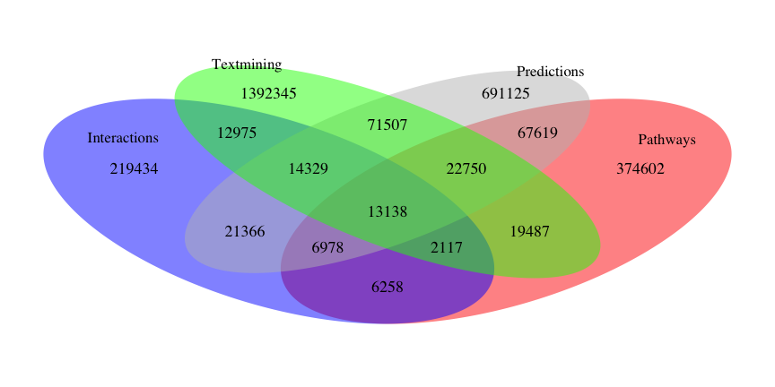
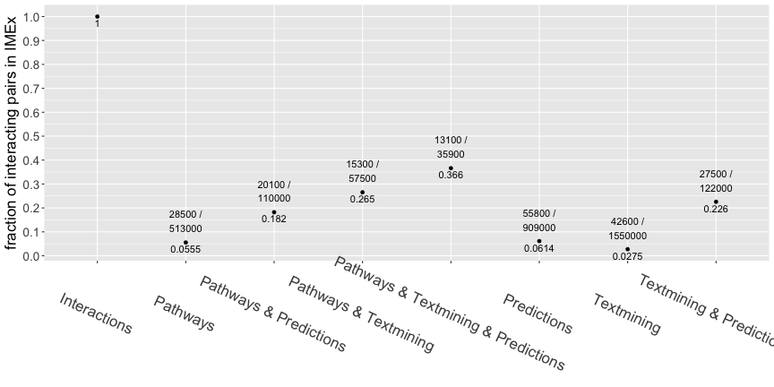

========================================================
width: 1200
height: 1000
font-family: 'Helvetica', 'EBI-Species'
## Comparison of protein association datasets and their enrichment in IMEx curated interactions
## Estimating the size of the uncurated interactome

author: Vitalii Kleshchevnikov, Pablo Porras  
date: 12 April 2017

========================================================

After producing tidy datasets comparing different resources to IMEx data, we put together the data and compare the overlap. 

IMPORTANT: This set of scripts assume the different referenced datasets have been freshly updated. If you need to update results of this set, please re-run the corresponding source as well.

The following datasets are included in the analysis:


 - IMEx dataset: contains 141262 interacting pair of proteins recorded in 8821 publications.
 


 - Reactome dataset: contains 430095 protein associations recorded in 9381 publications. 
 


 - text-mining EPMC dataset contains 959438 protein associations recorded in 167311 publications.
 


 - IID-predictions dataset: contains 707917 protein associations.
 


 - text-mining EVEX dataset: contains 517258 protein associations recorded in 54247 publications.
 
========================================================

Other datasets included in the analysis


 - BioGRID dataset: contains 221403 protein associations recorded in 25307 publications.


 - GO IPI dataset: contains 10215 protein associations recorded in 5459 publications.
 


 - merged OmniPath interaction dataset and OmniPath ptm dataset: contains 8893 protein associations recorded in 7592 publications.
 


 - STRING textmining dataset: contains 167611 protein associations.

 - STRING pathway-based inference dataset: contains 191107 protein associations.

 - STRING predictions dataset: contains 242030 protein associations.

Part 1: Generating comparison dataset at the pair level
========================================================


The comparison set gives a total number of 2936030 potentially interacting pairs, of which 2794768 (95.19%) are not curated in IMEx. 

Overlaps at the pair level, summary:
========================================================


Part 2: Generating comparison dataset at the publication level
========================================================


The comparison set gives a total number of 245352 publications, of which 236531 (96.4%) are not curated in IMEx. 

Overlaps at the publication level, summary:
========================================================


Part 3: Generating comparison dataset at the pair level taking the publication into account
========================================================


The comparison set gives a total number of 8202340 protein association pairs, of which 8041282 (98.04%) are not curated in IMEx. In all these pairs the publication from which they were derived was also matched, so the overlaps and numbers differ from previous comparisons. 

Part 4: Comparing groups of resources
========================================================
type: section

1 Pathways
========================================================
type: sub-section

Reactome vs Omnipath (excluding IMEx databases, BioGRID, HPRD, STRING) vs STRING pathway-based inference
========================================================


2 Text-mining
========================================================
type: sub-section

EPMC-TM vs EVEX vs STRING textmining
========================================================


3 Predictions
========================================================
type: sub-section

IID vs STRING phylogeny- and orthology-based predictions 
========================================================


4 Interactions
========================================================
type: sub-section

IMEx vs Biogrid vs GO IPI
========================================================


which resources are enriched in the publications containing interaction data?
========================================================
type: section


========================================================
type: sub-section
## 1 Are particular resources enriched in the IMEx-curated publications ?


As compared to NCBI gene to pubmed ID dataset (hypergeometric test, p-values):

```
         imex      reactome       tm_epmc          EVEX       BioGRID 
 0.000000e+00 5.222585e-191  1.000000e+00 5.471301e-282  0.000000e+00 
       GO_IPI      OmniPath 
 0.000000e+00 3.735250e-133 
```

========================================================
type: sub-section
As compared to the union of all resources in this comparison (hypergeometric test, p-values):

```
        imex     reactome      tm_epmc         EVEX      BioGRID 
0.000000e+00 2.102444e-50 1.000000e+00 5.332067e-03 0.000000e+00 
      GO_IPI     OmniPath 
0.000000e+00 1.772329e-31 
```


========================================================
type: sub-section
## 2 Are particular resources enriched in the BioGRID-curated publications ?

As compared to NCBI gene to pubmed ID dataset (hypergeometric test, p-values):

```
    imex reactome  tm_epmc     EVEX  BioGRID   GO_IPI OmniPath 
       0        0        1        0        0        0        0 
```


========================================================
type: sub-section
## 3 Fractions: IMEx-curated publications


========================================================
type: sub-section
## 4 Fractions: BioGRID-curated publications


========================================================
type: sub-section
## tm_epmc (old) is depleted in interaction-containing papers as compared to all gene-associated (NCBI) papers!

========================================================
type: sub-section
## 5 Fractions: IMEx-curated interacting pairs


========================================================
type: sub-section
## 6 Fractions: BioGRID-curated interacting pairs


========================================================
type: sub-section
## groups of resources enriched in curated interaction data (IMEx+BioGRID+GO IPI)



========================================================
type: sub-section
## groups of resources enriched in curated interaction data (IMEx+BioGRID+GO IPI)


