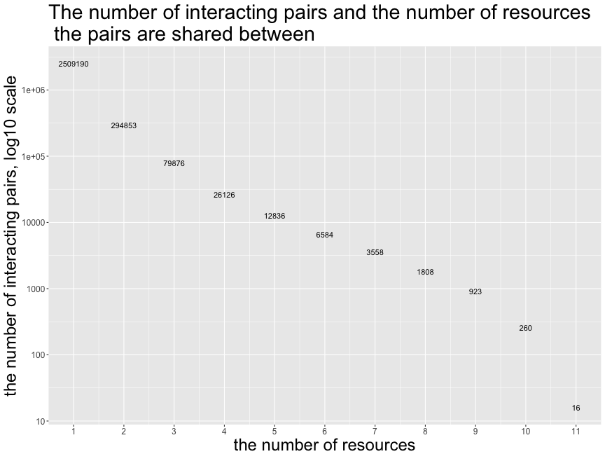
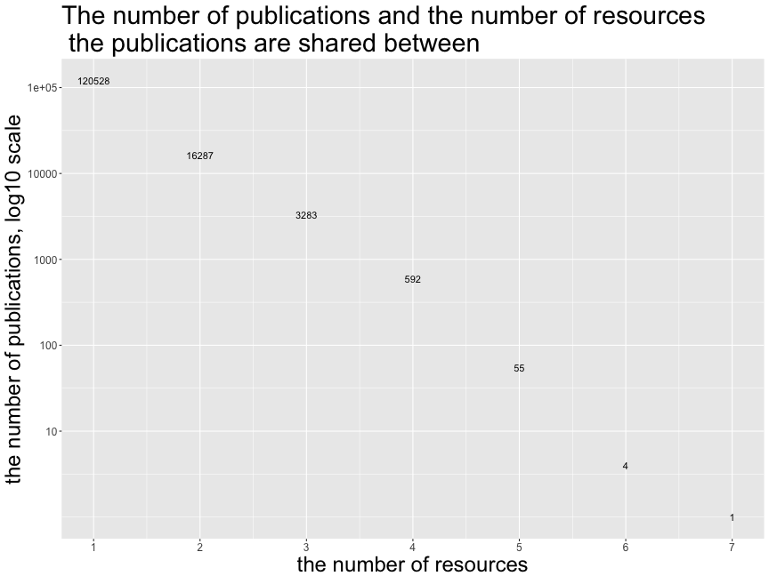
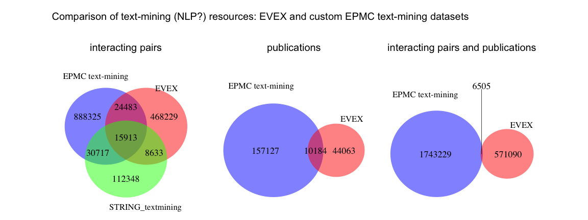
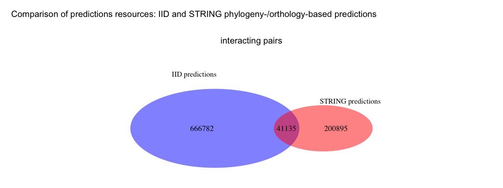
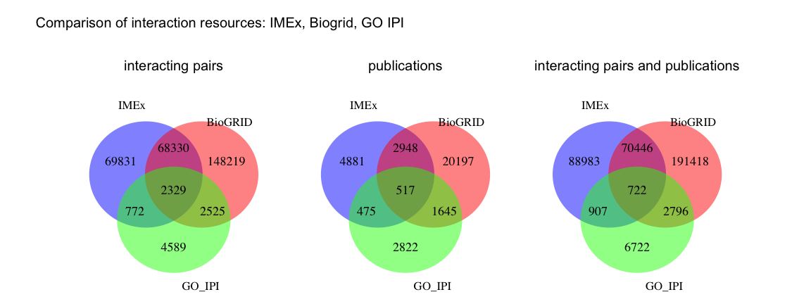
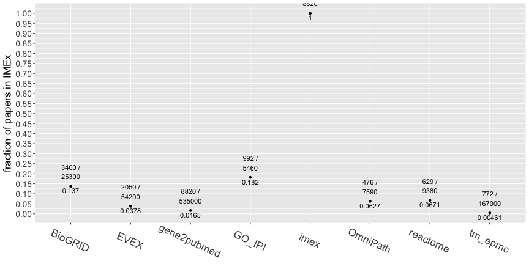
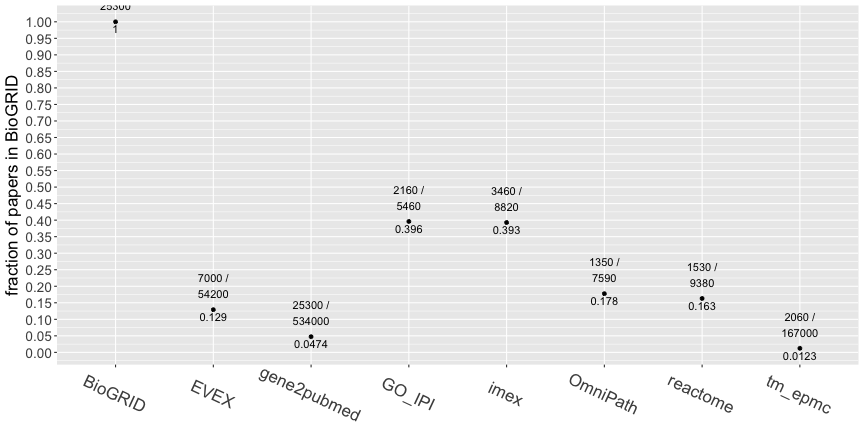
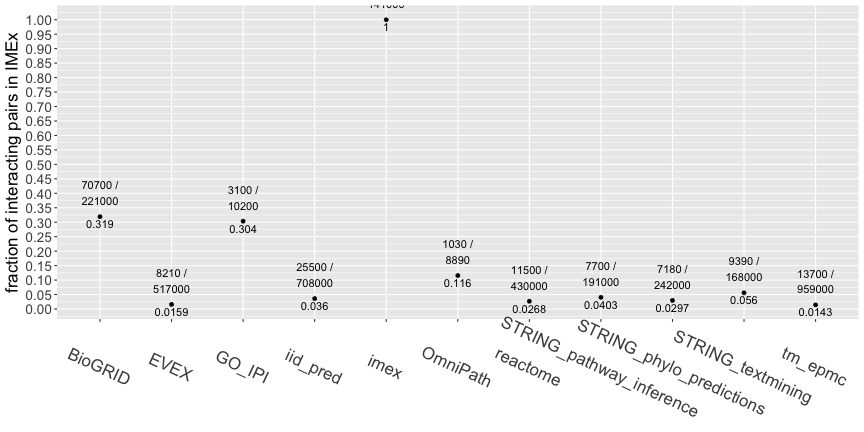
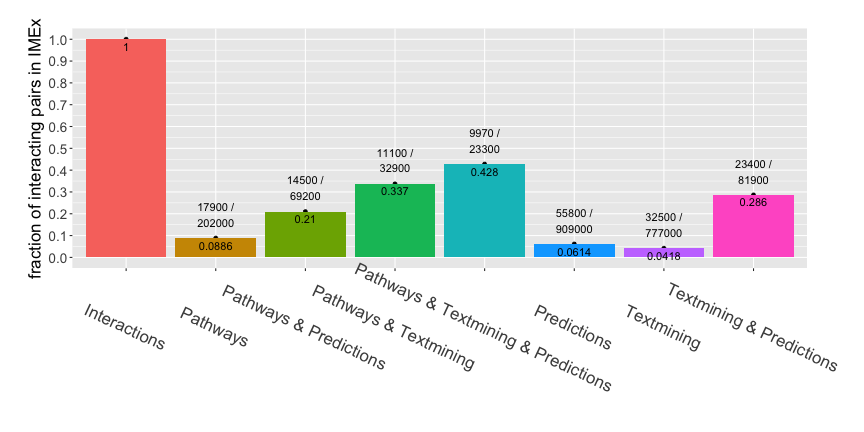

========================================================
width: 1200
height: 1000
font-family: 'Helvetica', 'EBI-Species'
## Comparison of protein association datasets and their enrichment in IMEx curated interactions
## Estimating the size of the uncurated interactome

author: Vitalii Kleshchevnikov, Pablo Porras  
date: 12 April 2017

========================================================

The aim of this analysis is to compare publications and interacting pair datasets produced by a number of resources. These resources potentially indicate which protein-protein interactions have been reported but not curated in IMEx. Some of these resources also provide source papers describing the interaction.

IMPORTANT: This script assumes that different referenced datasets have been freshly updated. If you need to update results of this set, please re-run the corresponding source as well.

The following datasets are included in the analysis:


 - IMEx dataset: contains 141262 interacting pair of proteins recorded in 8821 publications.
 


 - Reactome dataset: contains 6419 protein associations recorded in 3046 publications. 
 


 - text-mining EPMC dataset contains 143365 protein associations recorded in 61153 publications.
 


 - IID-predictions dataset: contains 707917 protein associations.
 


 - text-mining EVEX dataset: contains 517258 protein associations recorded in 54247 publications.
 
========================================================

Other datasets included in the analysis


 - BioGRID dataset: contains 221403 protein associations recorded in 25307 publications.


 - GO IPI dataset: contains 10215 protein associations recorded in 5459 publications.
 


 - merged OmniPath interaction dataset and OmniPath ptm dataset: contains 8893 protein associations recorded in 7592 publications.
 


 - STRING textmining dataset: contains 167611 protein associations.

 - STRING pathway-based inference dataset: contains 191107 protein associations.

 - STRING predictions dataset: contains 242030 protein associations.

Part 1: Comparison dataset at the pair level
========================================================


The comparison dataset gives a total number of 1955991 potentially interacting pairs, of which 1814729 (92.78%) are not curated in IMEx. 
The dataset can be accessed: https://github.com/vitkl/darkspaceproject/blob/master/dsp_comparison/results/comp_table_final.txt.gz 

Overlaps at the pair level, summary:
========================================================



Part 2: Comparison dataset at the publication level
========================================================


The comparison set gives a total number of 140750 publications, of which 131929 (93.73%) are not curated in IMEx. 
The dataset can be accessed: https://github.com/vitkl/darkspaceproject/blob/master/dsp_comparison/results/pubcomp_table_final.txt.gz 

Overlaps at the publication level, summary:
========================================================


Part 3: Generating comparison dataset at the pair level taking the publication into account
========================================================


The comparison set gives a total number of 1839273 protein association pairs, of which 1678215 (91.24%) are not curated in IMEx. In all these pairs the publication from which they were derived was also matched, so the overlaps and numbers differ from previous comparisons. 
The dataset can be accessed: https://github.com/vitkl/darkspaceproject/blob/master/dsp_comparison/results/pubpaircomp_table_final.txt.tar.gz 

Part 4: Comparing groups of resources
========================================================
type: section

1 Pathways
========================================================
type: sub-section
### Pathways group includes these datasets:  
- Reactome. Manually created dataset. This resource provides a pair of proteins and an associated publication. [More details](https://github.com/vitkl/darkspaceproject/blob/master/reactome_interactions/reactome_vs_imex_lean.md)  
- Omnipath (excluding interactions imported to Omnipath from IMEx databases, BioGRID, HPRD, STRING). This dataset combines Omnipath interaction dataset and Omnipath post-translational modifications dataset. Omnipath gathers it's data from many primary interaction and PTM databases including IntAct. In case the resource is presented independently in this comparison - all interactions imported in Omnipath from that resource are removed. This resource provides a pair of proteins and an associated publication. [More details](https://github.com/vitkl/darkspaceproject/blob/master/OmniPath/OmniPath_dsgen.md)  
- STRING pathway-based inference. These are the interactions which are annotated in STRING with the detection method "psi-mi:"MI:0362"(inference)" and are primarily based on KEGG and Reactome pathway databases. This dataset may duplicate manually created Reactome dataset. This resource provides only a pair of proteins. [More details](https://github.com/vitkl/darkspaceproject/blob/master/STRING/STRING_dsgen.md)   

Reactome vs Omnipath vs STRING pathway-based inference
========================================================


2 Text-mining
========================================================
type: sub-section
### Text-mining group includes these datasets:  
- EPMC-TM. Text-mining effort of EPMC team to indentify interaction-containing papers. This text-mining project find pairs of proteins co-mentioned in sentences along with words describing interaction (for example, "... proteinA ... binds proteinB ..."). This resource provides a pair of proteins and an associated publication. [More details](https://github.com/vitkl/darkspaceproject/blob/master/epmc_text_mining/tm_epmc_tr_light.md)     
- EVEX. Independent text-mining project (http://evexdb.org/faq/). EVEX uses natural language processing (NLP) algorithms to identify different types of interactions. EVEX uses Entrez gene id as a universal identifier which is converted to Uniprot IDs for this comparison. Many-to-many mapping artificially increases the number of protein-protein interactions. This resource provides a pair of proteins and an associated publication. [More details](https://github.com/vitkl/darkspaceproject/blob/master/EVEX/EVEX_dsgen.md)
- STRING textmining. This dataset contains text-mining-based associations between pairs of proteins. An important distinction between STRING and other text-mining resources is that STRING doesn't use NPL, rather it associates proteins based on how many times they co-occur in Pubmed abstracts or PMC papers. This co-occurence is scored and then thresholded: only some of the interactions gather enough textmining hits to pass score threshold. This resource provides only a pair of proteins. [More details](https://github.com/vitkl/darkspaceproject/blob/master/STRING/STRING_dsgen.md)

EPMC-TM vs EVEX vs STRING textmining
========================================================


3 Predictions
========================================================
type: sub-section
### Predictions group includes these datasets:
- IID. Uses FpClass algorithm and orthology to predict protein-protein interactions. This resource provides only a pair of proteins. [More details](https://github.com/vitkl/darkspaceproject/blob/master/iid_predictions/iid_vs_imex.md)   
- STRING phylogeny- and orthology-based predictions. Assigns interactions based on interactions of orthologous proteins in other species, + two other minor methods. This resource provides only a pair of proteins. [More details](https://github.com/vitkl/darkspaceproject/blob/master/STRING/STRING_dsgen.md)   

IID vs STRING phylogeny- and orthology-based predictions 
========================================================



4 Interactions
========================================================
type: sub-section

- IMEx. Includes all IMEx databases and DIP (before merge with IntAct). This resource provides a pair of proteins and an associated publication. [More details](https://github.com/vitkl/darkspaceproject/blob/master/IMEx/IMEx_dsgen.md)  
- Biogrid. Major active primary physical interaction database. This resource provides a pair of proteins and an associated publication. [More details](https://github.com/vitkl/darkspaceproject/blob/master/BioGRID/BioGRID_dsgen.md)  
- GO IPI. This GO inferred-from-protein-interaction dataset excludes interactions already curated into IntAct (GOA-nonIntAct in PSICQUIC). Overlap seen may be due to DIP included in IMEx dataset. This resource provides a pair of proteins and an associated publication.  [More details](https://github.com/vitkl/darkspaceproject/blob/master/GO_IPI/GO_IPI_dsgen.md)  

IMEx vs Biogrid vs GO IPI
========================================================




which resources are enriched in the publications containing interaction data?
========================================================
type: section
hypergeometric test was used to evaluate enrichment of particular resource in publications already curated to IMEx

========================================================
type: sub-section
## 1 Are particular resources enriched in the IMEx-curated publications ?


As compared to NCBI gene to pubmed ID dataset (hypergeometric test, p-values):
~ 0 means enriched, ~ 1 means depleted

```
         imex      reactome       tm_epmc          EVEX       BioGRID 
 0.000000e+00 6.037449e-111  1.000000e+00 5.471301e-282  0.000000e+00 
       GO_IPI      OmniPath 
 0.000000e+00 3.735250e-133 
```

========================================================
type: sub-section
As compared to the union of all resources in this comparison (hypergeometric test, p-values):
~ 0 means enriched, ~ 1 means depleted

```
         imex      reactome       tm_epmc          EVEX       BioGRID 
 0.000000e+00  2.676737e-09  1.000000e+00  1.000000e+00  0.000000e+00 
       GO_IPI      OmniPath 
6.311952e-210  4.839113e-01 
```


========================================================
type: sub-section
## 2 Are particular resources enriched in the BioGRID-curated publications ?

As compared to NCBI gene to pubmed ID dataset (hypergeometric test, p-values):
~ 0 means enriched, ~ 1 means depleted

```
         imex      reactome       tm_epmc          EVEX       BioGRID 
 0.000000e+00 5.730489e-168  1.000000e+00  0.000000e+00  0.000000e+00 
       GO_IPI      OmniPath 
 0.000000e+00  0.000000e+00 
```


========================================================
type: sub-section
## 3 Fractions: IMEx- and BioGRID-curated publications
the fraction of publications in a particular resource which are also in IMEx or BioGRID



========================================================
type: sub-section
## tm_epmc (old and new) is depleted in interaction-containing papers as compared to all gene-associated (NCBI) papers!

========================================================
type: sub-section
## 4 Fractions: IMEx- or BioGRIG curated interacting pairs
the fraction of interacting pairs in a particular resource which are also in IMEx or BioGRID




========================================================
type: sub-section
## groups of resources enriched in curated interaction data (IMEx+BioGRID+GO IPI)
Comparing groups of resources (Interactions, Pathways, Text-mining, Predictions) rather than individual resouces. Interacting pairs not publications are considered.



========================================================
type: sub-section
## groups of resources enriched in curated interaction data (IMEx+BioGRID+GO IPI)
the fraction of interacting pairs in a particular group or a combination of groups which are also found in the interaction group (IMEx+BioGRID+GO IPI) 


