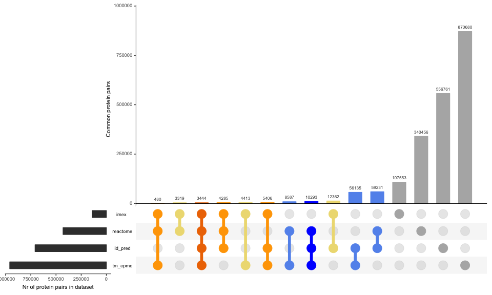
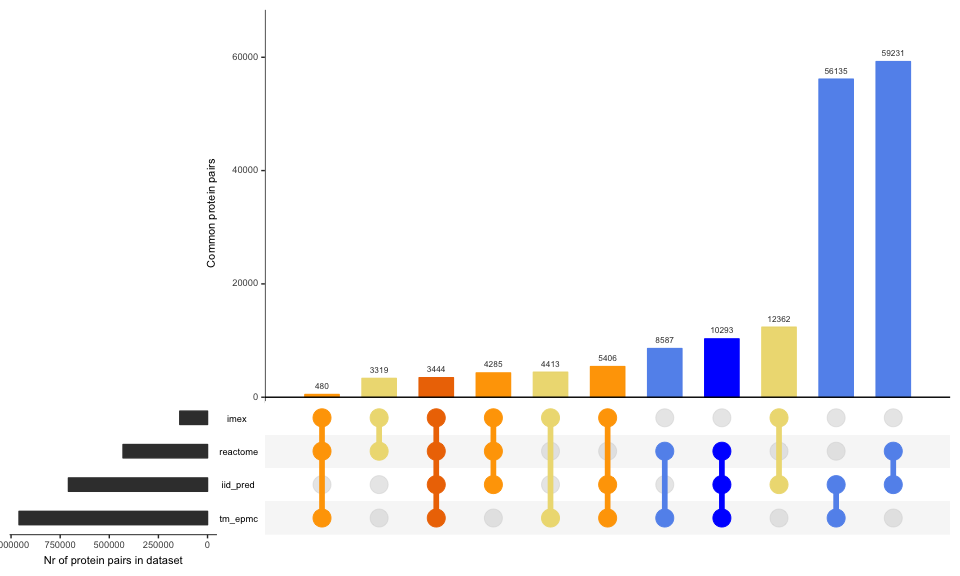
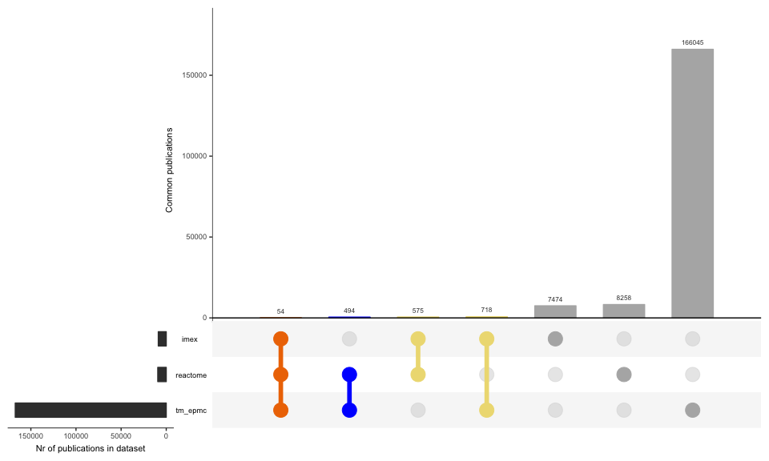
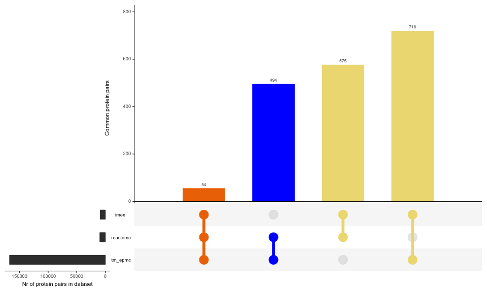
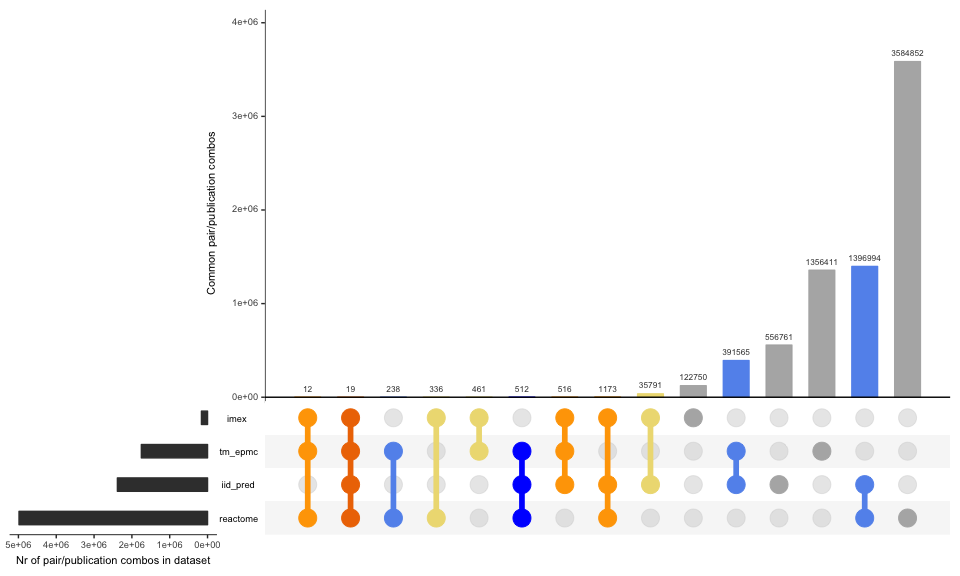
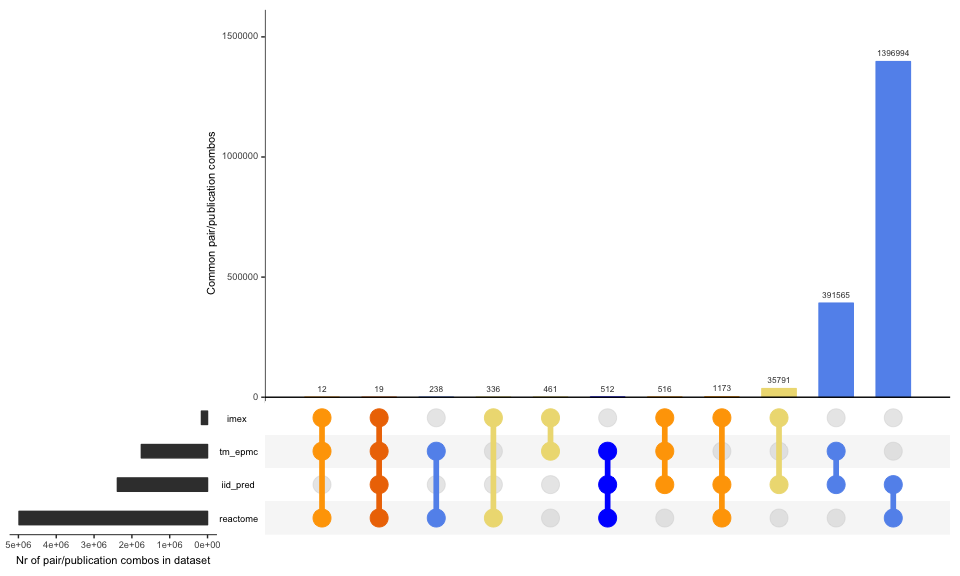

# Comparison of IMEx with other protein association datasets
Pablo Porras  
2016-12-19  

Estimating the size of the uncurated interactome
========================================================

### Synopsis

After producing tidy datasets comparing different resources to IMEx data, we put together the data and compare the overlap. 

IMPORTANT: This set of scripts assume the different referenced datasets have been freshly updated. If you need to update results of this set, please re-run the corresponding source as well. 

#### Required libraries

```r
library(plyr)
library(dplyr)
library(data.table)
library(UpSetR)
library(splitstackshape)
```
### Part 1: Load datasets

#### IMEx dataset

I select only purely human interactions here (interactions where both proteins are human). 


```r
imex_full <- fread("../IMEx/results/imex_full.txt", header=T, sep="\t",colClasses="character",data.table = F)
imex_human <- unique(subset(imex_full,taxid_a=="9606" & taxid_b=="9606"))
imex_human$imex <- 1
imex_human_sel <- unique(select(imex_human,pair_id=pair_id_clean,pmid=pubid,imex))
imex_pairs <- unique(select(imex_human,pair_id=pair_id_clean,imex))
imex_pmids <- unique(select(imex_human,pmid=pubid,imex))
```

The dataset contains 141262 protein interactions recorded in 8821 publications.

#### Reactome data


```r
setwd("../reactome_interactions/results/")
system("gunzip -k pairs_pmid_reactome.txt.gz")
reactome_pairs_pmids <- fread("pairs_pmid_reactome.txt",header=T,sep="\t",colClasses=c("character","character","numeric"),data.table = F)
system("rm pairs_pmid_reactome.txt")
setwd("../../dsp_comparison/")

reactome_pairs <- unique(select(reactome_pairs_pmids,pair_id,reactome))
reactome_pmids <- unique(select(reactome_pairs_pmids,pmid,reactome))
```

The reactome dataset contains 430095 protein associations recorded in 9381 publications. 

#### Text-mining EPMC data


```r
setwd("../epmc_text_mining/results/")
system("gunzip -k pairs_pmids_tm.txt.gz")
tm_pairs_pmids <- fread("pairs_pmids_tm.txt",header=T,sep="\t",colClasses=c("character","character","numeric"),data.table = F)
system("rm pairs_pmids_tm.txt")
setwd("../../dsp_comparison/")

tm_pairs_pmids_sel <- unique(select(tm_pairs_pmids,pair_id,pmid,tm_epmc=tm))
tm_pairs <- unique(select(tm_pairs_pmids,pair_id,tm_epmc=tm))
tm_pmids <- unique(select(tm_pairs_pmids,pmid,tm_epmc=tm))
```

The text-mining EPMC dataset contains 959438 protein associations recorded in 167311 publications.

#### IID predictions data


```r
iid_pred_pairs <- fread("../iid_predictions/results/pairs_iid_pred.txt",header=T,sep="\t",colClasses=c("character","numeric"),data.table=F)
```

The IID-predictions dataset contains 707917 protein associations.

### Part 2: Generating comparison dataset at the pair level


```r
all_df <- list(imex_pairs,reactome_pairs,tm_pairs,iid_pred_pairs)

comp_table <- Reduce(function(...) merge(..., all=TRUE), all_df)

# I clean and replace all NAs if present.

comp_table_final <- comp_table
comp_table_final[is.na(comp_table_final <- comp_table)] <- 0
write.table(comp_table_final,"./results/comp_table_final.txt",col.names=T,row.names=F,sep="\t",quote=F)
system("gzip ./results/comp_table_final.txt")
```

The comparison set gives a total number of 2043405 potentially interacting pairs, of which 1902143 (93.09%) are not curated in IMEx. 

I produce a plot with the summary of the overlap between the different datasets evaluated. 

##### Figure 1: Comparison between different protein association datasets
<!-- -->

I also produce a sub-plot showing exclusively the intersections, so a more informative scale is used. 

##### Figure 2: Intersection between different protein association datasets
<!-- -->

### Part 3: Generating comparison dataset at the publication level


```r
allpub_df <- list(imex_pmids,reactome_pmids,tm_pmids)

pubcomp_table <- Reduce(function(...) merge(..., all=TRUE), allpub_df)

# I clean and replace all NAs if present.

pubcomp_table_final <- pubcomp_table
pubcomp_table_final[is.na(pubcomp_table_final <- pubcomp_table)] <- 0
write.table(pubcomp_table_final,"./results/pubcomp_table_final.txt",col.names=T,row.names=F,sep="\t",quote=F)
system("gzip ./results/pubcomp_table_final.txt")
```

The comparison set gives a total number of 183618 publications, of which 174797 (95.2%) are not curated in IMEx. 

I produce a plot with the summary of the overlap between the different datasets evaluated. 

##### Figure 3: Comparison between different protein association datasets at the publication level
<!-- -->

And again, I zoom in to check only the intersections.

##### Figure 4: Intersection between different protein association datasets at the publication level
<!-- -->

### Part 4: Generating comparison dataset at the pair level taking the publication into account


```r
prepubpaircomp_table_1 <- unique(merge(imex_human_sel,reactome_pairs_pmids,by=c("pair_id","pmid"),all=T))
prepubpaircomp_table_2 <- unique(merge(prepubpaircomp_table_1,tm_pairs_pmids_sel,by=c("pair_id","pmid"),all=T))
pubpaircomp_table <- unique(merge(prepubpaircomp_table_2,iid_pred_pairs,by=c("pair_id"),all=T))

# I clean and replace all NAs if present.

pubpaircomp_table_form <- pubpaircomp_table
pubpaircomp_table_form[is.na(pubpaircomp_table_form <- pubpaircomp_table)] <- 0
```

The comparison set gives a total number of 7448391 protein association pairs, of which 7287333 (97.84%) are not curated in IMEx. In all these pairs the publication from which they were derived was also matched, so the overlaps and numbers differ from my previous comparisons. 

I produce a plot with the summary of the overlap between the different datasets evaluated. 

##### Figure 5: Comparison between different protein association datasets at the pair+publication level
<!-- -->

And again, a sub-plot showing exclusively the intersections, for better comparison.  

##### Figure 6: Intersection between different protein association datasets at the pair+publication level
<!-- -->

### Part 6: Checking how many of the pair/publication combos involved uncurated proteins

I use a list of proteins non-curated in IMEx produced by Vitalii Kleschevnikov (IntAct group). He produced several versions of this list, using the different versions of the UniProtKB as reference. 

##### Pre-formatting pair/puplication combo comparisons

I need to preformat the 'pubpaircomp_table_final' data frame to compare it with VK lists.


```r
pubpaircomp_table_check_pt1 <- pubpaircomp_table_form
pubpaircomp_table_check_pt1$prots <- pubpaircomp_table_form$pair_id
pubpaircomp_table_check_pt2 <- cSplit(pubpaircomp_table_check_pt1, "prots", sep = "_", direction = "long")
```

##### Upload IMEx non-curated protein lists

I do not use the list that considers isoforms, since they were not considered in any of the datasets used in the comparison. 

```r
noimex_spnoisof <- unique(fread("./imex_non_curated/Swissprot_without_isoforms_missing_in_IntAct.txt",header=F,colClasses = "character",data.table = F))

noimex_upnoisof <- unique(fread("./imex_non_curated/UniprotKB_without_isoforms_missing_in_IntAct.txt",header=F,colClasses = "character",data.table = F))
```

##### Check how many of the proteins are missing from IMEx

I will identify those pairs that have proteins that have not been 

```r
pubpaircomp_table_check_pt3 <- mutate(pubpaircomp_table_check_pt2,
                                  noncur_prot = 
                                          ifelse(
                                                  prots %in% noimex_upnoisof$V1,
                                                  1,
                                                  0))

pubpaircomp_noncur_pairs <- unique(subset(pubpaircomp_table_check_pt3,noncur_prot==1,select= c("pair_id","noncur_prot")))

pubpaircomp_table_check_pt4 <- unique(merge(pubpaircomp_table_form,pubpaircomp_noncur_pairs,by="pair_id",all.x = T,all.y = F))
pubpaircomp_table_final <- pubpaircomp_table_check_pt4
pubpaircomp_table_final[is.na(pubpaircomp_table_final <- pubpaircomp_table_check_pt4)] <- 0
        
write.table(pubpaircomp_table_final,"./results/pubpaircomp_table_final.txt",col.names=T,row.names=F,sep="\t",quote=F)

setwd("./results")
system("tar -czvf pubpaircomp_table_final.txt.tar.gz pubpaircomp_table_final.txt && rm pubpaircomp_table_final.txt")
setwd("../")
```

##### Generate new 'low-hanging fruit' list

I check the "low hanging fruit": those pair/publication combos that were not found in IMEx, but were identified in the other three resources, plus a column stating if the pair contains non-curated proteins or not. 


```r
lhf <- unique(subset(pubpaircomp_table_final,
                     imex == 0 &
                             reactome == 1 &
                             tm_epmc == 1 &
                             iid_pred == 1))

lhf <- arrange(lhf,desc(noncur_prot),desc(pmid))

lhf_pairs <- unique(select(lhf,pair_id))
lhf_pmids <- unique(select(lhf,pmid))

write.table(lhf,"./results/lhf_list.txt",col.names=T,row.names = F,sep="\t",quote=F)
```

There are 426 pairs recorded in 190 publications that are not curated in IMEx but are found in the other datasets. 


### Part 7: Test sets for Reactome and text-mined datasets

I generate a couple of random samples from the subset of the text-mined and Reactome datasets that is not represented in IMEx. These samples are to be checked by curators to estimate what is the percentage of true/false positives in these datasets. I decide to just provide the PMIDs and request curators to check if the PMID contains interactors and identify the proteins if that's so. 


```r
pubpairs_not_imex <- pubpaircomp_table_final[pubpaircomp_table_final$imex==0 & pubpaircomp_table_final$pair_id != "",]
pubpairs_not_imex_sel <- unique(select(pubpairs_not_imex,pmid,pair_id))

publs_not_imex <- unique(select(pubpairs_not_imex,pmid,imex,reactome,tm_epmc,iid_pred,noncur_prot))

set.seed(88)

reactpubl_not_imex <- publs_not_imex[publs_not_imex$reactome==1,]
reactpubl_sample <- reactpubl_not_imex[sample(1:nrow(reactpubl_not_imex),100),]
react_sample <- unique(merge(reactpubl_sample,pubpairs_not_imex_sel,by="pmid"))

tmpubl_not_imex <- publs_not_imex[publs_not_imex$tm_epmc==1,]
tmpubl_sample <- tmpubl_not_imex[sample(1:nrow(tmpubl_not_imex),100),]
tm_sample <- unique(merge(tmpubl_sample,pubpairs_not_imex_sel,by="pmid"))

write.table(reactpubl_sample,"./results/reactpubl_sample.txt",col.names = T,row.names = F,sep="\t",quote=F)
write.table(tmpubl_sample,"./results/tmpubl_sample.txt",col.names = T,row.names = F,sep="\t",quote=F)
```

Low-hanging fruit and Reactome/TM evaluation lists can be checked and accessed at https://docs.google.com/spreadsheets/d/1tL1HtVD3-BxHxKuXbIYhcFjmCptGVEOD5aFJCZw6CZk/edit?usp=sharing. 

********************************************************************************************
