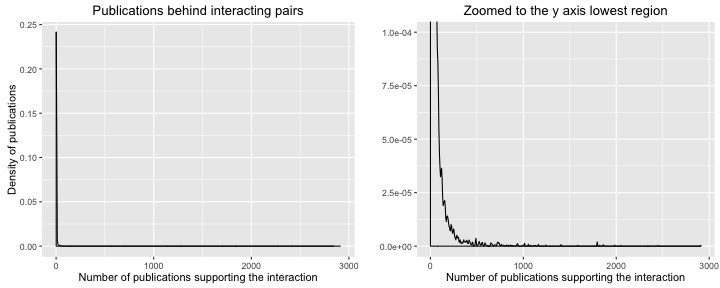
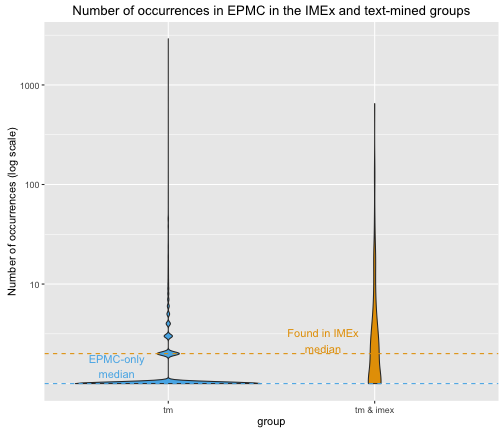

Text mining prediction EPMC: Technical report
========================================================

### Synopsis

We collaborated the EPMC team at EBI to use text-mining techniques that use a set of keywords (see Appendix) that describe potential interaction relationships to identify sentences that may depict interacting proteins. The sentences are extracted from the abstract or full text (when available, due to copyright restrictions) or publications listed in PubMed. The text-mining exercise was performed by Senay Kafkas (SK). Email exchange about this subject can be found in the folder ./source_files/emails. 


### Part 1: Evaluate and extract information from SK file

SK sent the result file from her search script on 2015/08/28 and an updated version with all PMIDs added on 2016/04/07. Here is the text of the email she sent on the first instance:  

*"I now adapted our gene-disease pipeline which we developed for the cttv project, for extracting the PPIs. I used the keyword list that we agreed on before.*  

*The data that I generated is big, hence I cannot attach it to the e-mail, but you can access it from:*

*/nfs/misc/literature/shenay/PPIExtraction/PPIData4Expr.txt*

*I provided the data in the format that we provide for the cttv project. The first line in the file describes the data format which is not complicated to understand. One thing is I provided only 3 publication IDs and sentences. However if you would need all of the publications and sentences, I can extract this data easily as well."*

It is important to note that the data contains human identifiers only. 

#### Estimating file size and memory requirements

The file sent by SK is too big to be loaded in R, so I process first a sample to have a look at the data.


```r
# The files used here are over 1GB and not suitable to be loaded in github. They are  available upon request. 
system("tar -xzf ./source_files/PPIData4Expr_noLimit.tar.gz -C ./source_files/")
system("touch ./processed_files/PPIData4Expr_noLimit_sample.txt")
system("sed -n '1,1000 p' ./source_files/PPIData4Expr_noLimit.txt > ./processed_files/PPIData4Expr_noLimit_sample.txt")
```

```r
ppi_sample <- read.delim("./processed_files/PPIData4Expr_noLimit_sample.txt", sep="\t",header=T,quote="\"")
head(ppi_sample)
```

```
  GeneID               EFO_ID                                         GeneName
1 Q9UK58               P37231                                        cyclin L1
2 P49961               P18627                                             CD39
3 P08670               P05019                                              VIM
4 P54710               P08571 FXYD domain-containing ion transport regulator 2
5 P43694 Q08722,Q9H0U3,P09923                                            GATA4
6 Q9BPZ7               P49815                                             SIN1
                                       DiseaseName Nof.Docs
1 peroxisome proliferator activated receptor gamma        1
2                                            LAG-3        1
3                                             IGF1        4
4                                             CD14        1
5                                              IAP        2
6                                             TSC2        2
  Nof.co.occr.in.Title.Abs Nof.co.occr.in.Body
1                        0                   1
2                        0                   2
3                        1                   5
4                        0                   1
5                        1                   1
6                        0                   3
                                           PMCIDs
1                                      PMC2858032
2                                      PMC4118494
3 PMC3840702###PMC3954560###PMC4246767###25787077
4                                      PMC2858032
5                           PMC3334497###17290010
6                         PMC2637922###PMC4142396
                                                                                                                                                                                                                                                                                                                                                                                                                                                                                                                                                                                                                                                                                                                                                                                                                                                                                                                                                                                                                                                                                                                                                                                                                                                                                                                                                                                                                                                                                                                                                                                                                                                                                                                                                                                                                                                                                                                                                                                                                                                                                                                                                                                                                                                                                                                                                                                                                                                                                                                                                                                                                                                                                                                                                                                                                                                                                                                                                                                                                                                                                                                                                                                                                                                                                                                                                                                                                                                                                                                                                                                                                                                                                                                                                                                                                                                                                                                                                                                                                                                                                                                                                                                                                                                                                                                                                                                                                                                                                                                                                                                                                                                                                                                                                                                                                                                                                                                                                                                                                                                                                                                                                                                                                                                                                                                                                                                                                                                                                                                                                                                                                                                                                                                                                                                                                                                                                                                                                                                                                                                                                                                                                                                                                                                                                                                                                                                                                                                                                                                                                                                                                                                                                                                                                                                                                                                                                                                                                                                                                                                                                                                                                                                                                                                                                                                                                                                                                                                                                                                                                                                                                                                                                                                                                                                                                                                                                                                                                                                                                                                                                                                                                                                                                                                                                                                                                                                                                                                                                                                                                                                                                                                                                                                                                                                                                                                                                                                                                                                                                                                                                                                                                                                                                                                                                                                                                                                                                                                                                                                                                                                                                                                                                                                                                                                                                                                                                                                                 Sentences
1 Aco1: <z:uniprot sup=inside fb=0 ids=P21399,Q99798>aconitase</z:uniprot> 1; Agt: <z:uniprot sup=inside fb=1 ids=P01019>angiotensinogen</z:uniprot>; Aifm1: apoptosis-inducing factor, mitochondrion-associated 1; Ak3: <z:uniprot sup=inside fb=0 ids=Q9UIJ7>adenylate kinase 3</z:uniprot>; Alcam: <z:uniprot sup=long fb=0 ids=Q13740>activated leukocyte cell adhesion molecule</z:uniprot>; Alox5: <z:uniprot sup=overlap fb=0 ids=P09917>arachidonate 5-lipoxygenase</z:uniprot>; Apoe: <z:uniprot sup=inside fb=0 ids=P02649>apolipoprotein E</z:uniprot>; Arg1: <z:uniprot sup=inside fb=0 ids=P05089>arginase 1</z:uniprot>, liver; Ass1: argininosuccinate synthetase 1; Atf3: <z:uniprot sup=inside fb=0 ids=P18847>activating transcription factor 3</z:uniprot>; Atp6v1a: ATPase, H transporting, lysosomal V1 subunit A; Atp6v1d: ATPase, H+ transporting, lysosomal V1 subunit D; Azin1: <z:uniprot sup=inside fb=0 ids=O14977>antizyme inhibitor 1</z:uniprot>; Bloc1s2: biogenesis of lysosome-related organelles complex-1, subunit 2; Bnip3l: <z:uniprot sup=inside fb=0 ids=P10415>BCL2</z:uniprot>/adenovirus E1B interacting <z:uniprot sup=inside fb=0 ids=Q12988>protein 3</z:uniprot>-like; Bst1: bone marrow stromal cell antigen 1; Btd: <z:uniprot sup=inside fb=0 ids=P43251>biotinidase</z:uniprot>; Calm1: <z:uniprot sup=inside fb=57 ids=P62158>calmodulin</z:uniprot> 1; C3: complement component 3; C1qb: complement component 1, q subcomponent, beta polypeptide; Car5b: carbonic anhydrase 5b, mitochondrial; Cat: atalase; Cxcl13: chemokine (C-X-C motif) ligand 13; Ccl2: chemokine (C-C motif) ligand 2; Ccl5: chemokine (C-C motif) ligand 5; Ccng1: <z:uniprot sup=inside fb=0 ids=P51959>cyclin G1</z:uniprot>; Ccnl1: <z:uniprot sup=inside fb=0 ids=Q9UK58>cyclin L1</z:uniprot>; Ccr1: chemokine (C-C motif) receptor 1; Ccr5: chemokine (C-C motif) receptor 5; Cd14: <z:uniprot sup=inside fb=3 ids=P08571>CD14</z:uniprot> molecule; Cd55: <z:uniprot sup=inside fb=0 ids=P08174>CD55</z:uniprot> antigen; Cd74: <z:uniprot sup=inside fb=0 ids=P04233>CD74</z:uniprot> antigen (invariant polypeptide of major histocompatibility complex, class I; Cd81: CD 81 antigen; Cd9: <z:uniprot sup=inside fb=0 ids=P21926>CD9 antigen</z:uniprot>; Cdc42ep3: <z:uniprot sup=inside fb=0 ids=P60953>CDC42</z:uniprot> effector protein (Rho GTPase binding) 3; Cdh17: <z:uniprot sup=inside fb=0 ids=Q12864>cadherin 17</z:uniprot>; Cidea: cell death-inducing DNA fragmentation factor, alpha subunit-like effector A; Clu: lusterin; Crp: <z:uniprot sup=inside fb=0 ids=P02741>C-reactive protein</z:uniprot>, pentraxin-related; Ctsk: <z:uniprot sup=inside fb=0 ids=P43235>cathepsin K</z:uniprot>; Cxcl1: chemokine (C-X-C motif) ligand 1; Cxcl10: chemokine (C-X-C motif) ligand 10; Cxcr4: chemokine (C-X-C motif) receptor 4; Diablo: diablo homolog; Dnaja1: DnaJ (Hsp40) homolog, subfamily A, member 1; Dnajb1: DnaJ (Hsp40) homolog, subfamily B, member 1; Dusp5: dual specificity phosphatase 5; Ela1: <z:uniprot sup=inside fb=0 ids=Q9UNI1>elastase 1</z:uniprot>; Emb: embigin; Enpp3: ectonucleotide pyrophosphatase/phosphodiesterase 3; F3: <z:uniprot sup=inside fb=0 ids=P13726>coagulation factor III</z:uniprot>; Fah: <z:uniprot sup=inside fb=0 ids=P16930>fumarylacetoacetate hydrolase</z:uniprot>; Fbp1: fructose-1,6- biphosphatase 1; Fcgrt: Fc receptor, IgG, alpha chain transporter; Fn1: <z:uniprot sup=inside fb=48 ids=P02751>fibronectin</z:uniprot> 1; Fos: FBJ osteosarcoma oncogene; Fxyd2: <z:uniprot sup=overlap fb=0 ids=P54710>FXYD domain-containing ion transport regulator 2</z:uniprot>; Gaa: glucosidase, alpha, acid; Gbp2: guanylate nucleotide binding protein 2; Gda: <z:uniprot sup=inside fb=0 ids=Q9Y2T3>guanine deaminase</z:uniprot>; Gnptg: N-acetylglucosamine-1-phosphotransferase, gamma subunit; Gpd2: glycerol-3-phosphate dehydrogenase 2, mitochondrial; Gsta2: <z:uniprot sup=inside fb=0 ids=O60760>glutathione-S-transferase</z:uniprot>, alpha type 2; Gstm1: <z:uniprot sup=inside fb=0 ids=O60760>glutathione S-transferase</z:uniprot>, mu 1; Hacl1: <z:uniprot sup=inside fb=0 ids=Q9UJ83>2-hydroxyacyl-CoA lyase 1</z:uniprot>; Hdac2: <z:uniprot sup=inside fb=0 ids=Q92769>histone deacetylase 2</z:uniprot>; Hip1: <z:uniprot sup=inside fb=0 ids=O00291,Q9BYW2>huntingtin interacting protein 1</z:uniprot>; Hmgcs1: <z:uniprot sup=inside fb=0 ids=Q01581,P54868>3-hydroxy-3-methylglutaryl-coenzyme A synthase</z:uniprot> 1; Hook1: hook homolog 1; Hsd11b1: hydroxysteroid 11-beta dehydrogenase 1; Hsd17b12: hydroxysteroid 17-beta dehydrogenase 12; Hspa1a: heat shock 70kD protein 1A; Hspa1b: heat shock 70 kD protein 1B; Hspa9: Heat shock protein 9; Hspb1: heat shock protein 1; Hsph1: heat shock 105 kDa/<z:uniprot sup=inside fb=0 ids=Q9H1K0>110 kDa protein</z:uniprot> 1; Ier3: immediate early response 3; Igf1: insulin-like growth factor 1; Il10: <z:uniprot sup=inside fb=0 ids=P22301>interleukin 10</z:uniprot>; Il1b: <z:uniprot sup=inside fb=0 ids=P01584>interleukin 1 beta</z:uniprot>; Il1r2: interleukin 1 receptor, type II; Il1rn: interleukin 1 receptor antagonist; IL8rb: <z:uniprot sup=inside fb=0 ids=P10145>interleukin 8</z:uniprot> receptor, beta; Irf1: <z:uniprot sup=inside fb=0 ids=P10914>interferon regulatory factor 1</z:uniprot>; Irf7: <z:uniprot sup=inside fb=0 ids=Q92985>interferon regulatory factor 7</z:uniprot>; Irf8: <z:uniprot sup=inside fb=0 ids=Q02556>interferon regulatory factor 8</z:uniprot>; Ivns1abp: <z:uniprot sup=overlap fb=0 ids=Q9Y6Y0>influenza virus NS1A binding protein</z:uniprot>; Lcn2: <z:uniprot sup=inside fb=0 ids=P80188>lipocalin 2</z:uniprot>; Lgals1: ectin, galactose binding, soluble 1; Mgst1: <z:uniprot sup=overlap fb=0 ids=P10620>microsomal glutathione S-transferase 1</z:uniprot>; Mmp12: matrix metallopeptidase 12; Mmp14: matrix metallopeptidase 14; Mmp7: matrix metallopeptidase 7; Mmp8: matrix metallopeptidase 8; Mtpn: <z:uniprot sup=inside fb=0 ids=P58546>myotrophin</z:uniprot>; Mx1: myxovirus resistance 1; Mx2: myxovirus resistance 2; Nos2: nitric oxide synthase 2, inducible, macrophage; Nr1h3: nuclear receptor subfamily 1, group H, member 3; Nudt4: nucleoside diphosphate linked moiety X type motif 4; Oas1a: 2'-5' oligoadenylate synthetase 1A; Odc1: <z:uniprot sup=inside fb=0 ids=P11926>ornithine decarboxylase</z:uniprot> 1; Pcsk1: proprotein convertase subtilisin/kexin type 1; Pde4b: phosphodiesterase 4B, cAMP specific; Pdlim1: PDZ and LIM domain 1; Pkib: protein kinase inhibitor beta; Pld1: <z:uniprot sup=inside fb=0 ids=Q13393>phospholipase D1</z:uniprot>; Plod1: procollagen-lysine, 2-oxoglutarate 5-dioxygenase 1; Pon1: paraoxonase 1; Pparg: <z:uniprot sup=inside fb=0 ids=P37231>peroxisome proliferator activated receptor gamma</z:uniprot>; Ppp6c: protein phosphatase 6, catalytic subunit; Prf1: <z:uniprot sup=inside fb=0 ids=P14222>perforin 1</z:uniprot>; Prkacb: protein kinase, cAMP dependent, catalytic, beta; Prkcb1: protein kinase C, beta; Psat1: <z:uniprot sup=inside fb=0 ids=Q9Y617>phosphoserine aminotransferase</z:uniprot> 1; Psmb9: proteosome subunit, beta type 9; Pstpip1: <z:uniprot sup=inside fb=0 ids=O43586>proline-serine-threonine phosphatase-interacting protein 1</z:uniprot>; Ptafr: <z:uniprot sup=inside fb=0 ids=P25105>platelet-activating factor receptor</z:uniprot>; Ptgs2: <z:uniprot sup=inside fb=0 ids=P35354>prostaglandin-endoperoxide synthase 2</z:uniprot>; Ptpn1: protein tyrosine phosphatase, non-receptor type 1; Ptprc: protein tyrosine phosphatase, receptor type C; Pvr: <z:uniprot sup=inside fb=0 ids=P15151>poliovirus receptor</z:uniprot>; Rgc32: response gene to complement 32; Rps8: ribosomal protein subunit 8; Rsad2: radical S-adenosyl methionine domain containing 2; RT1-Aw2: RT1 class Ib, locus Aw2; RT1-Bb: class II histocompatibility antigen, B-1 beta chain; RT1-Da: RT1 class II, locus Da; RT1-Db1: RT1 class II, locus Db1; S100a8: <z:uniprot sup=inside fb=0 ids=P05109>S100 calcium binding protein A8</z:uniprot> (<z:uniprot sup=inside fb=0 ids=P05109>calgranulin A</z:uniprot>); S100a9: <z:uniprot sup=inside fb=0 ids=P06702>S100 calcium binding protein A9</z:uniprot> (<z:uniprot sup=inside fb=0 ids=P06702>calgranulin B</z:uniprot>); Sdc4: syndecan 4; Sell: selectin, lymphocyte; Slc28a2: solute carrier family 28, member 2; Smo: <z:uniprot sup=inside fb=0 ids=Q9NWM0>spermine oxidase</z:uniprot>; Socs2: <z:uniprot sup=long fb=0 ids=O14508>suppressor of cytokine signaling 2</z:uniprot>; Socs3: <z:uniprot sup=long fb=0 ids=O14543>suppressor of cytokine signaling 3</z:uniprot>; Sod2: superoxide dismutase 2, mitochondrial; <z:uniprot sup=inside fb=0 ids=Q9BX95>Spp1</z:uniprot>: <z:uniprot sup=overlap fb=0 ids=P10451>secreted phosphoprotein 1</z:uniprot>; Sqstm1: sequestosome 1; Srgn: serglycin; St3gal2: <z:uniprot sup=inside fb=23 ids=P24347>ST3</z:uniprot> <z:uniprot sup=inside fb=0 ids=Q16842>beta-galactoside alpha-2,3-sialyltransferase 2</z:uniprot>; Star: steroidogenic acute regulatory protein; Tac1: tachykinin 1; Tap1: transporter 1, ATP-binding cassette; Tap2: transporter 2, ATP-binding cassette; Tbc1d23: TBC1 domain family, member 23; Tceb1: transcription elongation factor B, polypeptide 1; Tfpi: <z:uniprot sup=inside fb=0 ids=P10646>tissue factor pathway inhibitor</z:uniprot>; Trf: <z:uniprot sup=inside fb=14 ids=P02787>transferrin</z:uniprot>; Ufsp2: <z:uniprot sup=inside fb=0 ids=P61960>UFM1</z:uniprot>-specific peptidase 2; Vldlr: <z:uniprot sup=overlap fb=0 ids=P98155>very low density lipoprotein receptor</z:uniprot>; Xdh: xanthine dehydrogenase; Xrcc5: X-ray repair complementing defective repair in Chinese hamster cells 5. 
2                                                                                                                                                                                                                                                                                                                                                                                                                                                                                                                                                                                                                                                                                                                                                                                                                                                                                                                                                                                                                                                                                                                                                                                                                                                                                                                                                                                                                                                                                                                                                                                                                                                                                                                                                                                                                                                                                                                                                                                                                                                                                                                                                                                                                                                                                                                                                                                                                                                                                                                                                                                                                                                                                                                                                                                                                                                                                                                                                                                                                                                                                                                                                                                                                                                                                                                                                                                                                                                                                                                                                                                                                                                                                                                                                                                                                                                                                                                                                                                                                                                                                                                                                                                                                                                                                                                                                                                                                                                                                                                                                                                                                                                                                                                                                                                                                                                                                                                                                                                                                                                                                                                                                                                                                                                                                                                                                                                                                                                                                                                                                                                                                                                                                                                                                                                                                                                                                                                                                                                                                                                                                                                                                                                                                                                                                                                                                                                                                                                                                                                                                                                                                                                                                                                                                                                                                                                                                                                                                                                                                                                                                                                                                                                                                                                                                                                                                                                                                                                                                                                                                                                                                                                                                                                                                                                                                                                                                                                                                                                                                                                                                                                                                                                                                                                                                                                                                                                                                                                                                                                                                                                                                                                                                                                                                                                                                                                                                                                                                                                                                                                                                                                                                                                                                                                                   As for surface immune-regulatory markers, the <z:uniprot sup=inside fb=0 ids=P49961>CD39</z:uniprot>+ CD4 T cell subset exhibited significantly higher levels of programmed death-1 (<z:uniprot sup=inside fb=0 ids=P18621>PD-1</z:uniprot>), glucocorticoid-induced TNFR-related gene (<z:uniprot sup=inside fb=0 ids=Q9Y5U5>GITR</z:uniprot>), cytotoxic T-lymphocyte antigen 4(<z:uniprot sup=inside fb=0 ids=P16410>CTLA-4</z:uniprot>), inducible T-cell costimulator (ICOS) and relatively higher expression of lymphocyte activation gene-3 (<z:uniprot sup=inside fb=0 ids=P18627>LAG-3</z:uniprot>) and V-domain Ig suppressor of T cell activation (VISTA). 
3                                                                                                                                                                                                                                                                                                                                                                                                                                                                                                                                                                                                                                                                                                                                                                                                                                                                                                                                                                                                                                                                                                                                                                                                                                                                                                                                                                                                                                                                                                                                                                                                                                                                                                                                                                                                                                                                                                                                                                                                                                                                                                                                                                                                                                                                                                                                                                                                                                                                                                                                                                                                                                                                                                                                                                                                                                                                                                                                                                                                                                                                                                                                                                                                                                                                                                                                                                                                                                                                                                                                                                                                                                                                                                                                                                                                                                                                                                                                                                                                                                                                                                                                                                                                                                                                                                                                                                                                                                                                                                                                                                                                                                                                                                                                                                                                                                                                                                                                                                                                                                                                                                                                                                                                                                                                                                                                                                              Inhibitors of β-catenin-dependent canonical WNT: <z:uniprot sup=inside fb=0 ids=Q8N474>SFRP1</z:uniprot>, <z:uniprot sup=inside fb=0 ids=Q96HF1>SFRP2</z:uniprot>, <z:uniprot sup=inside fb=0 ids=Q6FHJ7>SFRP4</z:uniprot>, <z:uniprot sup=inside fb=0 ids=Q9UBP4>DKK3</z:uniprot>, <z:uniprot sup=inside fb=0 ids=Q9UP38>FZD1</z:uniprot>,7, <z:uniprot sup=inside fb=0 ids=Q96MT3>PRICKLE1</z:uniprot>, NXN Mesenchymal markers: <z:uniprot sup=inside fb=0 ids=P19022>N-cadherin</z:uniprot>, <z:uniprot sup=inside fb=0 ids=P55287>OB cadherin</z:uniprot>, SPARC, <z:uniprot sup=inside fb=0 ids=Q16832>DDR2</z:uniprot> <z:uniprot sup=inside fb=3 ids=Q08881,O75751>EMT</z:uniprot> inducers(TFs): SNAI2, <z:uniprot sup=inside fb=0 ids=P37275>ZEB1</z:uniprot>, <z:uniprot sup=inside fb=0 ids=O60315>ZEB2</z:uniprot>, <z:uniprot sup=inside fb=0 ids=Q15672>TWIST1</z:uniprot>, <z:uniprot sup=inside fb=0 ids=P55287>CDH11</z:uniprot> ECM remodelling and invasion: <z:uniprot sup=inside fb=0 ids=P50281>MMP14</z:uniprot>, <z:uniprot sup=inside fb=17 ids=P08670>VIM</z:uniprot> <z:uniprot sup=inside fb=33 ids=Q13201>ECM</z:uniprot> proteins: <z:uniprot sup=inside fb=48 ids=P02751>fibronectin</z:uniprot> 1, collagens Angiogenesis: PLAT, PLAU, <z:uniprot sup=inside fb=0 ids=Q92832,O14786>NRP1</z:uniprot>, <z:uniprot sup=inside fb=0 ids=Q99435,O60462>NRP2</z:uniprot>, <z:uniprot sup=inside fb=0 ids=P07996>THBS1</z:uniprot>, <z:uniprot sup=inside fb=0 ids=P35442>THBS2</z:uniprot>, <z:uniprot sup=inside fb=0 ids=P35443>THBS4</z:uniprot> TGFs, their receptors and binding proteins: <z:uniprot sup=inside fb=0 ids=P05019>IGF1</z:uniprot>, <z:uniprot sup=inside fb=0 ids=P24593>IGFBP5</z:uniprot>, <z:uniprot sup=inside fb=0 ids=Q16270>IGFBP7</z:uniprot>,<z:uniprot sup=inside fb=0 ids=P01137>TGFB</z:uniprot>, <z:uniprot sup=inside fb=0 ids=Q14766>LTBP1</z:uniprot>, <z:uniprot sup=inside fb=0 ids=Q14767>LTBP2</z:uniprot>, <z:uniprot sup=inside fb=0 ids=P16234>PDGFRA</z:uniprot>, <z:uniprot sup=inside fb=0 ids=P09619>PDGFRB</z:uniprot> ###For antibodies used in immunoblotting and/or immunochemistry were purchased as follows: mouse anti-human monoclonal cluster of differentiation (CD)44 (Abcam, Cambridge, MA, USA), used at concentration of 5 μg/ml; rabbit anti-human monoclonal CD90 (Abcam), used at concentration of 1 μg/ml; mouse anti-human monoclonal <z:uniprot sup=inside fb=0 ids=P16422>epithelial cell adhesion molecule</z:uniprot> (<z:uniprot sup=inside fb=0 ids=P16422>EpCAM</z:uniprot>) (Abcam), used at concentration of 5 μg/ml; mouse anti-human monoclonal aldehyde dehydrogenase (ALDH) (Abgent, San Diego, CA, USA), used at concentration of 3 μg/ml; mouse anti-human monoclonal β-catenin (Abcam), used at concentration of 2 μg/ml; mouse anti-human monoclonal <z:uniprot sup=inside fb=0 ids=P05019>IGF1</z:uniprot> (Abcam), used at concentration of 1 μg/ml; rabbit anti-human monoclonal (sex determining region Y)-box 2 [Homo sapiens (human)] (<z:uniprot sup=inside fb=0 ids=P48431>SOX2</z:uniprot>) (Abcam), used at 1∶500 dilution; mouse anti-human monoclonal octamer-binding <z:uniprot sup=inside fb=0 ids=P15884>transcription factor 4</z:uniprot> (OCT4) (Abcam), used at 1∶100 dilution; mouse anti-human monoclonal <z:uniprot sup=inside fb=0 ids=P12830>E-cadherin</z:uniprot> (Abcam), used at 1∶100 dilution; mouse anti-human monoclonal <z:uniprot sup=inside fb=0 ids=P08670>vimentin</z:uniprot> (Abcam), used at concentration of 3 μg/ml; and rabbit anti-human monoclonal β-actin (Epitomics, Burlingame, CA, USA), used at 1∶1000 dilution. ###Similarly, blocking the downstream signaling pathway with LY294002 repressed <z:uniprot sup=inside fb=0 ids=P05019>IGF-I</z:uniprot>-induced cellular morphology changes and attenuated EMT-associated marker, <z:uniprot sup=inside fb=0 ids=P12830>E-cadherin</z:uniprot> and <z:uniprot sup=inside fb=0 ids=P08670>vimentin</z:uniprot>, expression changes (P<0.05; Fig. 3B). ###The Coordinate Cellular Response to <z:uniprot sup=inside fb=0 ids=P05019>Insulin-Like Growth Factor-I</z:uniprot> (<z:uniprot sup=inside fb=0 ids=P05019>IGF-I</z:uniprot>) and <z:uniprot sup=inside fb=0 ids=P18065>Insulin-Like Growth Factor Binding Protein-2</z:uniprot> (<z:uniprot sup=inside fb=0 ids=P18065>IGFBP-2</z:uniprot>) Is Regulated Through <z:uniprot sup=inside fb=0 ids=P08670>Vimentin</z:uniprot> Binding to Receptor Tyrosine Phosphatase β (RPTPβ). 
4 Aco1: <z:uniprot sup=inside fb=0 ids=P21399,Q99798>aconitase</z:uniprot> 1; Agt: <z:uniprot sup=inside fb=1 ids=P01019>angiotensinogen</z:uniprot>; Aifm1: apoptosis-inducing factor, mitochondrion-associated 1; Ak3: <z:uniprot sup=inside fb=0 ids=Q9UIJ7>adenylate kinase 3</z:uniprot>; Alcam: <z:uniprot sup=long fb=0 ids=Q13740>activated leukocyte cell adhesion molecule</z:uniprot>; Alox5: <z:uniprot sup=overlap fb=0 ids=P09917>arachidonate 5-lipoxygenase</z:uniprot>; Apoe: <z:uniprot sup=inside fb=0 ids=P02649>apolipoprotein E</z:uniprot>; Arg1: <z:uniprot sup=inside fb=0 ids=P05089>arginase 1</z:uniprot>, liver; Ass1: argininosuccinate synthetase 1; Atf3: <z:uniprot sup=inside fb=0 ids=P18847>activating transcription factor 3</z:uniprot>; Atp6v1a: ATPase, H transporting, lysosomal V1 subunit A; Atp6v1d: ATPase, H+ transporting, lysosomal V1 subunit D; Azin1: <z:uniprot sup=inside fb=0 ids=O14977>antizyme inhibitor 1</z:uniprot>; Bloc1s2: biogenesis of lysosome-related organelles complex-1, subunit 2; Bnip3l: <z:uniprot sup=inside fb=0 ids=P10415>BCL2</z:uniprot>/adenovirus E1B interacting <z:uniprot sup=inside fb=0 ids=Q12988>protein 3</z:uniprot>-like; Bst1: bone marrow stromal cell antigen 1; Btd: <z:uniprot sup=inside fb=0 ids=P43251>biotinidase</z:uniprot>; Calm1: <z:uniprot sup=inside fb=57 ids=P62158>calmodulin</z:uniprot> 1; C3: complement component 3; C1qb: complement component 1, q subcomponent, beta polypeptide; Car5b: carbonic anhydrase 5b, mitochondrial; Cat: atalase; Cxcl13: chemokine (C-X-C motif) ligand 13; Ccl2: chemokine (C-C motif) ligand 2; Ccl5: chemokine (C-C motif) ligand 5; Ccng1: <z:uniprot sup=inside fb=0 ids=P51959>cyclin G1</z:uniprot>; Ccnl1: <z:uniprot sup=inside fb=0 ids=Q9UK58>cyclin L1</z:uniprot>; Ccr1: chemokine (C-C motif) receptor 1; Ccr5: chemokine (C-C motif) receptor 5; Cd14: <z:uniprot sup=inside fb=3 ids=P08571>CD14</z:uniprot> molecule; Cd55: <z:uniprot sup=inside fb=0 ids=P08174>CD55</z:uniprot> antigen; Cd74: <z:uniprot sup=inside fb=0 ids=P04233>CD74</z:uniprot> antigen (invariant polypeptide of major histocompatibility complex, class I; Cd81: CD 81 antigen; Cd9: <z:uniprot sup=inside fb=0 ids=P21926>CD9 antigen</z:uniprot>; Cdc42ep3: <z:uniprot sup=inside fb=0 ids=P60953>CDC42</z:uniprot> effector protein (Rho GTPase binding) 3; Cdh17: <z:uniprot sup=inside fb=0 ids=Q12864>cadherin 17</z:uniprot>; Cidea: cell death-inducing DNA fragmentation factor, alpha subunit-like effector A; Clu: lusterin; Crp: <z:uniprot sup=inside fb=0 ids=P02741>C-reactive protein</z:uniprot>, pentraxin-related; Ctsk: <z:uniprot sup=inside fb=0 ids=P43235>cathepsin K</z:uniprot>; Cxcl1: chemokine (C-X-C motif) ligand 1; Cxcl10: chemokine (C-X-C motif) ligand 10; Cxcr4: chemokine (C-X-C motif) receptor 4; Diablo: diablo homolog; Dnaja1: DnaJ (Hsp40) homolog, subfamily A, member 1; Dnajb1: DnaJ (Hsp40) homolog, subfamily B, member 1; Dusp5: dual specificity phosphatase 5; Ela1: <z:uniprot sup=inside fb=0 ids=Q9UNI1>elastase 1</z:uniprot>; Emb: embigin; Enpp3: ectonucleotide pyrophosphatase/phosphodiesterase 3; F3: <z:uniprot sup=inside fb=0 ids=P13726>coagulation factor III</z:uniprot>; Fah: <z:uniprot sup=inside fb=0 ids=P16930>fumarylacetoacetate hydrolase</z:uniprot>; Fbp1: fructose-1,6- biphosphatase 1; Fcgrt: Fc receptor, IgG, alpha chain transporter; Fn1: <z:uniprot sup=inside fb=48 ids=P02751>fibronectin</z:uniprot> 1; Fos: FBJ osteosarcoma oncogene; Fxyd2: <z:uniprot sup=overlap fb=0 ids=P54710>FXYD domain-containing ion transport regulator 2</z:uniprot>; Gaa: glucosidase, alpha, acid; Gbp2: guanylate nucleotide binding protein 2; Gda: <z:uniprot sup=inside fb=0 ids=Q9Y2T3>guanine deaminase</z:uniprot>; Gnptg: N-acetylglucosamine-1-phosphotransferase, gamma subunit; Gpd2: glycerol-3-phosphate dehydrogenase 2, mitochondrial; Gsta2: <z:uniprot sup=inside fb=0 ids=O60760>glutathione-S-transferase</z:uniprot>, alpha type 2; Gstm1: <z:uniprot sup=inside fb=0 ids=O60760>glutathione S-transferase</z:uniprot>, mu 1; Hacl1: <z:uniprot sup=inside fb=0 ids=Q9UJ83>2-hydroxyacyl-CoA lyase 1</z:uniprot>; Hdac2: <z:uniprot sup=inside fb=0 ids=Q92769>histone deacetylase 2</z:uniprot>; Hip1: <z:uniprot sup=inside fb=0 ids=O00291,Q9BYW2>huntingtin interacting protein 1</z:uniprot>; Hmgcs1: <z:uniprot sup=inside fb=0 ids=Q01581,P54868>3-hydroxy-3-methylglutaryl-coenzyme A synthase</z:uniprot> 1; Hook1: hook homolog 1; Hsd11b1: hydroxysteroid 11-beta dehydrogenase 1; Hsd17b12: hydroxysteroid 17-beta dehydrogenase 12; Hspa1a: heat shock 70kD protein 1A; Hspa1b: heat shock 70 kD protein 1B; Hspa9: Heat shock protein 9; Hspb1: heat shock protein 1; Hsph1: heat shock 105 kDa/<z:uniprot sup=inside fb=0 ids=Q9H1K0>110 kDa protein</z:uniprot> 1; Ier3: immediate early response 3; Igf1: insulin-like growth factor 1; Il10: <z:uniprot sup=inside fb=0 ids=P22301>interleukin 10</z:uniprot>; Il1b: <z:uniprot sup=inside fb=0 ids=P01584>interleukin 1 beta</z:uniprot>; Il1r2: interleukin 1 receptor, type II; Il1rn: interleukin 1 receptor antagonist; IL8rb: <z:uniprot sup=inside fb=0 ids=P10145>interleukin 8</z:uniprot> receptor, beta; Irf1: <z:uniprot sup=inside fb=0 ids=P10914>interferon regulatory factor 1</z:uniprot>; Irf7: <z:uniprot sup=inside fb=0 ids=Q92985>interferon regulatory factor 7</z:uniprot>; Irf8: <z:uniprot sup=inside fb=0 ids=Q02556>interferon regulatory factor 8</z:uniprot>; Ivns1abp: <z:uniprot sup=overlap fb=0 ids=Q9Y6Y0>influenza virus NS1A binding protein</z:uniprot>; Lcn2: <z:uniprot sup=inside fb=0 ids=P80188>lipocalin 2</z:uniprot>; Lgals1: ectin, galactose binding, soluble 1; Mgst1: <z:uniprot sup=overlap fb=0 ids=P10620>microsomal glutathione S-transferase 1</z:uniprot>; Mmp12: matrix metallopeptidase 12; Mmp14: matrix metallopeptidase 14; Mmp7: matrix metallopeptidase 7; Mmp8: matrix metallopeptidase 8; Mtpn: <z:uniprot sup=inside fb=0 ids=P58546>myotrophin</z:uniprot>; Mx1: myxovirus resistance 1; Mx2: myxovirus resistance 2; Nos2: nitric oxide synthase 2, inducible, macrophage; Nr1h3: nuclear receptor subfamily 1, group H, member 3; Nudt4: nucleoside diphosphate linked moiety X type motif 4; Oas1a: 2'-5' oligoadenylate synthetase 1A; Odc1: <z:uniprot sup=inside fb=0 ids=P11926>ornithine decarboxylase</z:uniprot> 1; Pcsk1: proprotein convertase subtilisin/kexin type 1; Pde4b: phosphodiesterase 4B, cAMP specific; Pdlim1: PDZ and LIM domain 1; Pkib: protein kinase inhibitor beta; Pld1: <z:uniprot sup=inside fb=0 ids=Q13393>phospholipase D1</z:uniprot>; Plod1: procollagen-lysine, 2-oxoglutarate 5-dioxygenase 1; Pon1: paraoxonase 1; Pparg: <z:uniprot sup=inside fb=0 ids=P37231>peroxisome proliferator activated receptor gamma</z:uniprot>; Ppp6c: protein phosphatase 6, catalytic subunit; Prf1: <z:uniprot sup=inside fb=0 ids=P14222>perforin 1</z:uniprot>; Prkacb: protein kinase, cAMP dependent, catalytic, beta; Prkcb1: protein kinase C, beta; Psat1: <z:uniprot sup=inside fb=0 ids=Q9Y617>phosphoserine aminotransferase</z:uniprot> 1; Psmb9: proteosome subunit, beta type 9; Pstpip1: <z:uniprot sup=inside fb=0 ids=O43586>proline-serine-threonine phosphatase-interacting protein 1</z:uniprot>; Ptafr: <z:uniprot sup=inside fb=0 ids=P25105>platelet-activating factor receptor</z:uniprot>; Ptgs2: <z:uniprot sup=inside fb=0 ids=P35354>prostaglandin-endoperoxide synthase 2</z:uniprot>; Ptpn1: protein tyrosine phosphatase, non-receptor type 1; Ptprc: protein tyrosine phosphatase, receptor type C; Pvr: <z:uniprot sup=inside fb=0 ids=P15151>poliovirus receptor</z:uniprot>; Rgc32: response gene to complement 32; Rps8: ribosomal protein subunit 8; Rsad2: radical S-adenosyl methionine domain containing 2; RT1-Aw2: RT1 class Ib, locus Aw2; RT1-Bb: class II histocompatibility antigen, B-1 beta chain; RT1-Da: RT1 class II, locus Da; RT1-Db1: RT1 class II, locus Db1; S100a8: <z:uniprot sup=inside fb=0 ids=P05109>S100 calcium binding protein A8</z:uniprot> (<z:uniprot sup=inside fb=0 ids=P05109>calgranulin A</z:uniprot>); S100a9: <z:uniprot sup=inside fb=0 ids=P06702>S100 calcium binding protein A9</z:uniprot> (<z:uniprot sup=inside fb=0 ids=P06702>calgranulin B</z:uniprot>); Sdc4: syndecan 4; Sell: selectin, lymphocyte; Slc28a2: solute carrier family 28, member 2; Smo: <z:uniprot sup=inside fb=0 ids=Q9NWM0>spermine oxidase</z:uniprot>; Socs2: <z:uniprot sup=long fb=0 ids=O14508>suppressor of cytokine signaling 2</z:uniprot>; Socs3: <z:uniprot sup=long fb=0 ids=O14543>suppressor of cytokine signaling 3</z:uniprot>; Sod2: superoxide dismutase 2, mitochondrial; <z:uniprot sup=inside fb=0 ids=Q9BX95>Spp1</z:uniprot>: <z:uniprot sup=overlap fb=0 ids=P10451>secreted phosphoprotein 1</z:uniprot>; Sqstm1: sequestosome 1; Srgn: serglycin; St3gal2: <z:uniprot sup=inside fb=23 ids=P24347>ST3</z:uniprot> <z:uniprot sup=inside fb=0 ids=Q16842>beta-galactoside alpha-2,3-sialyltransferase 2</z:uniprot>; Star: steroidogenic acute regulatory protein; Tac1: tachykinin 1; Tap1: transporter 1, ATP-binding cassette; Tap2: transporter 2, ATP-binding cassette; Tbc1d23: TBC1 domain family, member 23; Tceb1: transcription elongation factor B, polypeptide 1; Tfpi: <z:uniprot sup=inside fb=0 ids=P10646>tissue factor pathway inhibitor</z:uniprot>; Trf: <z:uniprot sup=inside fb=14 ids=P02787>transferrin</z:uniprot>; Ufsp2: <z:uniprot sup=inside fb=0 ids=P61960>UFM1</z:uniprot>-specific peptidase 2; Vldlr: <z:uniprot sup=overlap fb=0 ids=P98155>very low density lipoprotein receptor</z:uniprot>; Xdh: xanthine dehydrogenase; Xrcc5: X-ray repair complementing defective repair in Chinese hamster cells 5. 
5                                                                                                                                                                                                                                                                                                                                                                                                                                                                                                                                                                                                                                                                                                                                                                                                                                                                                                                                                                                                                                                                                                                                                                                                                                                                                                                                                                                                                                                                                                                                                                                                                                                                                                                                                                                                                                                                                                                                                                                                                                                                                                                                                                                                                                                                                                                                                                                                                                                                                                                                                                                                                                                                                                                                                                                                                                                                                                                                                                                                                                                                                                                                                                                                                                                                                                                                                                                                                                                                                                                                                                                                                                                                                                                                                                                                                                                                                                                                                                                                                                                                                                                                                                                                                                                                                                                                                                                                                                                                                                                                                                                                                                                                                                                                                                                                                                                                                                                                                                                                                                                                                                                                                                                                                                                                                                                                                                                                                                                                                                                                                                                                                                                                                                                                                                                                                                                                                                                                                                                                                                                                                                                                                                                                                                                                                                                                                                                                                                                                                                                                                                                                                                                                                                                                                                                                                                                                                                                                                                                                                                                                                                                                                                                                                                                                                                                                                                                                                                                                                                                                                                                                                                                                                                                                                                                                                                                                                                                                                                                                                                                                                                                                                                                                                                                                                                                                                                                                                                                                                                                                                                                            In support of the role of <z:uniprot sup=inside fb=0 ids=P43694>GATA4</z:uniprot> in enterocyte differentiation, <z:uniprot sup=inside fb=0 ids=P43694>GATA4</z:uniprot> binding sites are present in the regulatory regions of several enterocyte expressed genes such as, <z:uniprot sup=inside fb=0 ids=P09848>lactase-phlorizin hydrolase</z:uniprot> (<z:uniprot sup=inside fb=0 ids=P09848>LPH</z:uniprot>) [8], sucrose isomaltase (SI) [6], intestinal <z:uniprot sup=inside fb=0 ids=P00505>fatty acid binding protein</z:uniprot> (<z:uniprot sup=inside fb=0 ids=P12104>IFABP</z:uniprot>/FABP-2) [5], [7], <z:uniprot sup=inside fb=0 ids=P07148>liver type fatty acid binding protein</z:uniprot> (<z:uniprot sup=inside fb=0 ids=P07148>LFABP</z:uniprot>/<z:uniprot sup=inside fb=0 ids=P00505>FABP-1</z:uniprot>) [9], claudin-2 [10], <z:uniprot sup=inside fb=0 ids=P09923>intestinal alkaline phosphatase</z:uniprot> (<z:uniprot sup=inside fb=11 ids=Q08722,Q9H0U3,P09923>IAP</z:uniprot>) [5]. ###However, TGF-beta signaling cooperated with the gut epithelial <z:uniprot sup=overlap fb=0 ids=P43694>transcription factor GATA4</z:uniprot> to synergistically activate <z:uniprot sup=inside fb=11 ids=Q08722,Q9H0U3,P09923>IAP</z:uniprot> and <z:uniprot sup=inside fb=0 ids=P12104>IFABP</z:uniprot> promoters. 
6                                                                                                                                                                                                                                                                                                                                                                                                                                                                                                                                                                                                                                                                                                                                                                                                                                                                                                                                                                                                                                                                                                                                                                                                                                                                                                                                                                                                                                                                                                                                                                                                                                                                                                                                                                                                                                                                                                                                                                                                                                                                                                                                                                                                                                                                                                                                                                                                                                                                                                                                                                                                                                                                                                                                                                                                                                                                                                                                                                                                                                                                                                                                                                                                                                                                                                                                                                                                                                                                                                                                                                                                                                                                                                                                                                                                                                                                                                                                                                                                                                                                                                                                                                                                                                                                                                                                                                                                                                                                                                                                                                                                                                                                                                                                                                                                                                                                                                                                                                                                                                                                                                                                                                                                                                                                                                                                                                                                                                                                                                                                                                                                                                                                                                                                                                                                                                                                                                                                                                                                                                                                                                                                                                                                                                                                                                                                                                                                                                                                                                                                                                                                                                                                                                                                                                                                                                                                                                                                                                                                                                                                                                                                                                                                                                                                                                                                                                                                                                                                                                                                                                                                                                                                                                                                                                                                                                                                                                                                                                                                                                                                                                                                                                                                                                                                                                                                                                                                                                                                                                                                                                                                                                                                                                                                                                                                                                                                                                                                                                                                                                                                                                                                                                                                                                                                                                                                      Singly phosphorylated (T308-P) Akt from <z:uniprot sup=inside fb=0 ids=Q9BPZ7>SIN1</z:uniprot>−/− MEFs is competent to phosphorylate the cytoplasmic Akt substrates GSK3 and <z:uniprot sup=inside fb=0 ids=P49815>TSC2</z:uniprot>, but not the nuclear target FoxO [16]. ###Judging by in vivo substrates, such as GSK3 and <z:uniprot sup=inside fb=0 ids=P49815>TSC2</z:uniprot> phosphorylation, Akt activity is largely normal with genetic disruption of mTORC2 (Rictor or <z:uniprot sup=inside fb=0 ids=Q9BPZ7>SIN1</z:uniprot> KO) and subsequent reduction in p-AktSer473 [3,36,45–47]. 
```

It seems that the sentence fields are very large and make the file extremely big. I check to see if I have enough memory to load the table. 


```r
top.size <- object.size(read.delim("./processed_files/PPIData4Expr_noLimit_sample.txt", sep = "\t", quote = "\"", colClasses = "character"))
lines <- as.numeric(gsub("[^0-9]", "", system("wc -l ./source_files/PPIData4Expr_noLimit.txt", intern=T)))
```

```
## Warning: running command 'wc -l ./source_files/PPIData4Expr_noLimit.txt' had
## status 1
```

```r
size.estimate <- lines / 1000 * top.size
```

Just reading the file would require about  bytes of memory, too much in any case. I decide to simplify the file to load it up. 

#### Pre-formatting the text-mined dataset

I re-process the dataset by removing the reference sentences, which make up for most of the file size. 
Further cleaning is required, since there are several UniProtKB accessions, comma-separated, per line. I need to have a single identifier per line in order to generate pair ids. 
Finally, the PMIDs and PMCIDs given in the PMCID field also need to be divided in single line records.

All tasks are tackled using PERL, which is more efficient than R in this case. 


```r
system("perl ./scripts/field_selector.pl ./source_files/PPIData4Expr_noLimit.txt ./processed_files/PPIData4Expr_sel_fields.txt")
system("rm ./source_files/PPIData4Expr_noLimit.txt")
system("perl ./scripts/multiplier.pl ./processed_files/PPIData4Expr_sel_fields.txt ./processed_files/tm_full.txt")
system("perl ./scripts/multiplier2.pl ./processed_files/tm_full.txt ./processed_files/tm_full_single.txt")
```

File size gets dramatically reduced (5.25 GB to ~94 MB), so it is now manageable and I load it up. 


```r
tm_full <- read.csv("./processed_files/tm_full_single.txt", sep = "\t", header = T, colClasses="character")

system("rm ./processed_files/tm_full.txt")
system("rm ./processed_files/tm_full_single.txt")

tm_full$Nof.Docs <- as.numeric(tm_full$Nof.Docs)
tm_full$Nof.co.occr.in.Title.Abs <- as.numeric(tm_full$Nof.co.occr.in.Title.Abs)
tm_full$Nof.co.occr.in.Body <- as.numeric(tm_full$Nof.co.occr.in.Body)
```

```
## Warning: NAs introduced by coercion
```

```r
tm_full <- tm_full[order(as.numeric(tm_full$Nof.Docs),decreasing=T),]
```

Now I generate the pair ids for the text-mined datset.


```r
tm_full$pair_id <- apply(tm_full[,1:2], 1,function(i){
  paste(sort(i),collapse = "_")
})
tm_full$tm <- 1
```

#### Exploring the dataset

I do a tentative plot of the data, to see how many pairs, roughly, are represented in just a few publications and how many are represented in many of them. 


```r
library(dplyr)
tm_full_pair_info <- unique(select(tm_full,pair_id,Nof.Docs,Nof.co.occr.in.Title.Abs,Nof.co.occr.in.Body,tm))

library(ggplot2)

g <- ggplot(data=tm_full_pair_info, aes(tm_full_pair_info$Nof.Docs))
g <- g + geom_density()
g <- g + labs(title ="Publications behind interacting pairs", y = "Density of publications", x= "Number of publications supporting the interaction")

g2 <- g + coord_cartesian(ylim = c(0,0.0001))
g2 <- g2 + labs(title ="Zoomed to the y axis lowest region", x = "Number of publications supporting the interaction", y="")

multiplot(g,g2,cols=2)
```



The graph is not perfect, but it is still informative. I now need to compare the text mining predictions with the IMEx set of interactions. 

### Part 2: Comparison with the IMEx dataset

#### Loading the IMEx dataset

I use a small pipeline to put together data from DIP and IntAct. The details can be found [here](https://github.com/pporrasebi/darkspaceproject/IMEx/IMEx_dsgen.md). 


```r
imex_full <- read.delim("../../darkspaceproject/IMEx/results//imex_full.txt", header=T, sep="\t",colClasses="character")
```

I select exclusively the human data (interactions where both proteins are human). 


```r
imex_human <- unique(subset(imex_full,taxid_a=="9606" & taxid_b=="9606"))
```

#### Comparison between IMEx and the text-mined dataset at the pair level

I compare both datasets using the pair ids.


```r
imex_sel <- unique(select(imex_human,pair_id_clean,pair_id_clean,id_a_clean,id_b_clean,taxid_a,taxid_b,pubid))
imex_sel$imex <- 1
imex_pairs <- unique(select(imex_sel, pair_id=pair_id_clean,imex))

comp <- unique(merge(tm_full_pair_info,imex_pairs,by="pair_id",all=T))

comp <- mutate(comp, db_pair =
                 ifelse(tm == 1 & is.na(imex), "tm",
                 ifelse(is.na(tm) & imex == 1, "imex",
                 ifelse(tm == 1 & imex == 1, "tm & imex",
                 "check"))))

comp$db_pair <- as.factor(comp$db_pair)

comp <- mutate(comp, nr_oc_group =
               ifelse(Nof.Docs <= 5, Nof.Docs, "over 5"))

table(comp$db_pair,useNA="ifany")
```

```

     imex        tm tm & imex 
   115667    826434       175 
```

```r
comp_simple <- unique(select(comp, pair_id,db_pair))

write.table(comp_simple,"./results/pairs_tm_vs_imex.txt",col.names=T,row.names=F,quote=F,sep="\t")
```

There is some overlap between the datasets when comparing the pairs. I save this file as a temporary output while the issues with the publication count (discussed below) are solved. 

#### Comparison between IMEx and the text-mined dataset at the publication level

Now I will check how many of the publications where the pairs have been reported in the text-mined dataset were curated in IMEx. For that I first need to translate the PMC ids given in the PMCIDs field to PMIDs, in order to be able to compare with the IMEx dataset. 

First I obtain the translation table. 


```r
if(!file.exists("./source_files/PMID_PMCID_DOI.csv.gz")){
  download.file(url="ftp://ftp.ebi.ac.uk/pub/databases/pmc/DOI/PMID_PMCID_DOI.csv.gz", destfile="./source_files/PMID_PMCID_DOI.csv.gz",method="curl")
}
library("data.table")
```

```
## 
## Attaching package: 'data.table'
```

```
## The following objects are masked from 'package:dplyr':
## 
##     between, last
```

```r
system("gunzip ./source_files/PMID_PMCID_DOI.csv.gz")

map_pub <- fread("./source_files/PMID_PMCID_DOI.csv",header=T,sep=",",stringsAsFactors=F)
```

```
## 
Read 0.0% of 26493346 rows
Read 10.9% of 26493346 rows
Read 11.7% of 26493346 rows
Read 19.9% of 26493346 rows
Read 21.0% of 26493346 rows
Read 27.0% of 26493346 rows
Read 32.9% of 26493346 rows
Read 36.7% of 26493346 rows
Read 39.9% of 26493346 rows
Read 47.6% of 26493346 rows
Read 47.7% of 26493346 rows
Read 54.1% of 26493346 rows
Read 55.9% of 26493346 rows
Read 61.7% of 26493346 rows
Read 65.5% of 26493346 rows
Read 65.9% of 26493346 rows
Read 77.6% of 26493346 rows
Read 92.5% of 26493346 rows
Read 26493346 rows and 3 (of 3) columns from 0.943 GB file in 00:00:51
```

```r
map_pub_sel <- unique(select(map_pub,PMID,PMCID))
rm(map_pub)
system("rm ./source_files/PMID_PMCID_DOI.csv")
```


```r
tm_pmcids <- unique(select(tm_full,PMCIDs))
tm_pmcids2pmids <- merge(tm_pmcids,map_pub_sel,by.x="PMCIDs",by.y="PMCID",all.x=T,all.y=F)
tm_pmcids2pmids <- mutate(tm_pmcids2pmids, PMID =
                 ifelse(is.na(PMID), PMCIDs,
                 PMID))
rm(map_pub_sel)
```

Now I map the pairs to the cleaned-up PMIDs, so can generate a file that can be compared to other datasets. 


```r
tm_full_map <- unique(merge(tm_full,tm_pmcids2pmids,by="PMCIDs",all.x=T,all.y=F))
tm_sel <- unique(select(tm_full_map,pair_id,pmid=PMCIDs,tm,Nof.Docs,Nof.co.occr.in.Title.Abs,Nof.co.occr.in.Body))
write.table(tm_sel,"./results/pairs_pmids_tm.txt",col.names=T,row.names=F,quote=F,sep="\t")
system("gzip ./results/pairs_pmids_tm.txt")
```

### Part 3: Evaluate occurence of a pair as interaction predictor

Given the limited overlap, I have a quick look to check if the different parameters counted by SK in the EPMC dataset correlate somehow with their presence in the IMEx dataset. 


```r
tm_vs_imex <- unique(subset(comp, db_pair == "tm" | db_pair == "tm & imex"))

g3 <- ggplot(data=tm_vs_imex, aes(x=db_pair,y=Nof.Docs))
g3 <- g3 + geom_violin(aes(fill=db_pair))
g3 <- g3 + scale_fill_manual(values=c("#56B4E9","#E69F00"),
                             labels=c("Found in IMEx", "text-mined only"))
g3 <- g3 + scale_y_log10(breaks=c(10,100,1000,10000),
                         labels=function(n){format(n, scientific = FALSE)})
g3 <- g3 + labs(title ="Number of occurrences in EPMC in the IMEx and text-mined groups", y = "Number of occurrences (log scale)", x="group")
g3 <- g3 + geom_hline(yintercept=median(tm_vs_imex[tm_vs_imex$db_pair == "tm",2]), colour="#56B4E9", linetype="dashed")
g3 <- g3 + geom_hline(yintercept=median(tm_vs_imex[tm_vs_imex$db_pair == "tm & imex",2]), colour="#E69F00", linetype="dashed")
g3 <- g3 + annotate("text", x=0.75, median(tm_vs_imex[tm_vs_imex$db_pair == "tm",2])+0.5, label = "EPMC-only\nmedian", colour="#56B4E9")
g3 <- g3 + annotate("text", x=1.75, median(tm_vs_imex[tm_vs_imex$db_pair == "tm & imex",2])+0.7, label = "Found in IMEx\nmedian", colour="#E69F00")
g3 <- g3 + theme(legend.position="none")
g3
```



Now I check the statistical significance of the difference in the number of publications between the set of predicted pairs found in IMEx and the rest. 

The data is clearly non-parametric, I compare if the variances of the two sets are at least similar to decide which test to use. I use the [Bartlett test of homogeneity of variances](https://en.wikipedia.org/wiki/Bartlett's_test). 


```r
bartlett.test(tm_vs_imex[,2], tm_vs_imex[,8])
```

```

	Bartlett test of homogeneity of variances

data:  tm_vs_imex[, 2] and tm_vs_imex[, 8]
Bartlett's K-squared = Inf, df = 5, p-value < 2.2e-16
```
The null hypothesis of homogeneous variances is rejected, so I decide to use the [Mood test](https://en.wikipedia.org/wiki/Median_test) for comparison of the median of two populations. I have to do the test with a sample of 20000 elements of the text0mined subset, since the fully-sized test throws an error and does not give any results. 


```r
nocs_tm <- sample(tm_vs_imex[tm_vs_imex$db_pair == "tm",2], 20000)
nocs_both <- sample(tm_vs_imex[tm_vs_imex$db_pair == "tm & imex",2])

mood.test(nocs_both,nocs_tm,alternative="two.sided")
```

```

	Mood two-sample test of scale

data:  nocs_both and nocs_tm
Z = 13.068, p-value < 2.2e-16
alternative hypothesis: two.sided
```

I reject the null hypothesis of identical medians. It seems that pairs represented in IMEx tend to be found in a higher number of publications, we can probably use the number of publications as a criterium to decide which pairs to explore first. 


************************************************************

## Appendix: Keywords describing interaction relationships

 - (de)acetylate
 - (co)activate
 - transactivate 
 - (dis)associate 
 - add ?
 - bind
 - link ?
 - catalyse
 - cleave
 - co(-)immunoprecipitate, co(-)ip
 - (de)methylate
 - (de)phosphorylate
 - (de)phosphorylase
 - produce ?
 - modify
 - impair 
 - inactivate 
 - inhibit 
 - interact
 - react
 - (dis)assemble
 - discharge ?
 - modulate 
 - stimulate
 - substitute ?
 - (de)ubiquitinate 
 - heterodimerize
 - heterotrimerize 
 - immunoprecipitate
 - (co)assemble
 - co-crystal
 - complex
 - copurifies
 - cross-link
 - two(-)hybrid, 2(-)hybrid, 2(-)H, yeast two(-) hybrid, yeast 2(-) hybrid), Y(-)2H, classical two(-)hybrid, classical 2(-) hybrid, Gal4 transcription regeneration
 - cosediment
 - comigrate
 - AP(-)MS
 - TAP-MS
 - Homo (dimer/trimer/tetramer…)
 - Oligomerize

********************************************************

## Appendix 2: Extra code

#### Multiplot function


```r
# Multiple plot function
#
# ggplot objects can be passed in ..., or to plotlist (as a list of ggplot objects)
# - cols:   Number of columns in layout
# - layout: A matrix specifying the layout. If present, 'cols' is ignored.
#
# If the layout is something like matrix(c(1,2,3,3), nrow=2, byrow=TRUE),
# then plot 1 will go in the upper left, 2 will go in the upper right, and
# 3 will go all the way across the bottom.
#
multiplot <- function(..., plotlist=NULL, file, cols=1, layout=NULL) {
  library(grid)

  # Make a list from the ... arguments and plotlist
  plots <- c(list(...), plotlist)

  numPlots = length(plots)

  # If layout is NULL, then use 'cols' to determine layout
  if (is.null(layout)) {
    # Make the panel
    # ncol: Number of columns of plots
    # nrow: Number of rows needed, calculated from # of cols
    layout <- matrix(seq(1, cols * ceiling(numPlots/cols)),
                    ncol = cols, nrow = ceiling(numPlots/cols))
  }

 if (numPlots==1) {
    print(plots[[1]])

  } else {
    # Set up the page
    grid.newpage()
    pushViewport(viewport(layout = grid.layout(nrow(layout), ncol(layout))))

    # Make each plot, in the correct location
    for (i in 1:numPlots) {
      # Get the i,j matrix positions of the regions that contain this subplot
      matchidx <- as.data.frame(which(layout == i, arr.ind = TRUE))

      print(plots[[i]], vp = viewport(layout.pos.row = matchidx$row,
                                      layout.pos.col = matchidx$col))
    }
  }
}
```
